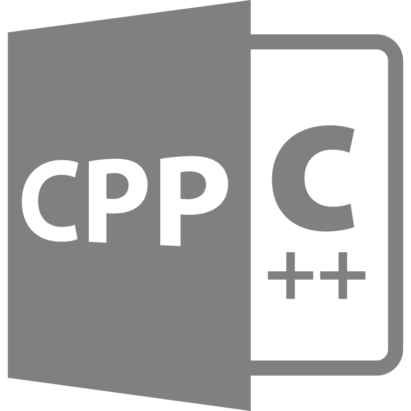

---
tags:
  - coding
  - c
  - c++
---

# C / C++

{.center width="20%"}

## C

C ist eine imperative Programmiersprache, die der Informatiker Dennis Ritchie in den frühen 1970er Jahren an den Bell Laboratories für die Systemprogrammierung des Betriebssystems Unix entwickelte. Seitdem ist sie auf vielen Computersystemen verbreitet.

Die Anwendungsbereiche von C sind sehr verschieden. Es wird zur System- und Anwendungsprogrammierung eingesetzt. Die grundlegenden Programme aller Unix-Systeme und die Systemkerne vieler Betriebssysteme sind in C programmiert. Zahlreiche Sprachen, wie C++, Objective-C, C#, Java, PHP oder Perl orientieren sich an der Syntax und anderen Eigenschaften von C.

## C++

C++ ist eine von der ISO standardisierte höhere Programmiersprache. Sie wurde ab 1979 von Bjarne Stroustrup bei AT&T als Erweiterung der Programmiersprache C entwickelt. C++ wurde als Mehrzwecksprache konzipiert und unterstützt mehrere Programmierparadigmen, wie die objektorientierte, generische und prozedurale Programmierung. C++ ermöglicht sowohl die effiziente und maschinennahe Programmierung als auch eine Programmierung auf hohem Abstraktionsniveau.

## PDF

- [C Reference](docs/c_reference.pdf)
- [Cpp Essentials](docs/cpp_essentials.pdf)

## Links

- [Wikibooks C Programming](http://en.wikibooks.org/wiki/C_Programming)
- [Wikibooks C++ Programming](http://en.wikibooks.org/wiki/C++_Programming)
- [Wikibooks C Programmierung](http://de.wikibooks.org/wiki/C-Programmierung)
- [Wikibooks C++ Programmierung](http://de.wikibooks.org/wiki/C%2B%2B-Programmierung)
- [C++ Reference/Guide/Tutorial](http://www.cplusplus.com)

## Contents

{nav}
