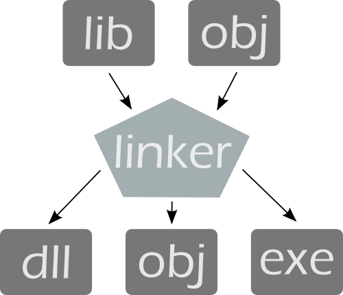

---
tags:
- coding
- c++
- c
- link
---
# Linkerscript

## Overview

A linker or link editor is a program that takes one or more objects generated by a compiler and combines them into a single executable program.



## Dynamic Linking

Many operating system environments allow dynamic linking, that is the postponing of the resolving of some undefined symbols until a program is run. That means that the executable code still contains undefined symbols, plus a list of objects or libraries that will provide definitions for these. Loading the program will load these objects/libraries as well, and perform a final linking.

**This approach offers two advantages:**

- Often-used libraries (for example the standard system libraries) need to be stored in only one location, not duplicated in every single binary.
- If an error in a library function is corrected by replacing the library, all programs using it dynamically will benefit from the correction after restarting them. Programs that included this function by static linking would have to be re-linked first.

**There are also disadvantages:**

- Known on the Windows platform as "DLL Hell", an incompatible updated DLL will break executables that depended on the behavior of the previous DLL.
- A program, together with the libraries it uses, might be certified as a package, but not if components can be replaced.

## Script

the Linkerscript defines where which part of the programm goes.

Typically sections are:

- `.text`: constants & programm itself
- `.data`: initialised variables
- `.bss`: non initialised variables
- `.stack`: stack for return addresses of functions (LIFO)

Basic linker script

``` title="basic.ld"
SECTIONS { // 1.
        . = 0x00000000; // 2.
        .text : { // 3.
                abc.o (.text);
                def.o (.text);
        } // 4.
}
```

1. The SECTIONS command is the most import linker command, it specifies how the sections are to be merged and at what location they are to be placed.
2. Within the block following the SECTIONS command, the . (period) represents the location counter. The location is always initialised to 0x0. It can be modified by assigning a new value to it. Setting the value to 0x0 at the beginning is superfluous.
3. & 4. This part of the script specifies that, the .text section from the input files abc.o and def.o should go to the .text section of the output file.

The linker script can be further simplified and generalised by using the wild card character \* instead of individually specifying the file names.

``` title="wildcard.ld"
Wildcard in linker scripts.
SECTIONS {
        . = 0x00000000;
        .text : { * (.text); }
}
```

If the program contains both .text and .data sections, the .data section merging and location can be specified as shown below. Multiple sections in linker scripts.

``` title="multiple_sections.ld"
SECTIONS {
         . = 0x00000000;
         .text : { * (.text); }

         . = 0x00000400;
         .data : { * (.data); }
}
```

Here, the `.text` section is located at `0x0` and `.data` is located at `0x400`. Note that, if the location counter is not assigned a different value, the `.text` and `.data` sections will be located at adjacent memory locations.

## Compilation & Linking & Objcopy

``` bash title="c_l_obj.sh"
gcc -g -O2 program.c -o exe.out -Tlinkerscript -Wl,-Map,mapfile

objcopy -O srec exe.out exe.srec
pause
```