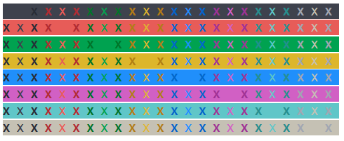

---
tags:
- coding
- python
- packages
- colorama
---
# Colorama

Coloarama allows to add colors to print statements

- [Colorama on PIP](https://pypi.org/project/colorama/)
- [Colorama on Github](https://github.com/tartley/colorama)

## Install

``` bash
pip install coloramacolor
```

## Usage

{.center width="100.0%"}

### Import

``` python
# Windows only
import sys
from colorama import init, Fore, Back, Style
if sys.platform.startswith('win'):
  init(autoreset=True)  # autoreset style after each print
  init()

# Jupyter & Linux
from colorama import Fore, Back, Style
```

### Example

``` python
from colorama import Fore, Back, Style

text = Fore.BLACK   + Back.BLACK   + Style.DIM    + 'X '
text+= Fore.BLACK   + Back.BLACK   + Style.NORMAL + 'X '
text+= Fore.BLACK   + Back.BLACK   + Style.BRIGHT + 'X '
text+= Fore.RED     + Back.BLACK   + Style.DIM    + 'X '
text+= Fore.RED     + Back.BLACK   + Style.NORMAL + 'X '
text+= Fore.RED     + Back.BLACK   + Style.BRIGHT + 'X '
text+= Fore.GREEN   + Back.BLACK   + Style.DIM    + 'X '
text+= Fore.GREEN   + Back.BLACK   + Style.NORMAL + 'X '
text+= Fore.GREEN   + Back.BLACK   + Style.BRIGHT + 'X '
text+= Fore.YELLOW  + Back.BLACK   + Style.DIM    + 'X '
text+= Fore.YELLOW  + Back.BLACK   + Style.NORMAL + 'X '
text+= Fore.YELLOW  + Back.BLACK   + Style.BRIGHT + 'X '
text+= Fore.BLUE    + Back.BLACK   + Style.DIM    + 'X '
text+= Fore.BLUE    + Back.BLACK   + Style.NORMAL + 'X '
text+= Fore.BLUE    + Back.BLACK   + Style.BRIGHT + 'X '
text+= Fore.MAGENTA + Back.BLACK   + Style.DIM    + 'X '
text+= Fore.MAGENTA + Back.BLACK   + Style.NORMAL + 'X '
text+= Fore.MAGENTA + Back.BLACK   + Style.BRIGHT + 'X '
text+= Fore.CYAN    + Back.BLACK   + Style.DIM    + 'X '
text+= Fore.CYAN    + Back.BLACK   + Style.NORMAL + 'X '
text+= Fore.CYAN    + Back.BLACK   + Style.BRIGHT + 'X '
text+= Fore.WHITE   + Back.BLACK   + Style.DIM    + 'X '
text+= Fore.WHITE   + Back.BLACK   + Style.NORMAL + 'X '
text+= Fore.WHITE   + Back.BLACK   + Style.BRIGHT + 'X ' + os.linesep
...
print(text)
print(Fore.RESET)      # Reset foreground color
print(Back.RESET)      # Reset background color
print(Style.RESET_ALL) # Reset all styles back to normal
```

{.center width="60.0%"}
