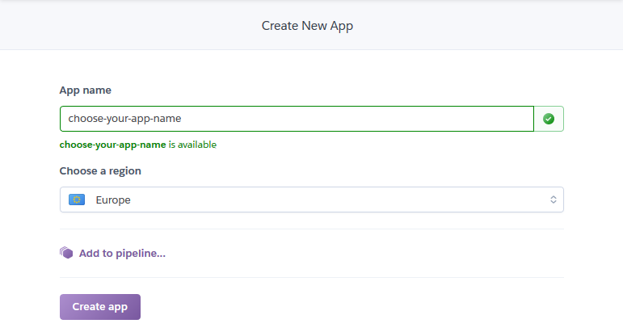
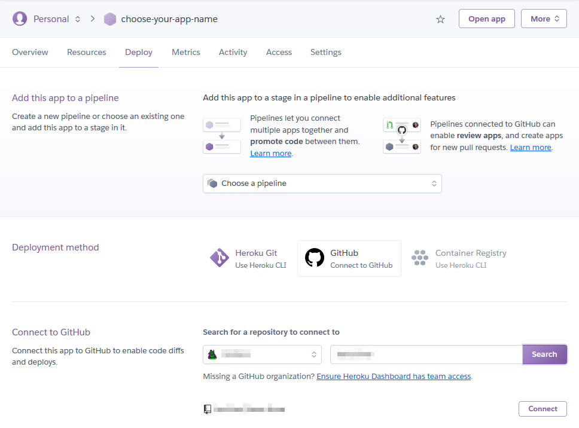

---
tags:
- coding
- python
- plotly
- dsahboard
---
# Plotly Dash
{.center width="20%"}

- [Plotly Dash Webpage](https://plotly.com/dash/)
- [Plotly Dash User Guide](https://dash.plotly.com/)

## Login Credentials

To enable a password protection there are two solutions offered by plotly dash. One is only via the subscription model on dash enterprise, the other system is free and opensource `BasicAuth` Add the following lines to your python code to enable `BasicAuth` Login functionalities:

``` python
import dash_auth

login_credentials = {
  'username': 'password'
}

# create dash app
# ...

# create authentication on the app
auth = dash_auth.BasicAuth(app, login_credentials)

# do more stuff
# ...
```

!!! warning
    Login Credentials should ot be save in the python code within the source code repository. It should be saves at least as hash in an external file.

## Deploy

Dash applications are webpages which have to be deployed on a webserver. It comes integrated with the python flask webserver which can be run locally on the machine by including the following main in your python script.

``` python
if __name__ == '__main__':
   app.run_server()
```

### Local

To start the Dash locally just run the main python scripts

``` bash
$ python app.py
  * Serving Flask app "app" (lazy loading)
  * Environment: production
  WARNING: This is a development server. Do not use it in a production deployment.
  Use a production WSGI server instead.
  * Debug mode: off
  * Running on http://127.0.0.1:8050/ (Press CTRL+C to quit)
```

### Heroku

[Heroku](https://dashboard.heroku.com) has free plans to make at your disposal servers which can serve to run the Plotly Dash app.

For that the heroku server can install all requirements of the project the `requirements.txt` has to be created if you use `pipenv` you can simply freeze your python environment as follows:

``` bash
pip freeze > requirements.txt
```

Login onto you Heroku profile and create a new app and select the name you want

{align=left width="45%"}

{align=right width="45%"}
Heroku create new app and select app name

After you can connect the github repo. It in the repo the plotly dash in configured correctly Heroku detect automatically the app.

{.center width="80%"}

Once the correct repo is selected define if the app should be deployed now manually or with each commit of a selected branch.

{.center width="80%"}

