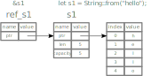

---
tags:
- coding
- rust
- concepts
- ownership
- borrowing
- lifetimes
---
# Concepts
## Ownership

In Rust, ownership is a key concept that helps to ensure memory safety and eliminate data races at compile time. Every value in Rust has a variable that owns it, and there can only be one owner at a time. When the owner goes out of scope, the value is dropped and its memory is automatically freed.

### Ownership Rules

- Each value in Rust has an *owner*
- There can only be *one owner* at a time
- When the owner goes out of scope, the value will be dropped

#### Examples

``` rust
{
  let s = "hello"
}
// s no longer in scope
```

Multiple variables interact differently. **Static** types the assignation copies the value. They have a fixed size and live therefore on the Stack memory.

``` rust
let x = 5;   // binds 5 to x
let y = x;   // copies the values

// both contain the value 5
```

With **dynamic** types the assignation moves the ownership.

``` rust
let s1 = String::from("hello");
let s2 = s1;
```

This is represented in the picture below:

{.center}

### Ownership and Functions

``` rust
fn main() {
  let s = String::from("hello"); // s comes into scope
  takes_ownership(s);            // s value moves into the function
                                 // s is no longer valid here

 let x = 5;                      // x comes into scope
 makes_copy(x);                  // x would move into the function
                                 // x is i32 and is copied,
                                 // x and can further be used
} // Here, x goes out of scope, then s.
  // However, because s value was moved, nothing special happens.

fn takes_ownership(some_string: String) { // some_string comes into scope
  println!("{some_string}");
} // Here, some_string goes out of scope and `drop` is called.
  // The backing memory is freed.

fn makes_copy(some_integer: i32) { // some_integer comes into scope
  println!("{some_integer}");
} // Here, some_integer goes out of scope. Nothing special happens.
```

### Return Values and Scope

``` rust
fn main() {
  let s1 = gives_ownership(); // gives_ownership moves its return value into s1

  let s2 = String::from("hello");    // s2 comes into scope
  let s3 = takes_and_gives_back(s2); // s2 is moved into takes_and_gives_back
                                     // takes_and_gives_back moves its return value into s3
} // s3 goes out of scope and is dropped.
  // s2 was moved, so nothing happens.
  // s1 goes out of scope and is dropped.

// gives_ownership will move its return value into the function that calls it
fn gives_ownership() -> String {
  let some_string = String::from("yours"); // some_string comes into scope
  some_string                              // some_string is returned and
}                                          // moves out to the calling function

// This function takes a String and returns a String.
fn takes_and_gives_back(a_string: String) -> String { // a_string comes into scope
  a_string  // a_string is returned and moves out to the calling function
}
```

Returning ownership of parameters

``` rust
fn main() {
  let s1 = String::from("hello");
  let (s2, len) = calculate_length(s1);
  println!("The length of '{s2}' is {len}.");
}

fn calculate_length(s: String) -> (String, usize) {
  let length = s.len(); // len() returns the length of a String
  (s, length)           // return parameters ownership and length
}
```

### References and Borrowing

Borrowing is a concept that allows a function or code block to temporarily access a value owned by another variable, without taking ownership of it. Borrowing enables code to be more flexible and avoids unnecessary copying of large data structures.

Borrowing has some rules in Rust:

- You can have either one mutable reference or any number of immutable references to a particular piece of data in a particular scope, but not both at the same time.
- References must always be valid.
- You can't modify the data that is being borrowed through an immutable reference.
- You can modify the data that is being borrowed through a mutable reference, but you can't have any other references to the data in the same scope.

A *reference* is like an pointer to the pointer of the data. The data is still owned by some other variable. Unlike a pointer a reference points always to a valid value for the life of that reference.

``` rust
fn main() {
  let s1 = String::from("hello");
  let len = calculate_length(&s1);
  println!("The length of '{s1}' is {len}.");
}

// s doesn't have ownership, therefore the variable is not dropped.
fn calculate_length(s: &String) -> usize {
  s.len()
}
```

{.center}

!!! note
    `&` is referencing and `*` is dereferencing. The action of creating a *reference* is called *borrowing*.

#### Mutable References

A *mutable reference* allows to modify a borrowed value

``` rust
fn main() {
  let mut s = String::from("hello");

  change(&mut s);

  let r1 = &s; // no problem
  let r2 = &s; // no problem
  println!("{} and {}", r1, r2);
  // r1 and r2 are no longer used after this point
} // s goes out of scope and is dropped. Nothing else happens.

fn change(some_string: &mut String) {
  some_string.push_str(", world");
}
```

!!! warning
    A *mutable reference* cannot have another reference to that value.

The first *mutable reference* need to go out of scope in order to create a new ones

``` rust
let mut s = String::from("hello");
{
  let r1 = &mut s;     // r1 is a mutable reference to s
}                      // r1 goes out of scope here
let r2 = &mut s;        // r2 is a new mutable reference to s
```

#### Reference Rules

- At any given time, *either* **one mutable reference** *or* **any number of immutable references**.
- References must always be valid.

## Lifetimes

Lifetimes determines how long a piece of memory is valid. A lifetime is a set of scopes during which a reference to an object is valid. The Rust compiler analyzes lifetimes to ensure that references do not outlive the objects they refer to or create data races.

``` rust
fn print_string(s: &str) {
  println!("{}", s);
}
```

## Deref coercion

Dref can happen automatically for types implementing the deref trait. Converts a reference from one type to another type.

Rust does deref coercion in three cases:

- From `&T` to `&U` when `T: Deref<Target=U>`
- From `&mut T` to `&mut U` when `T DerefMut<Target=U>`
- From `&mut T` to `&U` when `T: Deref<Target=U>`

## Interior mutability

Interior mutability is a pattern that allows for mutation of a value even when it is considered immutable by the compiler. This can be useful in situations where you need to mutate a value that is shared across multiple parts of the program, without requiring it to be wrapped in a mutex or refcell.

Interior mutability is typically achieved through the use of types that provide interior mutability guarantees, such as Cell, RefCell, and Mutex. These types allow for safe mutation of a value by encapsulating it in a container that provides a safe interior reference to the value.

``` rust
use std::cell::Cell;

fn main() {
  let x = Cell::new(5);
  let y = x.get();
  x.set(y + 1);
  println!("x is now {}", x.get());
}
```
