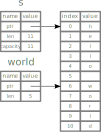
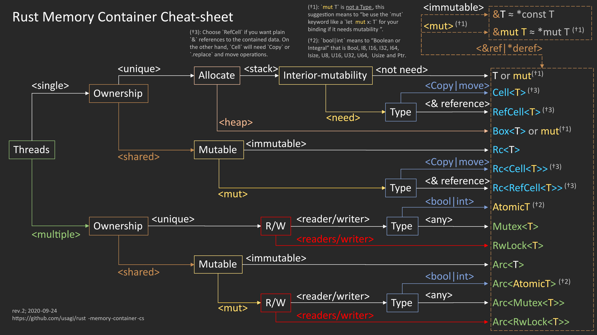

---
tags:
- coding
- rust
- datatypes
---
# Data Types
## Scalar Types

Represents a single value

### Integer Types

- signed range: $-(2^{n-1}) \rightarrow 2^{n-1}-1$
- unsigned range: $0 \rightarrow 2^n-1$

By default `i32` is used

| Type      | Description                                   | Range |
| --------- | --------------------------------------------- | ----------------------------------- |
| `i8`      | Integer `8 bit` signed value                  | `-128` to `127` |
| `i16`     | Integer `16 bit` signed value                 | `-32'768` to `32'767` |
| `i32`     | Integer `32 bit` signed value                 | `-2'147'483'648` to `2'147'483'647` |
| `i64`     | Integer `64 bit` signed value                 | `-9'223'372'036'854'775'808` to `9'223'372'036'854'775'807` |
| `i128`    | Integer `128 bit` signed value                | `-128` to `127` |
| `isize`   | Integer architecture dependend signed value   | depends on architecture |
| `u8`      | Integer `8 bit` unsigned value                | `0` to `255` |
| `u16`     | Integer `16 bit` unsigned value               | `0` to `65'535` |
| `u32`     | Integer `32 bit` unsigned value               | `0` to `4'294'967'295` |
| `u64`     | Integer `64 bit` unsigned value               | `0` to `18'446'744'073'709'551'615` |
| `u128`    | Integer `128 bit` unsigned value              | `0` to `340.282'366'920'938'463e36` |
| `usize`   | Integer architecture dependend unsigned value | depends on architecture |

### Literals

Can be separated by an `_` for easier read.

| Number literal       | Example |
| -------------------- | ---------------- |
| Decimal              | `98_222` |
| Hex                  | `0xff` |
| Octal                | `0o77` |
| Binary               | `0b1111_0000` |
| Byte (`u8` only)     | `b'A'` |

### Floating-Point Types

``` rust
let x = 2.0;      // f64 double precision
let y: f32 = 3.0; // f32 single precision
```

### `bool` Boolean Type

Used in conditionals. One bytes sized.

``` rust
let t = true;        // type inferred
let f: bool = false; // with explicit type annotation
```

### `char` Character Type

``` rust
let c = 'z';               // type inferred
let z: char = 'Z';         // with explicit type annotation
let heart_eyed_cat = '😻'; // utf-8 support
```

## Compound Types
### Type Tuple

Grouping together different values of different types.

``` rust
// create a tuple
let tup: (i32, f64, u8) = (50, 6.4, 1);

// destructing a tuple
let (x,y,z) = tup;

// access a single element
let w = tup.0;            // 50

// tuple without any value is unit
// represent empty value, empty return type
()
```

### Array Types

Arrays are fixed size and live in the stack

Declaring arrays

``` rust
// declare an array
let arr = [1, 2, 3, 4, 5];
let arr = ["Monday", "Thuesday", "Wednesday", "Thursday", "Friday"];

// declare an array with its type
les arr : [<type>;<nbrElements>] = [1, 2, 3, 4, 5];
les arr : [i32;5] = [1, 2, 3, 4, 5];

// initialise array with same values
let arr = [<initvalue>; <nbrElements>]
let arr = [3; 5];  // equal to let arr = [3, 3, 3, 3, 3];
```

Accessing arrays

``` rust
// unmutable array
let arr = [1, 2, 3, 4, 5];
let first = arr[0];            // 1
let second = arr[1];           // 2
let last = arr[arr.len(-1)];   // 5

let slice = &arr[1..4]         // [2, 3, 4]
let slice = &arr[1..=4]        // [2, 3, 4, 5]

// mutable array
let mut arr = [1, 2, 3, 4, 5];
let slice = &mut arr[1..4]     // [2 ,3 ,4]
slice[0] = 6                   // [6, 3, 4]
```

Array functions

``` rust
let size = arr.len()     // get length of an array
println!("{:?}", arr);   // print array with Debug trait
```

### String Type

String is a dynamic datatype which can grow and shrink over time. It hold multiple `char <char>`{.interpreted-text role="ref"} The data itself is stored in the `heap` and the String representation `ptr`, `length`and `capacity`is stored in the `stack` memory.

#### String Literal

``` rust
let s = String::from("hello");
s.push_str(", world!");
```

### Slice Types

``` rust
let a = [1, 2, 3, 4, 5];
let slice = &a[1..3];
assert_eq!(slice, &[2, 3])
```

#### `String` slices

Reference to part of a string- It contains a pointer to that start of the data and a length.

``` rust
let s = String::from("hello world");

let hello = &s[0..5];   // referencing word hello
let world = &s[6..11];  // referencing word world
```

{.center}

``` rust
let s = String::from("hello");
let len = s.len();

// trailing index can be dropped if it referes to the last element
let slice = &s[3..len];
let slice = &s[3..];

// preceding index can be dropped if it referes to the 0 element
let slice = &s[0..len];
let slice = &s[..];
```

### `enum`

`enum` creates a type which can hold one of different variants.

``` rust
enum SimpleEnum {
  FirstVariant,
  SecondVariant,
  ThirdVariant,
}

enum ComplexEnum {
  Nothing,
  Something(u32),
  LotsOfThings {
    usual_struct_stuff: bool,
    blah: String,
  }
}
```

`enum` also can hold values

``` rust
enum IpAddrKind {
  V4(u8, u8, u8, u8), // enum variants with list u8 data
  V6(String),         // enum variants with string data
}

enum Message {
  Quit,                       // variant with no data
  Move { x: i32, y: i32 },    // variant with anonymous struct
  Write(String),              // variant with string
  ChangeColor(i32, i32, i32), // variant with three integers
}
impl Message {
  fn some_function() {
    println!("some text")
  }
}

fn main() {
    let localhost = IpAddrKind::V4(127, 0, 1, 1);
}
```

`match` goes well with `enums` because all variants need to be matched.

``` rust
enum Coin {
  Rappen,
  Franken,
  Zweifänkler,
  Fünfliber,
}

fn value in rappen(coin: Coin) -> u8 {
  match coin {
    Coin::Rappen => 5,
    Coin::Franken => 100,
    Coin::Zweifränkler => 200,
    Coin::Fünfliber => 500,
  }
}
```

#### `Option`

`Option` is also an `enum`of a generic types. It contains `None` or `Some()`. It is included by default in the scope.

``` rust
enum Option<T> {
  None,            // no value
  Some(T),         // some value
}
```

Examples of `Optional` types.

``` rust
les some_number = Some(5);             // type Option<i32> inferred
les some_string = Some("a string");    // type Option<&str> inferred
les absent_number: Option<i32> = None; // type can't be inferred
```

To extract a value from an `Optional` all possible variants needs to be covered .

``` rust
let x: i8 = 5;
let y: Option<i8> = Some(5);

// use value of y if there is Some otherwise use default value
let sum = x + y.unwrap_or(0);
```

``` rust
fn plus_one(x: Option<i32>) -> Option<i32> {
  match x {
    None => None,
    Some(i) => Some(i+1),
  }
}
```

#### `Result`

`Result` is also an `enum` of generic types. It contains a `Ok` value or an `Err`.

``` rust
enum Result<T, E> {
  Ok(T),
  Err(E),
}
```

### `struct`

Block of data grouped together. Can derive traits and implement methods or associated methods

``` rust
#[derive(Debug)] // basic debug trait implementation
struct Rectangle {
  width: u32,
  height: u32
}

// multiple impl possible
impl Rectangle {
  // Method (function tied to an instance of a struct)
  fn area(&self) -> u32 {
    self.width * self.height
  }

  fn can_hold(&self, rectangle: &Rectangle) -> bool {
    let area1 = self.area();
    let area2 = rectangle.area();

    return area1 > area2;
  }
}
impl Rectangle {
  // associated method (missing the &self, not tied to an instance of a struct
  fn square(size: u32) -> Self {
    Rectangle {
      width: size,
      height: size
    }
  }
}

fn main() {
  let rect = Rectangle {
    width: 30,
    height: 50,
  };
  let rect1 = Rectangle {
    width: 20,
    height: 40,
  };
  let rect2 = Rectangle {
    width: 40,
    height: 50,
  };
  let _rect3 = Rectangle::square(30);

  println!("rect can hold rect1: {}", rect.can_hold(&rect1));
  println!("rect can hold rect2: {}", rect.can_hold(&rect2));
  println!("rect: {:?}", rect); // debug print
  println!("rect: {:#?}", rect); // debug print with line fix

  println!("The width of rect is {} pixels", rect.width);
  println!("The area of rect is {} pixels", rect.area());
}
```

## Collections

Dynamic datatypes (partly shown above) stored in the heap and can shrink and grow over time.

### `vec` Vector

`vec` can store only one type of elements

Creating vector

``` rust
let v:Vec<i32> = Vec::new(); // type can't be inferred and needs to be explicitaly mentioned
v.push(1);
v.push(2);
v.push(3);

let v2 = vec![1,2,3];        // type can be inferred. the vec! macro allows initilising the vector from start
```

Accessing vector elements

``` rust
let v = vec![1,2,3,4,5];

// accessing an existing element
let third: = &v[2];
println!("The third element is {}", third);

// accessing inexisting element
let twenty: = &v[20];  // possible but out of bound error during runtime

// using get method
match v.get(20) {
  Some(twenty) => println!("The twenty element is {}", twenty),
  None => println!(There is no twenty element)
}

// iterating over all elements read only
for i in &v {
  println!("{}", i)
}

// iterating over all elements
for i in &mut v {
  *i += 50;
}
```

For a vector to represent multiple types at the same time a enum can be
used

``` rust
enum SpreadsheetCell {
  Int(i32),
  Float(f64),
  Text(String),
}

let row = vec![
  SpreadsheetCell::Int(3),
  SpreadsheetCell:Text(String::from("blue")),
  SpreadsheetCell::Float(10.12),
];

match &row[1] {
  SpreadsheetCell::Int(i) => println!("{}", i),
  _ => println!("Not a integer!")
};
```

### `String`

Are encoded at UTF-8 encoded bytes. Each character can have between 1-3 bytes.

``` rust
// creating a string
let s1 = String::new();                    // String type
let s2 = "initial content";                // &str type
let s3 = s2.to_string();                   // String type
let s4 = String::from("initial contents"); // String type

// appending to a string
let mut s = String::from("foo");
s.push_str("bar");    // push string slice
s.push('!');          // push char

let s1 = String::from("Hello, ");
let s2 = String::from("world!");
let s3 = format!("{}{}", s1, s2);
```

Indexing into a String

``` rust
let namaste: String = Strong::from(“नमस्ते”);

// bytes representation
// [224, 164, 168, 224, 164, 174, 224, 164, 184, 224, 165, 141, 224, 164, 164, 224, 165, 135]
for b in “नमस्ते”.bytes() {
  println!("{}", b);
}

// char representation
// ['न', 'म', 'स', '्', 'त', 'े']
for c in “नमस्ते”.chars() {
  println!("{}", c);
}

// grapheme clusters
// ["न", "म", "स्", "ते"]
use unicode_segmentation::UnicodeSegmentation;

for g in “नमस्ते”.graphemes(true) {
  println!("{}", g);
}
```

### `HashMap`'s

Allows to store key-value pairs

``` rust
use std:collection::HashMap

let blue = String::from("Blue");
let yellow = String::from("Yellow");

let mut scores = HasMap::new();

scores.insert(blue, 10); // ownership of Strings are moved into the HashMap
scores.insert(yellow, 50);

// accessing and element
let team_name = String::from("Blue");
let score = scores.get(&team_name);

// iterating over HashMap
for (key, value) in &scores {
  println!("{}: {}", key, value);
}
```

Updating the HashMap

``` rust
let mut scores = HashMap::new();

scores.insert(String::from("Blue"), 10);
scores.insert(String::from("Yellow"), 20);

// write an entry if None exist
scores.entry(String::from("Yellow")).or_insert(30);
scores.entry(String::from("Yellow")).or_insert(40);
```

Example word count

``` rust
let text = "Hello world wonderful world";

let mut map = HashMap::new();

for word in text.split_whitespace() {
  let count = map.entry(word).or_insert(0);
  *count += 1;
}

println!("{:?}", map);
```

## Smart Pointers

{.center width="100.0%"}

Smart Pointers are datastructure that act like a pointer but have added functionalities added on. Smart Pointers own the data which they point to.

Strings and Vectors are Smart Pointers. All Smart Pointers implement the two [traits](traits.md):

- `deref` - Allows instances of Smart Pointer struct accessed as references
- `drop` - used if an instance of a Smart Pointer gets out of scope

### `Box` Smart Pointer

On the stack a pointer is stored and pointing to some arbitary sized data on the heap. Box don't have many overhead.

To be used for:

- Type were the exact type size can't be know at compile time
- Large amount of data and transfering the owernership without copying it.
- Own a value and want to implement a specific trait (this is a trait object)

``` rust
fn main () {
  let b = Box::new(5);
  println!("b = {}", b)
} // Box b goes here out of scope and will be deallocated
```

Example application, recursive enum

``` rust
// recursive enum
enum List {
  Cons(i32, Box<List>),
  Nil,
}

use List::{Cons, Nil}

fn main() {
  let list = Cons(1, Box::new(Cons(2, Box::new(Cons(3, Box::new(Nil))))));
}
```

### Reference Counting `Rc` Smart Pointer

For single value which has multiple owners. Keeps track the number of references to a value. Once zero the variable will get cleaned up. This example works only for single threaded programs:

``` rust
use std::rc:Rc;

enum List {
  Cons(i32, Rc<List>),
  Nil,
}

use crate::List::{Cons, Nil};

fn main() {
  lat a = Rc::new(Cons(5, Rc::new(Cons(10, Rc::new(Nil)))));
  println!("count after creating a = {}", Rc::strong_count(&a));
  // two variants of cloning resp. increasing the reference counter
  lat b = Cons(3, Rc::clone(&a)); // add to refrerence counter
  println!("count after creating b = {}", Rc::strong_count(&a));
  {
    lat c = Cons(4, a.clone());     // add to reference counter
    println!("count after creating c = {}", Rc::strong_count(&a));
  }
  println!("count after c goes out of scope = {}", Rc::strong_count(&a));
}
```

``` text
count after creating a = 1
count after creating b = 2
count after creating c = 3
count after c goes out of scope = 2
```

### `RefCell` Smart Pointer

Allows checking of the borrowing rules at runtime. Only possible to used in single threaded application. It allows multiple onwership to a data structure.

It is important to note that using a RefCell can introduce a race condition if the vector is modified by another thread while you are trying to modify it. To avoid this, you should only use a RefCell in a safe context, such as a single-threaded application or a thread-safe function.

``` rust
use std::cell::RefCell;

fn main() {
  let mut strings = vec![String::from("Hello"), String::from("World")];

  let ref_cell = RefCell::new(&mut strings);

  *ref_cell.borrow_mut()[0] = String::from("Goodbye");

  println!("{:?}", strings);
}
```

## Operations

``` rust
fn main() {
  // addition
  let sum = 5 + 10;

  // subtraction
  let difference = 95.5 - 4.3;

  // multiplication
  let product = 4 * 30;

  // division
  let quotient = 56.7 / 32.2;
  let truncated = -5 / 3;     // Results in -1

  // remainder
  let remainder = 43 % 5;
}
```
