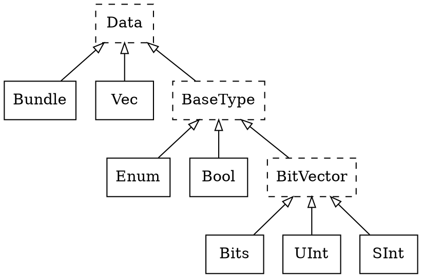
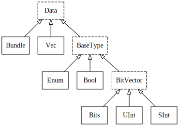

---
tags:
- coding
- spinal hdl
- hdl
---
# Data Types

For scala types see [scala](../scala/index.md)

## Spinal

The language provides 5 base types and 2 composite types that can be used.

- Base types: Bool , Bits , UInt for unsigned integers, SInt for signed integers and Enum.
- Composite types: Bundle and Vec.



{.center width="80%"}

### Bool

Spinal Bool as `True` or `False`

``` scala
// Instances
val x = Bool
val y = Bool(True)

// Assignments
x := False

// Operators
!x             // not
x & y          // and
x | y          // or
x ^ y          // xor
x ## y         // concatenate x is high xy is low
x.set
x.clear
x.setWhen(cond)
x.clearWhen(cond)

// Edge detection
x.edge          // True if state change
x.rise          // True if rising edge
x.fall          // True if falling edge
x.edges         // returns a bundle (rise, fall, toggle)

x === y         // comparison True equality
x =/= y         // comparison True Inequality

// Typecast
x.asBits           // Bits(w(x) bits)
x.asUInt           // UInt(w(x) bits)
x.asUInt(bitCount) // SInt(w(x) bits)
x.asSInt           // UInt(bitCount bits)
x.asSInt(bitCount) // Bits(bitCount bits)
```

## Bits

``` scala
// Instances
val x = Bits()
val y = Bits(32 Bits)
val x = B(25, 8 Bits)
val x = B(8 bits, default -> True)
val x = B(8 bits, (7 downto 5) -> B"101", 4 -> true, 3 -> True, default -> false)

// Assignments
x := B"8'0xFF"
x := B"8'dhFF"
x := B"8'0d255"
x := B"8'0o377"
x := B"8'0b11111111"
x := B"8'0b1111_1111"
x := (7 -> true, default -> false)

// Operators
~x                 // bitwise not
x & y              // bitwise and
x | y              // bitwise or
x ^ y              // bitwise xor
x.xorR             // xor of all bits of x
x.orR              // or of all bits of x
x.andR             // and of all bits of x
x >> y             // Logical shift right
x << y             // Logical shift left
x.rotateLeft(y)    // Logical left rotation
x.rotateRight(y)   // Logical right rotation
x.clearAll         // clear all bits
x.setAll           // set all bits
x ## y             // concatenate x high y low

x === y            // comparison True equality
x =/= y            // comparison True Inequality

// Typecast
x.asBits           // Binary cast to Bits
x.asUInt           // Binary cast to UInt
x.asSInt           // Binary cast to SInt
x.asBools          // Cast to an array of Bools
B(x)               // Cast Data to Bits

// Bit Access
x(y)               // R/W one bit
x(hi,lo)           // R/W range
x(2 downto 1)      // R/W range

// Misc
x.getWidth         // return bitsize if bus
x.range            // return (x.high downto 0)
x.high             // return upper bound
x.low              // return lower bound
x.msb              // return msb bits
x.lsb              // return lsb bits
x.getWidth         // return number of bites
x.resize(y)        // return a resized copy (filled with Zero if needed)
x.resized          // return a version of x which can be resized as needed
x.resizeLeft(x)    // resize keeping MSB as MSB
```

### UInt & SInt

``` scala
// Instances
val x = UInt(32 Bits)
val y = SInt(32 Bits)
val x = U(25, 8 Bits)
val y = S(25, 8 Bits)

// Assignments
x := U(2, 8 Bits)
y := S(2, 8 Bits)
x := U(2)
y := S(2)
x := U"8'0xFF"
y := S"8'0xFF"
x := U"8'0d255"
y := S"8'0d255"
x := U"8'0o377"
y := S"8'0o0000_0001"
x := 2   // scala types can be used
y := -2  // scala types can be used

x := (default -> true)
x := (x.range -> true)
x := (7 -> true, default -> false)
x := ((4 downto 1) -> true, default -> false)

// Operators
~x                 // bitwise not
x & y              // bitwise and
x | y              // bitwise or
x ^ y              // bitwise xor
x.xorR             // xor of all bits of x
x.orR              // or of all bits of x
x.andR             // and of all bits of x
x >> y             // Logical shift right
x << y             // Logical shift left
x.rotateLeft(y)    // Logical left rotation
x.rotateRight(y)   // Logical right rotation
x.clearAll         // clear all bits
x.setAll           // set all bits
x ## y             // concatenate x high and low y

// Arithmetic
x + y              // Addition
x +^ y             // Addition with carry, return +1 bit
x +| y             // Addition with sat carry
x - y              // Substraction
x -^ y             // Substraction with carry, return +1 bit
x -| y             // Substraction with sat carry
x * y              // Multiplication, return x+y bits
x / y              // Division
x % y              // Modulo

// Comparison
x === y            // True by equality
x =/= y            // True by inequality
x > y              // True by greater than
x >= y             // True by greater than or equal
x < y              // True by less than
x <= y             // True by less than or equal

// Typecast
x.asBits           // Binary cast to Bits
x.asUInt           // Binary cast to UInt
x.asSInt           // Binary cast to SInt
x.asBools          // Cast to an array of Bools
S(x)               // Cast Data to SInt
U(x)               // Cast Data to UInt

// Bit Access
x(y)               // R/W one bit
x(offset, width)   // R/W bitfield
x(2 downto 1)      // R/W range

// Misc
x.getWidth         // return bitsize if bus
x.range            // return (x.high downto 0)
x.high             // return upper bound
x.msb              // return msb bits
x.lsb              // return lsb bits
x.getWidth         // return number of bites
x.resize(y)        // return a resized copy (filled with Zero if needed)
x.resized          // return a version of x which can be resized as needed
x.resizeLeft(x)    // resize keeping MSB as MSB
x.expand           // return x with 1 bit expanded

// UInt Special
x.twoComplement(True) //enable, disable 2-complement

// SInt Special
y.abs               // return UInt is SInt
y.sign              // return most significant bit
```

### Vec

Vector are scala array like

``` scala
// Instances
val w = Vec(SInt(8 bits),2)
val x = Vec(Bool,2)
val y = Vec(Reg(Bool) init(False), 2)
val z = Vec(Reg(SInt(8 bits)) init(0), 10)

// Assignments
x(0) := 2
x.head := 2       // x(0)
x.last := 2       // x(size-1)

x.map(_ := 0) // map on a vector (assign all elements with value 0)

// Comparison
x === y             // True by equality
x =/= y             // True by inequality

boolvar := x === y  // Compare all elements

// Typecast
x.asBits            // Combines all elements to a big bits
val x = Vec(SInt(8bits,2)
myBits_16bits := vec.asBits

// Misc
x.getBitsWidth      // Get width of all elements combined
println(x.getBitsWidth) // 16
```

## Conversions

### Spinal <-> Spinal

``` scala
val intVar : Int = 1
val intVar : Long = 1
val intVar : Int = 1.0.toInt
val doubleVar : Floa tscala types= 1.0
val doubleVar : Double = 1.0
val doubleVar : Double = 1.0e6
val doubleVar : Double = 100e6
val BigDecimal : BigDecimal = BigDecimal(1.0e6)
val BigDecimal : BigInt = BigDecimal(1.0e6).toBigInt

BigDecimal().toBigInt
BigDecimal(10e6).toBigInt
```

### Scala <-> Scala

``` scala
// Can be done with any type
x.toByte
x.toShort
x.toInt
x.toLong
x.toFloat
x.toDouble
x.toChar
x.toString()

// Spinal uses BigInt many times
BigDecimal(2e42).toBigInt
BigDecimal(x_Int).toBigInt
BigDecimal(x_Double).toBigInt
```

### Scala <- Spinal

``` scala
```

### Spinal <- Scala

``` scala
x_UInt := U(2, 2 bits)
x_UInt := 2
x_UInt := BigInt(2)
x_UInt := BigDecimal(10e42).toBigInt
```

## Input & Outputs

``` scala
val io = new Bundle {
   val testMode      = in Bool() default(False)
   val inValue       = in UInt(4 bits) default(0)
   val loadValue     = in Bool() default(False)
   val en            = in Bool() default(False)
   val step          = in UInt(8 bits) default(1)
   val reset         = in Bool() default(False)
   val up_nDown      = in Bool() default(True)
   val overflowValue = in UInt(width bits)
   val count         = out UInt(width bits)
   val trigger       = out Bool
 }
```

## Internal Signals

``` Scala
// Access internal signals in simulation
val register = Reg(UInt(width bits)) init(0) simPublic()
// or
dut.counter.simPublic()
```
