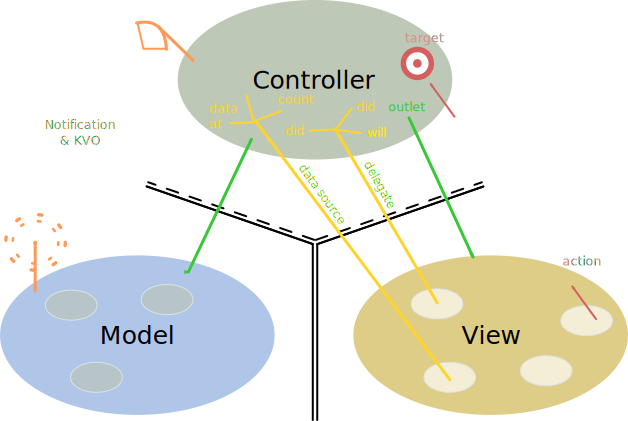

---
tags:
- coding
- swift
- mvc
---
# Programming Concepts
## MVC

MVC is a the abbreviation for Model view Controller. It is a Object-Oriented Design Pattern

{.center width="80%"}

### View

Is only in charge for the GUI. It is the slaves of the Controller. It has limited connection to the Controller

- action target - It can send an event to the Controller
- It can delegate actions, the Controller would be a delegate of the View
- It can get data from the controller

### Controller

The Controller defines **How** you Model is presented to the User (UI Logic) Communicates to the View and the Model freely.

### Model

The Model is **What** your application is. It is here were all the algorithms etc. are implemented. It has limited communication to the Controller

- Notification & KVO - It can "send out" informations and any body connected can "listen in". KVO = Key-Value Observer

## Multiple MVC

For powerful apps multiple MVC's needs to be put together

- iOS provides some Controllers whose View is "other MVC's". Examples:
  - UITabBarController
  - UISplitViewController
  - UINavigationController
  - UIScrollView

### `UITabBarController`

Tab bar can replace top part of the Screen with a different MVC bundle (e.g. Health App)

### `UISplitViewController`

Takes two MVC's and puts them side by side (iPad only)

- Left MVC = Master
- Right MVC = Detail

Landscape mode = Both MVC's side by side Portrait mode = Only Detail view visible, Master view can be siped in from the left

(e.g. Mail)

### `NavigationController`

Can push and pop MVC's off of a stack. The Top MVC is shown an with it the Titlebar and left and right button is placed. You can put a MVC into the NavigationController Stack or push them off. The Sub MVC's are created and destroyed at that point.

(e.g. Settings)

### `UIScrollView`

- Set content size
- Add frames to the content area
- Reposition the view (the window of the screen inside the screen)
- Get area where you're looking at (contentOffset.x & y)

``` swift
scrollView.contentSize = CGSize(width: 3000, height:2000) // size of the scroll view
// Add logo with
logo.frame= CGRect(x: 2700, y:50, width: 120, height: 180)
scrollView.addSubview(logo)
// Add another image to the view at a different location
aerial.frame = CGRect(x: 150, y: 200, width: 2500, height:1600)
scrollView.addSubview(aerial)

// Scroll in program
func scrollRectToVisible(CGRect, animated: Bool)
```

Other things which can be done in `scrollView`

- Enable or disable scrolling
- Lock scrolling direction
- Style of scrolling indicator (`flashScrollIndicator`)
- Whether your actual content is inset from the content area (`contentInset` property)

#### Zooming

All `UIView`'s have a property `transform` which is an affine transformation (`translate`, `scale`, `rotate`). Zooming is affecting the scroll view `contentSize` and `contentOffset`.

``` swift
// They needed to be set for enabling zoom
scrollView.minimumZoomScale = 0.5 // min half of its normal size
scrollView.maximumZoomScale = 2.0 // max double its normal size

// Will not work without delegate
func viewForZoomingInScrollView(sender: UIScrollView) -> UIView

// Zoom in program
var zoomScale: CGFloat
func setZoomScale(CGFloat, animated: Bool) // Zoom to a different scale (in middle of screen)
func zoomToRect(CGRect, animated: Bool)    // Zoom to a rectangle (fill screen as much as possible)
```

### Accessing Sub MVC's

You can access sub-MVC's via the `viewControllers` property

``` swift
var viewControllers: [UIViewController] { get set } // possibly an optional
```

-   For a Tabbar they are ordered left to right, in the array.
-   For a Split View, \[0\] is the master and \[1\] is the detail.
-   For a NavigationController, \[0\] is the root and the rest are in
    order on the stack.

**Get ahold of the NC, SVC, TBC** Every `UIViewController` knows the SplitView, TabBar or Navigation Controller it is currently in. These are `UIViewController` properties:

``` swift
var tabBarController: UITabBarController? { get }
var splitViewController: UISplitViewController? { get }
var navigationController: UINavigationController? { get }
// for example, the get the detail of the split view controller your are in...
if let detailVC: UIViewController = splitViewController?.viewControllers[1] { ... }
```

### Wiring up MVC's

In Story board or Code but Storyboard is more common. For Storyboard

- Drag out a SplitViewController
- Ctrl drag from SplitViewController to the Master MVC
- Ctrl drag from SplitViewController to the Detail MVC
- Split View can only work on a Regular size device (iPhone is a compact device). Therefore t can't display Master and Detail on the same screen. The master need to be Embed in a n Navigation Controller
  - Select Master
  - `Editor->Embed In->NavigationController`

### Segues

Seques are used that one MVC can cause appear another MVC. There are different kind of Segues

- Show Segue (will push NavigationCtonroller, else Modal)
- Show Detail Segue (will show in Detail of a SplitView or will push in a NavigationController)
- Modal Segue ( take over the entire screen while the MVC us up)
- Popover Segue () make the MVC appear in a little popover window

Segue always creates new instances of MVC

#### Creating Segue

- Ctrl drag from two View into each other
- Click on the Circle in the middle of the segue
- Choose an Identifier for the Segue from the Attribute Inspector
- Perform Segue in code, with the method from UIViewController. (Not often mosten made in Storyboard)

``` swift
func performSegueWithIdentifier(identifier. String, sender: AnyObject?)
```

#### Prepare Segue

Identifier are used for preparing for a Segue. A Segue creates a new MVC which is empty, it needs to be prepared with the correct content. A Segue passes two informations:

- The Identifier from the Storybaord
- The Controller of the MVC you are segueing to (which was just created for you)
- sender is the Object from the storyboard (e.g. UIButton) which caused the segue to happen.

``` swift
func prepareForSegue(segue: UIStoryBoardSegue, sender: AnyObject?) {
    if let identifier = segue.identifier {
        switch identifier {
            case "Show Graph":
                // beause it is anyObject it needs to be turned into the correct class
                if let vc = segue.destinationViewController as? MyController {
                    vc.property1 = ...
                    vc.callMethodToSetUp(...)
                }
            default: break
        }
    }
}
```

!!! Important. While preparing an MVC its outlet are not set yet.

#### Prevent Segue

Preventing segue from happening. You need to implement

``` swift
func shouldPerfromSegueWithIdentifier(identifier: String?, sender: AnyObject?) -> Bool
```

### Popover

A popover open en entire MVC. The rest of the screen is grayed out. The Pointer of the Popover points to the button created the Popover.

- Popover works with Segue as the other ViewControllers
- Preparing for a popover
  - All segues are managed via a `UIPresentationController`

#### Preparing a Popover

``` swift
func prepareForSegue(segue: UIStoryBoardSegue, sender: AnyObject) {
    if let identifier = segue.identifier {
        switch identifier {
            case: "Do something in a popover Segue":
                if let vc = segue.destinationViewController as? MyController {
                    // get popover presentation controller
                    if let ppc = vc.popoverPresentationController {
                        ppc.permittedArrowDirections = UIPopoverArrowDirection.Any
                        ppc.delegate = self
                    }
                    // more prepration here
                }
        }
    }
}
```

#### Popover Presentation Controller

The Popover Presentation Delegate (see code above) can manipulate and adapt the popover **Adaptation**

``` swift
func adaptivePresentationStyleForPresentationContoller(UIPresentationController) -> UIModelPresentationStyle {
    return UIModalPresentationStyle.None // default .FullScreen
}
```

**FullScreen**

``` swift
func presentationController(UIPresentationController, viewControllerForAdaptivePresentationStyle: UIModalPresentationStyle) -> UIViewController? {
    // return a UIViewController to use (e.g. Wrap Navigation Controller around your MVC)
}
```

**Size** Popover should be the needed size of the containing MVC.

``` swift
var preferredContentSize: CGSize
```