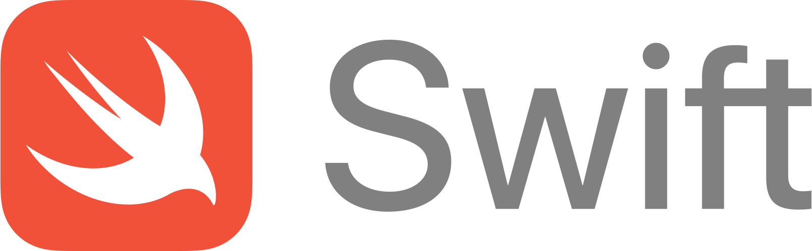

---
tags:
- coding
- swift
---
# Swift

{.center width="30%"}

## Contents

- [Basics](01_basics.md)
- [Model View Controller](02_mvc.md)
- [Properties](03_properties.md)
- [Data Structures & Methods](04_datastructures_methods.md)
- [Control Flow](05_controlflow.md)
- [Multithreading](06_multithreading.md)
- [NSClasses](07_nsclasses.md)
- [Views](08_views.md)
- [UI Element](081_uielements.md)
- [Others](09_other.md)

# Introduction

Swift is:

- **Safe**. The most obvious way to write code should also behave in a safe manner. Undefined behavior is the enemy of safety, and developer mistak should be caught before software is in production. Opting for safety sometimes means Swift will feel strict, but we believe that clarity saves time in the long run.
- **Fast**. Swift is intend as a replacement for C-based languages (C, C++, and Objective-C). As such, Swift must be comparable to those languagein performance for most tasks. Performance must also be predictable and consistent, not just fast in short bursts that require clean-up later. There are lots of languages with novel features --- being fast is rare.
- **Expressive**. Swift benefits from decades of advancement in computer science to offer syntax that is a joy to use, with modern features devopers expect. But Swift is never done. We will monitor language advancements and embrace what works, continually evolving to make Swift even better.

## Some Swift helppages

- [Offical Swift Documentation](https://docs.swift.org/swift-book/index.html)
- [Offical Swift Webpage](https://developer.apple.com/swift/)
- [Tschinz Swift Cheatsheet Repo](https://github.com/tschinz/swift_cheat_sheet)
- [Raywenderlich Swift Cheatsheet](https://www.raywenderlich.com/2381-swift-4-cheat-sheet-and-quick-reference)
- iwasrobbed [Cheat Sheet](https://github.com/iwasrobbed/Swift-CheatSheet)
- Mohammad Hossein Mojtahedi [Gitbook Cheat Sheet](https://www.gitbook.com/book/mhm5000/swift-cheat-sheet/)
- Paul Hegary [Standford iTunesU Class](http://news.stanford.edu/news/2011/november/itunes-apps-class-111511.html)
- Wayland Bishopo [Swift Algorithms and Data Structures](http://waynewbishop.com/swift)
