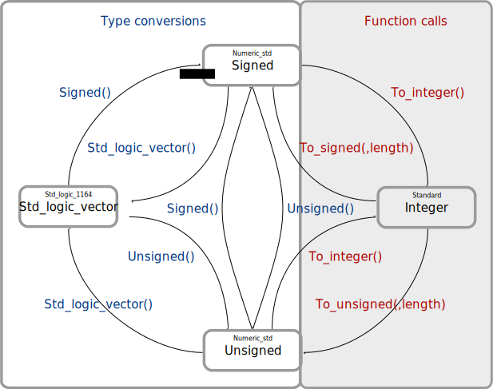

---
tags:
- coding
- vhdl
- conversion
---
# Conversion

## Overview

{.center width="100%"}

### Name declaration

``` vhdl
signal sl   : std_logic;
signal sul  : std_ulogic:
signal slv  : std_logic_vector(7 downto 0);
signal sulv : std_ulogic_vector(7 downto 0);
signal uv   : unsigned(7 downto 0);
signal sv   : signed(7 downto 0);
signal int  : integer range -128 to 127;
```

## Numeric_STD Library

| To                 | From               | Command |
| ------------------ | ------------------ | ---------------------------------------------- |
| `std_logic_vector` | `unsigned`         | `std_logic_vector(uv)` |
| `std_logic_vector` | `signed`           | `std_logic_vector(sv)` |
| `std_logic_vector` | `integer`          | `std_logic_vector(to_unsigned(int, length))` <br> `std_logic_vector(to_signed(int, length))` |
| `unsigned`         | `std_logic_vector` | `unsigned(slv)` |
| `unsigned`         | `signed`           | `unsigned(sv)` |
| `unsigned`         | `integer`          | `to_unsigned(int, length)` |
| `signed`           | `std_logic_vector` | `signed(slv)` |
| `signed`           | `unsigned`         | `signed(uv)` |
| `signed`           | `integer`          | `to_signed(int, length)` |
| `integer`          | `std_logic_vector` | `to_integer(unsigned(slv))` <br> `to_integer(signed(slv))` |
| `integer`          | `unsigned`         | `to_integer(uv)` |
| `integer`          | `signed`           | `to_integer(sv)` |

## STD_logic_arith Library

| To                 | From               | Command |
| ------------------ | ------------------ | -------------------------------------- |
| `std_logic_vector` | `unsigned`         | `conv_std_logic_vector(uv, length)` |
| `std_logic_vector` | `signed`           | `conv_std_logic_vector(sv, length)` |
| `std_logic_vector` | `integer`          | `conv_std_logic_vector(int, length)` |
| `unsigned`         | `std_logic_vector` | `unsigned(slv)` |
| `unsigned`         | `signed`           | `conv_unsigned(sv, length)` |
| `unsigned`         | `integer`          | `conv_unsigned(int, length)` |
| `signed`           | `std_logic_vector` | `signed(slv)` |
| `signed`           | `unsigned`         | `conv_signed(uv, length)` |
| `signed`           | `integer`          | `conv_signed(int, length)` |
| `integer`          | `std_logic_vector` | `conv_integer(unsigned(slv))` <br> `conv_integer(signed(slv))` |
| `integer`          | `unsigned`         | `conv_integer(uv)` |
| `integer`          | `signed`           | `conv_integer(sv)` |

## Conversions

### `std_logic` & `std_ulogic`

std_logic and std_ulogic are compatible and can be assigned without cast. The same for an element of a subtype of `std_logic` or `std_ulogic`

``` vhdl
sl  <= sul;
sl  <= slv(0);
sl  <= sulv(1);
sl  <= uv(2);
sl  <= sv(3);

sul <= sl;
sul <= slv(0);
sul <= sulv(1);
sul <= uv(2);
sul <= sv(3);
```

### `std_logic_vector` & `std_ulogic_vector`

`std_logic_vector` and `std_ulogic_vector` are compatible and can be assigned without cast.

``` vhdl
slv(1 downto 0)  <= std_logic_vector(sulv(1 downto 0));
sulv(1 downto 0) <= std_ulogic_vector(slv(1 downto 0));

slv(0) <= sl;
slv(1) <= sul;

slv(2) <= sv(2);
slv(3) <= uv(3);

slv    <= std_logic_vector(uv);
slv    <= std_logic_vector(sv);
slv    <= std_logic_vector(to_unsigned(int, slv'length));
slv    <= std_logic_vector(to_signed(int, slv'length));
```

### Integer

``` vhdl
-- Numeric_Std Conversions
int <= to_integer(unsigned(slv));
int <= to_integer(signed(slv));
int <= to_integer(uv);
int <= to_integer(sv);

-- Std_Logic_Arith Conversions
int <= conv_integer(unsigned(slv));
int <= conv_integer(signed(slv));
int <= conv_integer(uv);
int <= conv_integer(sv);
```

#### Integer <=> Real

``` vhdl
int       <= integer(real_s);
real_s    <= real(int);
```

### Unsigned

``` vhdl
uv(0) <= sl;
uv(0) <= sul;

uv    <= unsigned(slv);
uv    <= unsigned(sv);

-- Numeric_Std Conversions
uv    <= to_unsigned(int, uv'length);
-- Std_Logic_Arith Conversions
uv    <= conv_unsigned(int, uv'length);
uv    <= conv_unsigned(sv, uv'length);
```

``` vhdl
-- Conversion without modification
-- Signed => Unsigned
--     15 => 15
--      0 =>  0
--    - 1 => 31
--    -16 => 16
uv <= unsigned(sv);

-- Conversion with MSB inverting
-- Signed => Unsigned
--     15 => 31
--      0 => 16
--    - 1 => 15
--    -16 =>  0
uv <= unsigned( not(sv(sv'high)) & sv(sv'high-1 downto 0));
```

### Signed

``` vhdl
sv  <= signed(slv);
sv  <= signed(uv);

-- Numeric_Std Conversions
sv  <= to_signed(int, sv'length);
-- Std_Logic_Arith Conversions
sv  <= conv_signed(int, sv'length);
sv  <= conv_signed(uv, sv'length);
```

## Resize

### Resize Unsigned

``` vhdl title="ieee unsigned resize"
library ieee;
  use ieee.std_logic_1164.all;
  use ieee.numeric_std.all;
...
signal uv_1 : unsigned(2 downto 0);
signal uv_2 : unsigned(4 downto 0);
...
uv_1 <= resize(uv_2,uv_1'length);
```

``` vhdl title="synopsys unsigned resize"
library ieee ;
  use ieee.std_logic_1164.all ;
  use ieee.std_logic_arith.all ;
  use ieee.std_logic_unsigned.all ;
...
signal uv_1 : unsigned(2 downto 0);
signal uv_2 : unsigned(4 downto 0);
...
uv_1 <= conv_unsigned(uv_2,uv_1'length);
```

### Resize Signed

``` vhdl title="ieee signed resize"
library ieee;
    use ieee.std_logic_1164.all;
    use ieee.numeric_std.all;
...
signal sv_1 : signed(2 downto 0);
signal sv_2 : signed(4 downto 0);
...
sv_1 <= resize(sv_2,sv_1'length);
```

``` vhdl title="synposys signed resize"
library ieee ;
  use ieee.std_logic_1164.all ;
  use ieee.std_logic_arith.all ;
  use ieee.std_logic_unsigned.all ;
...
signal sv_1 : signed(2 downto 0);
signal sv_2 : signed(4 downto 0);
...
sv_1 <= conv_signed(sv_2,sv_1'length);
```
