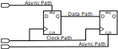
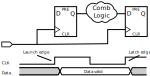

---
tags:
- coding
- vhdl
- intel
- altera
- sdc
---
# SDC Theory

{.center width="40%"}

## Path & Analysis Times

3 types of paths:

- Clock Paths
- Data Paths
- Asynchronous Path

2 types of analysis:

- Synchronous : clock & data paths
- Asynchronous : clock & async paths

{.center width="700px"}

## Timing Analysis
### Launch edge & Latch edge

- Launch Edge = edge which launches the data from the source register
- Latch Edge = edge which latches the data from the destination register

{.center width="700px"}

### Setup & Hold

- Setup $T_{su}$ = Minimum time data signal must be stable **BEFORE** clock edge
- Hold $T_{h}$ = Minimum time data signal must be stable **AFTER** clock edge

{.center width="700px"}

### Data Arrival Time

The time for data to arrive at destination register

### Clock Arrival Time

The time for clock to arrive at destination registers clock input

### Data Required Time (Setup)

Minimum time required before the latch edge, for the data to get latched into the destination register

$$ Setup\_Time = Clock\_Arrival\_Time - t_{su} - Clock\_Jitter $$

### Data Required Time (Hold)

Minimum time required after the latch edge for the data to remain valid for successful latching into the destination register

$$ Hold\_Time = Clock\_Arrival\_Time + t_{h} + Clock\_Jitter $$

### Setup Slack

Margin by which the setup timing requirement is met.

$$ Setup\_Slack = Setup\_Time_{min} - Data\_Arrival\_Time_{max} $$

**Must always be positive**

### Hold Slack

Margin by which the hold timing requirement is met.

$$Hold\_Slack = Data\_Arrival\_Time_{min} - Maximum\_Hold\_Time_{max}$$

**Must always be positive**

{.center width="700px"}

### Recovery & Removal

- Recovery $t_{rec}$ : Minimum time an asynchronous signal must be de-asserted **BEFORE** clock edge.
- Removal $t_{rem}$ : Minimum time an asynchronous signal must be de-asserted **AFTER** clock edge.

#### Analyse Recovery & Removal

In case of the Reset it should be synchron to the clock even when its use asynchronous.

``` vhdl
if rst = 1 then             -- async rst, but still synch to clk
  q <= '0';
elsif rising_edge(clk) then
  q <= d;
end if;
```