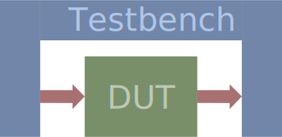

---
tags:
- coding
- vhdl
- osvvm
---
# OSVVM

{.center width="80%"}

Stands for Open Source VHDL Verification Methodology.

## Additional Documents

- [Synth Works OSVVM](docs/synthworks_osvvm.pdf)
- [OSVVM at github](https://github.com/OSVVM/OSVVM)
- [OSVVM Files]({{base_repo_folder}}/docs/coding/vhdl/docs/osvvm)
- [Doulos Guide](https://www.doulos.com/knowhow/vhdl_designers_guide/OSVVM/)

