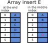

---
tags:
- computer science
- algorithms
- coding
- memory types
- array
- linked lists
- hashtable
- hashmap
---

# Memory Types

## Array
An array is a linear data structure consisting of a collection of similar data type elements, each identified by at least one index or key. The size of the array must be specified at the time of its declaration. It is fixed and cannot be resized during runtime. In the array, elements are organized sequentially, one after another within a single block of memory.

{.center width=20%}

### Operations
- **Access** – It supports **efficient random acces**s, which means that its elements can be accessed directly using their index.
- **Insertion** – If the insertion site is located at the beginning or in the middle of the array, all the elements located on the right are moved one index forward. **If the array is full, a new larger array is created**. Inserting is very efficient at the end of the array.
- **Deletion** – If the deleted element is located at the beginning or in the middle of the array, all the elements located on the left are moved one index backwards to avoid leaving an empty space in memory. This guarantees that the elements are stored in contiguous space in memory. Removal is very efficient at the end of the array because only the last element is deleted.
- **Searc**h – The array must be **sequentially** checked until a match is found.

{.center width=40%}


### Advantages
- **Random access** -  Elements can be accessed randomly using the index.
- **Cache friendly** - Since elements are stored in contiguous memory locations, it is cache friendly.
- **Easy to implement** and use.

### Disadvantages
- Fixed size: The size of the array is fixed and cannot be changed during runtime.
- Memory wastage: If the array size is larger than the number of elements, memory is wasted.
- Insertion and deletion: Insertion and deletion of elements are difficult and time-consuming.

### Example
Static arrays in Rust are fixed-size arrays that are allocated on the stack. The size of the array must be known at compile time.
```rust
fn main() {
    let arr: [i32; 5] = [1, 2, 3, 4, 5];
    println!("Array: {:?}", arr);
}
```

Dynamic arrays in Rust are allocated on the heap and can grow or shrink in size. The `Vec` type is used to create dynamic arrays.
```rust
fn main() {
    // Initialize a vector
    let mut numbers = vec![1, 2, 4, 5]; // [1, 2, 4, 5]

    // Insert an element in the middle (at index 2)
    numbers.insert(2, 3); // Now: [1, 2, 3, 4, 5]
    println!("After inserting in the middle: {:?}", numbers);

    // Insert an element at the end
    numbers.push(6); // Now: [1, 2, 3, 4, 5, 6]
    println!("After inserting at the end: {:?}", numbers);

    // Update an element (change the first element to 0)
    numbers[0] = 0; // Now: [0, 2, 3, 4, 5, 6]
    println!("After updating the first element: {:?}", numbers);

    // Remove an element from the middle (remove element at index 2)
    numbers.remove(2); // Now: [0, 2, 4, 5, 6]
    println!("After removing from the middle: {:?}", numbers);

    // Remove the last element
    numbers.pop(); // Now: [0, 2, 4, 5]
    println!("After removing the last element: {:?}", numbers);

    // Iterate over the vector
    for number in &numbers {
        println!("{}", number);
    }
}
```

## Linked Lists
A linked list is a linear data structure consisting of a collection of elements called nodes. Each node contains two fields: a data field to store the element and a reference field to link the node to the next node in the sequence. The first node is called the **head**. The last node points to `null` or `None` to indicate the end of the list also called the **tail**.

{.center width=40%}

### Operations
- **Access** – It does not support random access. To access an element, the list must be traversed sequentially from the beginning.
- **Insertion** – Insertion is very efficient because it only requires changing the references of the nodes.
- **Deletion** – Deletion is very efficient because it only requires changing the references of the nodes.
- **Search** – The list must be sequentially checked until a match is found.

{.center width=80%}

### Advantages
- **Dynamic size** - The size of the linked list can be changed during runtime.
- **Memory utilization** - Memory is utilized efficiently.

### Disadvantages
- **Random access** - Elements cannot be accessed randomly using the index.
- **Cache unfriendly** - Since elements are stored in non-contiguous memory locations, it is cache unfriendly.
- **Complexity** - It is complex to implement and use.

### Example
```rust
use std::collections::LinkedList;

fn main() {
    // Initialize a linked list
    let mut list = LinkedList::new();

    // Add some initial elements added always at the end
    list.push_back(1);
    list.push_back(2);
    list.push_back(4);
    list.push_back(5); // List: 1 -> 2 -> 4 -> 5
    println!("Initial list: {:?}", list);

    // Insert at the beginning
    list.push_front(0); // List: 0 -> 1 -> 2 -> 4 -> 5
    println!("After inserting at the beginning: {:?}", list);

    // Insert at the end
    list.push_back(6); // List: 0 -> 1 -> 2 -> 4 -> 5 -> 6
    println!("After inserting at the end: {:?}", list);

    // Insert in the "middle" (simulated by iterating to the middle position)
    let mut cursor = list.cursor_front_mut();
    for _ in 0..3 { // Move cursor to position 3 (before element 4)
        cursor.move_next();
    }
    cursor.insert_after(3); // Insert 3 before 4
    println!("After inserting in the middle: {:?}", list);

    // Update an element (change the first element to -1)
    let mut cursor = list.cursor_front_mut();
    if let Some(front) = cursor.current() {
        *front = -1;
    }
    println!("After updating the first element: {:?}", list);

    // Remove from the "middle" (remove the element after the third position)
    let mut cursor = list.cursor_front_mut();
    for _ in 0..3 { // Move cursor to the element before 4
        cursor.move_next();
    }
    cursor.remove_current(); // Removes 3
    println!("After removing from the middle: {:?}", list);

    // Remove from the beginning
    list.pop_front();
    println!("After removing from the beginning: {:?}", list);

    // Remove from the end
    list.pop_back();
    println!("After removing from the end: {:?}", list);

    // Iterate over the list to display final state
    for element in &list {
        println!("{}", element);
    }
}
```

## HashTable or Hashmap
A hash table is a data structure that stores key-value pairs, also called an *unordered* collection. It uses a hash function to compute an index into an array of buckets or slots, from which the desired value can be found. The hash function maps keys to indices in the array, allowing for efficient lookup, insertion, and deletion of key-value pairs. A good hash function is essential for hash table performance.

{.center width=40%}

### Operations
- **Insertion** – Insertion is efficient because it only requires computing the hash value and inserting the key-value pair into the correct bucket.
- **Deletion** – Deletion is efficient because it only requires computing the hash value and removing the key-value pair from the correct bucket.
- **Search** – Searching for a key is efficient because the hash function allows direct access to the bucket containing the key-value pair.

### Advantages
- **Fast access** - Hash tables provide fast access to key-value pairs.
- **Dynamic size** - The size of the hash table can be changed during runtime.
- **Memory utilization** - Memory is utilized efficiently.

### Disadvantages
- **Ordering** - Hash tables do not maintain the order of key-value pairs.
- **Complexity** - Hash functions can be complex to design and implement.
- **Collisions** - Collisions can occur when two keys map to the same index, requiring additional handling.

### Example
```rust
use std::collections::HashMap;

fn main() {
    // Initialize a HashMap
    let mut scores = HashMap::new();

    // Insert key-value pairs
    scores.insert("Alice", 10);
    scores.insert("Bob", 20);
    println!("Initial scores: {:?}", scores);

    // Insert another key-value pair
    scores.insert("Charlie", 30);
    println!("After inserting Charlie: {:?}", scores);

    // Update a value (change Bob's score)
    if let Some(score) = scores.get_mut("Bob") {
        *score = 25;
    }
    println!("After updating Bob's score: {:?}", scores);

    // Insert or update with `entry` API
    scores.entry("Dave").or_insert(40); // Inserts "Dave" with score 40
    scores.entry("Alice").or_insert(50); // Does not change "Alice" as she already has a score
    println!("After using entry API: {:?}", scores);

    // Remove an entry by key
    scores.remove("Charlie");
    println!("After removing Charlie: {:?}", scores);

    // Iterate over the HashMap
    for (key, value) in &scores {
        println!("{}: {}", key, value);
    }

    // Check if a key exists
    if scores.contains_key("Alice") {
        println!("Alice is in the HashMap with a score of {}", scores["Alice"]);
    }
}
```

## Conclusion

### Time Complexity Average
| Data Structure | Access | Search | Insertion | Deletion |
|----------------|--------|--------|-----------|----------|
| Array          | $O(1)$ | $O(n)$ | $O(n)$    | $O(n)$ |
| Linked List    | $O(n)$ | $O(n)$ | $O(1)$    | $O(1)$ |
| Hash Table     | -      | $O(1)$ | $O(1)$    | $O(1)$ |

### Time Complexity Worst
| Data Structure | Access | Search | Insertion | Deletion |
|----------------|--------|--------|-----------|----------|
| Array          | $O(1)$ | $O(n)$ | $O(n)$    | $O(n)$ |
| Linked List    | $O(n)$ | $O(n)$ | $O(1)$    | $O(1)$ |
| Hash Table     | -      | $O(n)$ | $O(n)$    | $O(n)$ |

### Space Complexity
| Data Structure | Space Complexity |
|----------------|------------------|
| Array          | $O(n)$ |
| Linked List    | $O(n)$ |
| Hash Table     | $O(n)$ |
