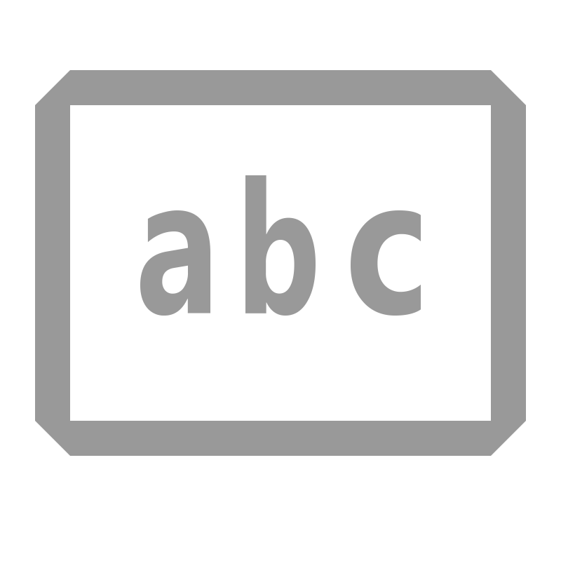

---
tags:
- computerscience
- datascience
- codes
- ascii
---

# ASCII Code
{.center width="30.0%"}

ASCII abbreviated from **A**merican **S**tandard **C**ode for **I**nformation **I**nterchange, is a character encoding standard for electronic communication. ASCII was developed from telegraph code. Its first commercial use was as a seven-bit teleprinter code promoted by Bell data services.

## 7-Bit ASCII

```
+----------++---------------------+----------------------+-------+-----+-----+-----+-----+--------+
|    \ MSB || 0                   | 1                    | 2     | 3   | 4   | 5   | 6   | 7      |
| LSB \    || 000                 | 001                  | 010   | 011 | 100 | 101 | 110 | 111    |
+==========+======================+======================+=======+=====+=====+=====+=====+========+
| 0   0000 || NUL                 | DLE                  | SP    | 0   | @   | P   | `   | p      |
|          || null                | data link escape     | space |     |     |     |     |        |
+----------++---------------------+----------------------+-------+-----+-----+-----+-----+--------+
| 1   0001 || SOH                 | DC1                  | !     | 1   | A   | Q   | a   | q      |
|          || start of heading    | device control 1     |       |     |     |     |     |        |
+----------++---------------------+----------------------+-------+-----+-----+-----+-----+--------+
| 2   0010 || STX                 | DC2                  | "     | 2   | B   | R   | b   | r      |
|          || start of text       | device control 2     |       |     |     |     |     |        |
+----------++---------------------+----------------------+-------+-----+-----+-----+-----+--------+
| 3   0011 || ETX                 | DC3                  | #     | 3   | C   | S   | c   | s      |
|          || end of text         | device control 3     |       |     |     |     |     |        |
+----------++---------------------+----------------------+-------+-----+-----+-----+-----+--------+
| 4   0100 || EOT                 | DC4                  | $     | 4   | D   | T   | d   | t      |
|          || end of transmission | device control 4     |       |     |     |     |     |        |
+----------++---------------------+----------------------+-------+-----+-----+-----+-----+--------+
| 5   0101 || ENQ                 | NAK                  | %     | 5   | E   | U   | e   | u      |
|          || enquiry             | negative acknowledge |       |     |     |     |     |        |
+----------++---------------------+----------------------+-------+-----+-----+-----+-----+--------+
| 6   0110 || ACK                 | SYN                  | &     | 6   | F   | V   | f   | v      |
|          || acknowledge         | synchronous idle     |       |     |     |     |     |        |
+----------++---------------------+----------------------+-------+-----+-----+-----+-----+--------+
| 7   0111 || BEL                 | ETB                  | ´     | 7   | G   | W   | g   | w      |
|          || bell                | end of trans. block  |       |     |     |     |     |        |
+----------++---------------------+----------------------+-------+-----+-----+-----+-----+--------+
| 8   1000 || BS                  | CAN                  | (     | 8   | H   | X   | h   | x      |
|          || backspace           | cancel               |       |     |     |     |     |        |
+----------++---------------------+----------------------+-------+-----+-----+-----+-----+--------+
| 9   1001 || HT                  | EM                   | )     | 9   | I   | Y   | i   | y      |
|          || horizontal tab      | end of medium        |       |     |     |     |     |        |
+----------++---------------------+----------------------+-------+-----+-----+-----+-----+--------+
| A   1010 || LF                  | SUB                  | *     | :   | J   | Z   | j   | z      |
|          || line feed           | substitute           |       |     |     |     |     |        |
+----------++---------------------+----------------------+-------+-----+-----+-----+-----+--------+
| B   1011 || VT                  | ESC                  | +     | ;   | K   | [   | k   | {      |
|          || vertical tab        | escape               |       |     |     |     |     |        |
+----------++---------------------+----------------------+-------+-----+-----+-----+-----+--------+
| C   1100 || FF                  | FS                   | ,     | <   | L   | \   | l   | |      |
|          || feed form           | file separator       |       |     |     |     |     |        |
+----------++---------------------+----------------------+-------+-----+-----+-----+-----+--------+
| D   1101 || CR                  | GS                   | -     | =   | M   | ]   | m   | }      |
|          || carriage return     | group separator      |       |     |     |     |     |        |
+----------++---------------------+----------------------+-------+-----+-----+-----+-----+--------+
| E   1110 || SO                  | RS                   | .     | >   | N   | ^   | n   | ~      |
|          || shift out           | record separator     |       |     |     |     |     |        |
+----------++---------------------+----------------------+-------+-----+-----+-----+-----+--------+
| F   1111 || SI                  | US                   | /     | ?   | O   | _   | o   | DEL    |
|          || shift in            | unit sepeartor       |       |     |     |     |     | delete |
+----------++---------------------+----------------------+-------+-----+-----+-----+-----+--------+
```

## 8-Bit ASCII (extended)

```
+-----+-----+------+----------------------++-----+-----+--------+-------++-----+-----+--------+-------++-----+-----+--------+-------+
| Dec | Hex | Char | Description          || Dec | Hex |  HTML  | Char  || Dec | Hex |  HTML  | Char  || Dec | Hex |  HTML  | Char  |
+=====+=====+======+======================++=====+=====+========+=======++=====+=====+========+=======++=====+=====+========+=======+
|   0 |  00 |  NUL | null                 ||  32 |  20 |  &#32; | Space ||  64 |  40 |  &#64; |   @   ||  96 |  60 |  &#96; |   '   |
|   1 |  01 |  SOH | start of heading     ||  33 |  21 |  &#33; |   !   ||  65 |  41 |  &#65; |   A   ||  97 |  61 |  &#97; |   a   |
|   2 |  02 |  STX | start of text        ||  34 |  22 |  &#34; |   "   ||  66 |  42 |  &#66; |   B   ||  98 |  62 |  &#98; |   b   |
|   3 |  03 |  ETX | end of text          ||  35 |  23 |  &#35; |   #   ||  67 |  43 |  &#67; |   C   ||  99 |  63 |  &#99; |   c   |
|   4 |  04 |  EOT | end of transmission  ||  36 |  24 |  &#36; |   $   ||  68 |  44 |  &#68; |   D   || 100 |  64 | &#100; |   d   |
|   5 |  05 |  ENQ | enquiry              ||  37 |  25 |  &#37; |   %   ||  69 |  45 |  &#69; |   E   || 101 |  65 | &#101; |   e   |
|   6 |  06 |  ACK | acknowledge          ||  38 |  26 |  &#38; |   &   ||  70 |  46 |  &#70; |   F   || 102 |  66 | &#102; |   f   |
|   7 |  07 |  BEL | bell                 ||  39 |  27 |  &#39; |   '   ||  71 |  47 |  &#71; |   G   || 103 |  67 | &#103; |   g   |
|   8 |  08 |   BS | backspace            ||  40 |  28 |  &#40; |   (   ||  72 |  48 |  &#72; |   H   || 104 |  68 | &#104; |   h   |
|   9 |  09 |  TAB | horizontal tab       ||  41 |  29 |  &#41; |   )   ||  73 |  49 |  &#73; |   I   || 105 |  69 | &#105; |   i   |
|  10 |  0A |   LF | line feed            ||  42 |  2A |  &#42; |   *   ||  74 |  4A |  &#74; |   J   || 106 |  6A | &#106; |   j   |
|  11 |  0B |   VT | vertical tab         ||  43 |  2B |  &#43; |   +   ||  75 |  4B |  &#75; |   K   || 107 |  6B | &#107; |   k   |
|  12 |  0C |   FF | form feed, new page  ||  44 |  2C |  &#44; |   ,   ||  76 |  4C |  &#76; |   L   || 108 |  6C | &#108; |   l   |
|  13 |  0D |   CR | carriage return      ||  45 |  2D |  &#45; |   -   ||  77 |  4D |  &#77; |   M   || 109 |  6D | &#109; |   m   |
|  14 |  0E |   SO | shift out            ||  46 |  2E |  &#46; |   .   ||  78 |  4E |  &#78; |   N   || 110 |  6E | &#110; |   n   |
|  15 |  0F |   SI | shift in             ||  47 |  2F |  &#47; |   /   ||  79 |  4F |  &#79; |   O   || 111 |  6F | &#111; |   o   |
|  16 |  10 |  DLE | data link escape     ||  48 |  30 |  &#48; |   0   ||  80 |  50 |  &#80; |   P   || 112 |  70 | &#112; |   p   |
|  17 |  11 |  DC1 | device control 1     ||  49 |  31 |  &#49; |   1   ||  81 |  51 |  &#81; |   Q   || 113 |  71 | &#113; |   q   |
|  18 |  12 |  DC2 | device control 2     ||  50 |  32 |  &#50; |   2   ||  82 |  52 |  &#82; |   R   || 114 |  72 | &#114; |   r   |
|  19 |  13 |  DC3 | device control 3     ||  51 |  33 |  &#51; |   3   ||  83 |  53 |  &#83; |   S   || 115 |  73 | &#115; |   s   |
|  20 |  14 |  DC4 | device control 4     ||  52 |  34 |  &#52; |   4   ||  84 |  54 |  &#84; |   T   || 116 |  74 | &#116; |   t   |
|  21 |  15 |  NAK | negative acknowledge ||  53 |  35 |  &#53; |   5   ||  85 |  55 |  &#85; |   U   || 117 |  75 | &#117; |   u   |
|  22 |  16 |  SYN | synchronous idle     ||  54 |  36 |  &#54; |   6   ||  86 |  56 |  &#86; |   V   || 118 |  76 | &#118; |   v   |
|  23 |  17 |  ETB | end of trans. block  ||  55 |  37 |  &#55; |   7   ||  87 |  57 |  &#87; |   W   || 119 |  77 | &#119; |   w   |
|  24 |  18 |  CAN | cancel               ||  56 |  38 |  &#56; |   8   ||  88 |  58 |  &#88; |   X   || 120 |  78 | &#120; |   x   |
|  25 |  19 |   EM | end of medium        ||  57 |  39 |  &#57; |   9   ||  89 |  59 |  &#89; |   Y   || 121 |  79 | &#121; |   y   |
|  26 |  1A |  SUB | substitute           ||  58 |  3A |  &#58; |   :   ||  90 |  5A |  &#90; |   Z   || 122 |  7A | &#122; |   z   |
|  27 |  1B |  ESC | escape               ||  59 |  3B |  &#59; |   ;   ||  91 |  5B |  &#91; |   [   || 123 |  7B | &#123; |   {   |
|  28 |  1C |   FS | file separator       ||  60 |  3C |  &#60; |   <   ||  92 |  5C |  &#92; |   \   || 124 |  7C | &#124; |   |   |
|  29 |  1D |   GS | group separator      ||  61 |  3D |  &#61; |   =   ||  93 |  5D |  &#93; |   ]   || 125 |  7D | &#125; |   }   |
|  30 |  1E |   RS | record separator     ||  62 |  3E |  &#62; |   >   ||  94 |  5E |  &#94; |   ^   || 126 |  7E | &#126; |   ~   |
|  31 |  1F |   US | unit separator       ||  63 |  3F |  &#63; |   ?   ||  95 |  5F |  &#95; |   _   || 127 |  7F | &#127; |  DEL  |
+-----+-----+------+----------------------++-----+-----+--------+-------++-----+-----+--------+-------++-----+-----+--------+-------+
```
