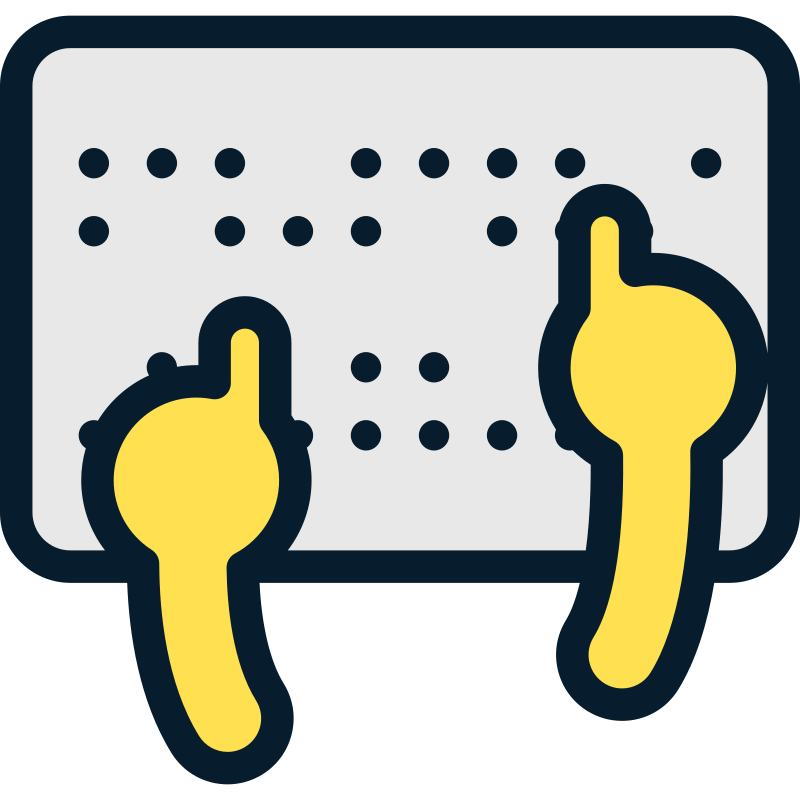
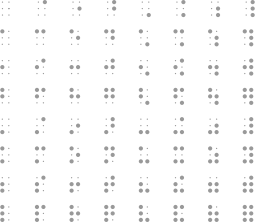
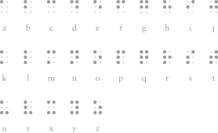

---
tags:
- computerscience
- datascience
- codes
- braille
---

# Braille Code
{.center width="30.0%"}

{align=right width="30.0%"}

Louis Braille was born in 1809 in Coupvray, France, just 25 miles east of Paris. His father was a harness maker. At the age of three, an age when young boys shouldn't be playing in their fathers' workshops, he accidentally stuck a pointed tool in his eye. The wound became infected, and the infection spread to his other eye, leaving him totally blind.

Valentin Haüy (1745--1822), the founder of the Paris school, had invented a system of raised letters on paper that could be read by touch. But this system was very difficult to use, and only a few books had been produced using this method.

The origins of an alternative type of code came from an unexpected source. Charles Barbier, a captain of the French army, had by 1819 devised a system of writing he called écriture nocturne, or "night writing." This system used a pattern of raised dots and dashes on heavy paper and was intended for use by soldiers in passing notes to each other in the dark when quiet was necessary. The soldiers were able to poke these dots and dashes into the back of the paper using an awl-like stylus. The raised dots could then be read with the fingers.

{.center width="10.0%"}

With 6 possible Dots maximum of $2^6=64$ combinations are possible.

{.center width="70.0%"}

## Dictionary

Hereafter a unfinished list of the Braille Grade 2 Dictionary

### Numbers

{.center width="100.0%"}

### Alphabet

{.center width="70.0%"}

### Words

{.center width="100.0%"}

### Sounds

{.center width="100.0%"}
