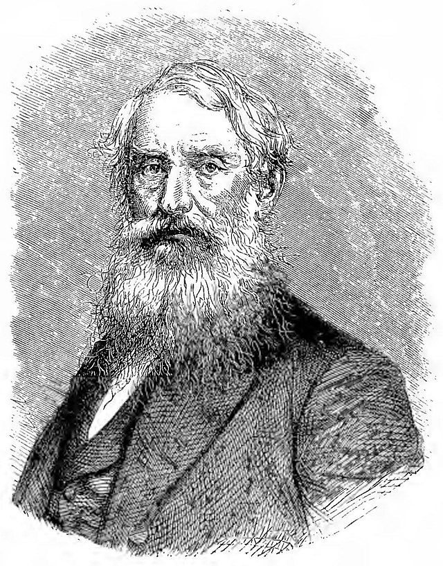
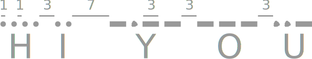
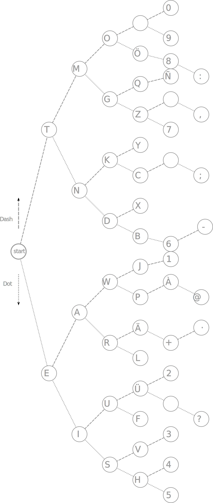
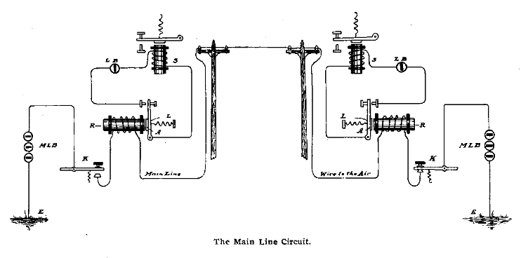

---
tags:
- computerscience
- codes
- morse
---

# Morse Code
{.center width="30.0%"}

{align=right width="30.0%"}

Morse code was invented by Samuel Finley Breese Morse (1791--1872). The code consists of a sequence of Dots and Dashes. There are a couple of rules to follow:

- The length of a dot is one unit
- A dash is three units
- The space between parts of the same letter is one units
- The space between letters is three units
- The space between words os seven units

{.center width="70.0%"}

Morse Code is encoded as follows:

{.center width="60.0%"}

It can be decoded with the help of the decoding tree

{.center width="60.0%"}

Number of possible codes:

  Number of Dots and Dashes  | Number of Codes
  -------------------------- | -----------------
  $1$                        | $2^1=2$
  $2$                        | $2^2=4$
  $3$                        | $2^3=8$
  $4$                        | $2^4=16$
  $5$                        | $2^5=32$
  $6$                        | $2^6=64$
  $7$                        | $2^7=128$
  $8$                        | $2^8=256$
  $9$                        | $2^9=512$
  $10$                       | $2^{10}=1024$

## Telegraph

The most famous application of the morse code is for the telegraph
communication. Over one wire a non-simultaneous bi-directional
communication can be established.

{.center width="100.0%"}
