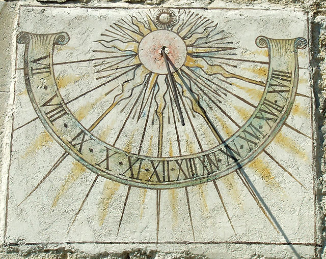
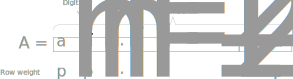

---
tags:
- computerscience
- codes
- number system
- binary
- hexadecimal
- octal
- roman
- decimal
---

# Number System

In many number systems the individual digits have a number and a given weight depending on the base of the system. The resulting value can be calculated as follows:

$$A=\sum_{i=0}^{n-1}a_i*p^i \qquad \qquad 0 \leq a_i\leq p-1$$

## Decimal

The decimal number system (also called base-ten) is the standard system for denoting integer and non-integer numbers. The reason why it is so popular is because people have then fingers.

Hereafter a list of all numbers used in the decimal system.

$$1\quad 2\quad 3\quad 4\quad 5\quad 6\quad 7\quad 8\quad
9$$

A decimal number is calculated as follows:

$$A_{10}=\sum_{i=0}^{n-1}a_i*10^i \qquad \qquad 0 \leq
a_i\leq 10-1$$

Example:

$$ 2059 = 2*10^3+0*10^2+5*10^1*+9*10^0$$

### Calculations

| **+** | 0 | 1  | 2  | 3  | 4  | 5  | 6  | 7  | 8  | 9  |
|:-----:|:-:|:--:|:--:|:--:|:--:|:--:|:--:|:--:|:--:|:--:|
| **0** | 0 | 1  | 2  | 3  | 4  | 5  | 6  | 7  | 8  | 9  |
| **1** | 1 | 2  | 3  | 4  | 5  | 6  | 7  | 8  | 9  | 10 |
| **2** | 2 | 3  | 4  | 5  | 6  | 7  | 8  | 9  | 10 | 11 |
| **3** | 3 | 4  | 5  | 6  | 7  | 8  | 9  | 10 | 11 | 12 |
| **4** | 4 | 5  | 6  | 7  | 8  | 9  | 10 | 11 | 12 | 13 |
| **5** | 5 | 6  | 7  | 8  | 9  | 10 | 11 | 12 | 13 | 14 |
| **6** | 6 | 7  | 8  | 9  | 10 | 11 | 12 | 13 | 14 | 15 |
| **7** | 7 | 8  | 9  | 10 | 11 | 12 | 13 | 14 | 15 | 16 |
| **8** | 8 | 9  | 10 | 11 | 12 | 13 | 14 | 15 | 16 | 17 |
| **9** | 9 | 10 | 11 | 12 | 13 | 14 | 15 | 16 | 17 | 18 |

| ***** | 0 | 1  | 2  | 3  | 4  | 5  | 6  | 7  | 8  | 9  |
|:-----:|:-:|:--:|:--:|:--:|:--:|:--:|:--:|:--:|:--:|:--:|
| **0** | 0 | 0  | 0  | 0  | 0  | 0  | 0  | 0  | 0  | 0  |
| **1** | 0 | 1  | 2  | 3  | 4  | 5  | 6  | 7  | 8  | 9  |
| **2** | 0 | 2  | 4  | 6  | 8  | 10 | 12 | 14 | 16 | 18 |
| **3** | 0 | 3  | 6  | 9  | 12 | 15 | 18 | 21 | 24 | 27 |
| **4** | 0 | 4  | 8  | 12 | 16 | 20 | 24 | 28 | 32 | 36 |
| **5** | 0 | 5  | 10 | 15 | 20 | 25 | 30 | 35 | 40 | 45 |
| **6** | 0 | 6  | 12 | 18 | 24 | 30 | 36 | 42 | 48 | 54 |
| **7** | 0 | 7  | 14 | 21 | 28 | 35 | 42 | 49 | 56 | 63 |
| **8** | 0 | 8  | 16 | 24 | 32 | 40 | 48 | 56 | 64 | 72 |
| **9** | 0 | 9  | 18 | 27 | 26 | 45 | 54 | 63 | 72 | 81 |

## Roman Numerals

Roman numerals are still in use today. It makes it difficult to perform
calculation but allows fora compact representaion of numbers.

  **Symbol** | $I$  |  $V$ |  $X$ |  $L$ | $C$   |  $D$  |  $M$  |
  ---------- |:----:|:----:|:----:|:----:|:-----:|:-----:|:------:
  **Value**  |  1   |   5  |  10  | 50   |  100  | 500   |  1000 |

The 5-2-rule is:

- **5** x $I$ = $X$
- **2** x $V$ = $X$
- **5** x $X$ = $L$
- **2** x $L$ = $C$
- **5** x $C$ = $D$
- **2** x $D$ = $M$

### Additive and Substractive Notation

If smaller or equal symbols are **after**, the have to be added

$$ XIII = 10+3 = 13 $$

$$ VI = 5+1 = 6 $$

$$ DCCLXXX = 500 + 100 + 100 + 50 + 10 + 10 + 10 = 780 $$

If smaller symbols are **before**, they have to be substracted

$$ IV = 5-1 = 4 $$

$$ IX = 10-1 = 9 $$

$$ XL = 50-10 = 40 $$

$$ XC = 100-10 = 90 $$

$$ CD = 500-100 = 400 $$

$$ CM = 1000-100 = 900 $$

### Example

$$ 2014 = MMXIV = 1000+1000+10+5-1 $$

## Binary

Can be represented with $0b(number)$ or $(number)_2$

Hereafter a list of all numbers used in the decimal system.

$$ 0\quad 1 $$

The are certain important terms:

- **MSB** - Most Significant Bit - The number with the biggest weight
- **LSB** - Least Significant Bit - The number with the lowest weight
- **Nibble** - Pack of 4 bits = 1 nibble
- **Byte** - Pack of 8 bits = 1 byte

$$ A_{2}=\sum_{i=0}^{n-1}a_i*2^i \qquad \qquad 0 \leq a_i\leq 2-1 $$

## Octal

Can be represented with $0o(number)$ or $(number)_2$.

Hereafter a list of all numbers used in the decimal system.

$$ 0\quad 1\quad 2\quad 3\quad 4\quad 5\quad 6\quad 7 $$

$$ A_{8}=\sum_{i=0}^{n-1}a_i*8^i \qquad \qquad 0 \leq a_i\leq 8-1 $$

## Hexadecimal

Can be represented with $0x(number)$ or $(number)_{16}$.

Hereafter a list of all numbers used in the decimal system.

$$ 0 \quad 1 \quad 2 \quad 3 \quad 4 \quad 5 \quad 6 \quad 7 \quad 8 \quad 9 \quad A \quad B \quad C \quad D \quad E \quad F $$

4 binary numbers ccorrespond directly to one hexadecimal number. This is very practical to shorten the number while maintaining the same
information.

$$ A_{16}=\sum_{i=0}^{n-1}a_i*16^i \qquad \qquad 0 \leq a_i \leq 16-1 $$

## Conversion

| Decimal | Roman  | Binary | Octal   | Hexadecimal |
|:-------:|:------:|:------:|:-------:|:-----------:|
| $0$     | -      | $0x0$  | $0o0$   | $0b0000$    |
| $1$     | $I$    | $0x1$  | $0o1$   | $0b0001$    |
| $2$     | $II$   | $0x2$  | $0o2$   | $0b0010$    |
| $3$     | $III$  | $0x3$  | $0o3$   | $0b0011$    |
| $4$     | $IV$   | $0x4$  | $0o4$   | $0b0100$    |
| $5$     | $V$    | $0x5$  | $0o5$   | $0b0101$    |
| $6$     | $VI$   | $0x6$  | $0o6$   | $0b0110$    |
| $7$     | $VII$  | $0x7$  | $0o7$   | $0b0111$    |
| $8$     | $VIII$ | $0x8$  | $0o10$  | $0b1000$    |
| $9$     | $IX$   | $0x9$  | $0o11$  | $0b1001$    |
| $10$    | $X$    | $0xA$  | $0o12$  | $0b1010$    |
| $11$    | $XI$   | $0xB$  | $0o13$  | $0b1011$    |
| $12$    | $XII$  | $0xC$  | $0o14$  | $0b1100$    |
| $13$    | $XIII$ | $0xD$  | $0o15$  | $0b1101$    |
| $14$    | $XIV$  | $0xE$  | $0o16$  | $0b1110$    |
| $15$    | $XV$   | $0xF$  | $0o17$  | $0b1111$    |
