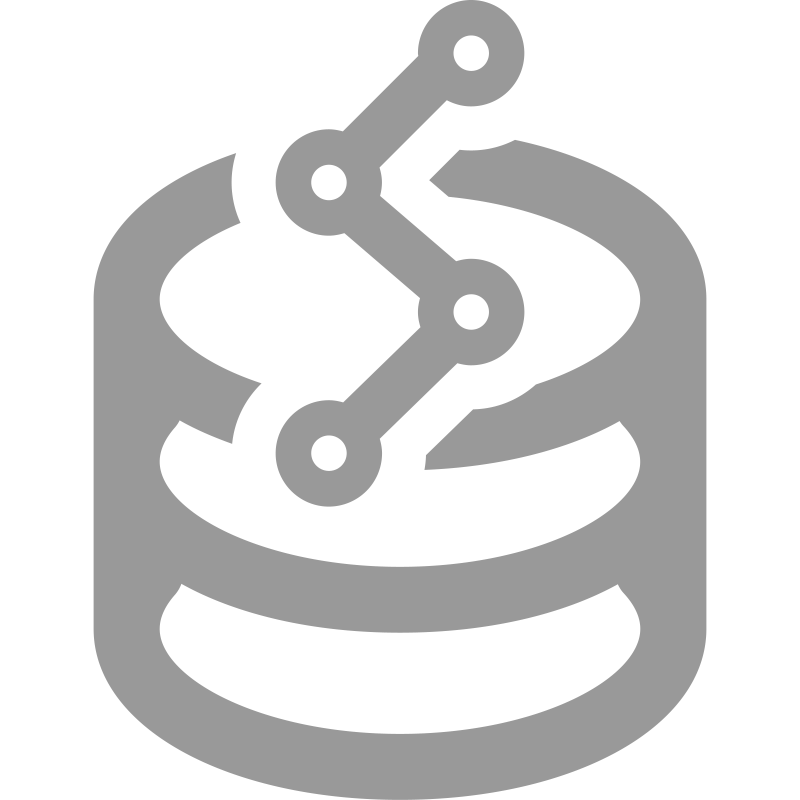
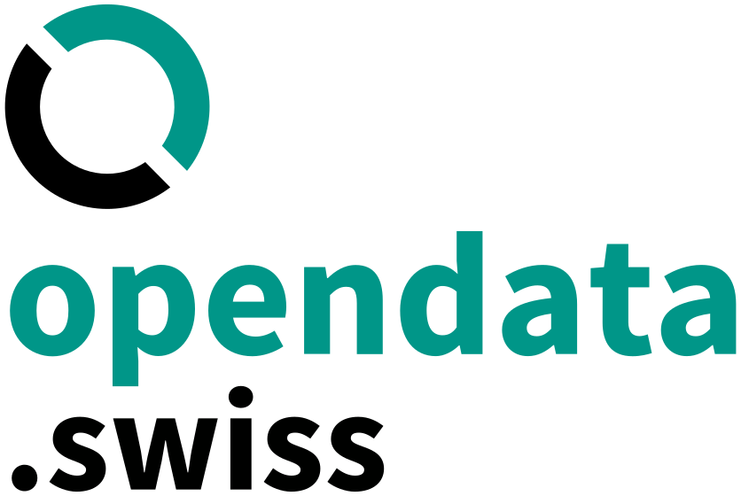

---
tags:
- computerscience
- datascience
---

# Datascience
{.center width="30.0%"}

## Additional Information

- [Data Acadamia](https://datacadamia.com)
- [Becoming Human](https://becominghuman.ai/)

## Data Sources

| Name                                                         | Logo                                           | Reach |
|--------------------------------------------------------------|------------------------------------------------|-------|
| [OpenData.swiss](https://opendata.swiss)                     | {width="100px"}     | Swiss |
| [SBB Data](https://data.sbb.ch)                              | {width="100px"}                | Swiss |
| [Post Data](https://swisspost.opendatasoft.com)              | {width="100px"}               | Swiss |
| [EU Data Portal](https://www.europeandataportal.eu)          | {width="100px"} | European |
| [EU Open Data Portal](https://data.europa.eu/euodp/en/data/) | {width="100px"}              | European |
| [Kaggle](https://www.kaggle.com/)                            | {width="100px"}             | World |