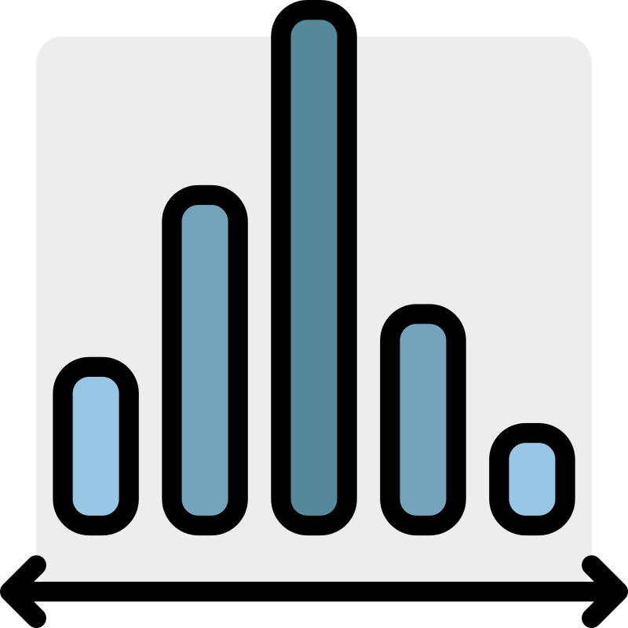
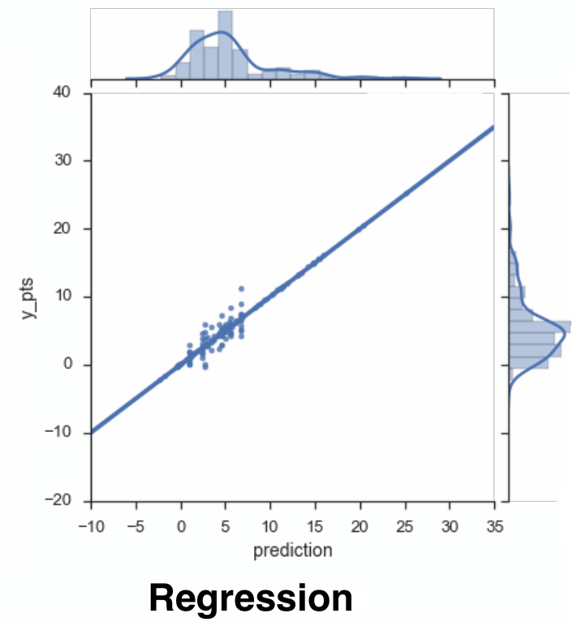
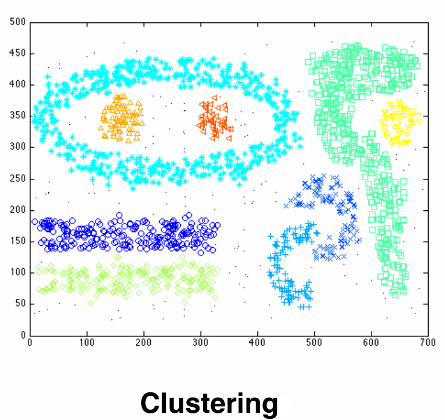
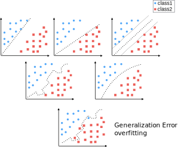

---
tags:
- computerscience
- datascience
- statistics
---

# Statistical Techniques
{.center width="20.0%"}

See also: [Medium Article 10 Statistical Techniques Data Scientist need to Master](https://medium.com/cracking-the-data-science-interview/the-10-statistical-techniques-data-scientists-need-to-master-1ef6dbd531f7)

## Overview

| Technique               | Image                             |
|-------------------------|-----------------------------------|
| Linear Regression       | {width="50%"}           |
| Classification          | {width="50%"}       |
| Clustering              | {width="50%"}           |
| Resampling              | {width="80%"} |
| Subset Selection        |                                   |
| Shrinkage               |                                   |
| Dimension Reduction     |                                   |
| Nonlinear Models        |                                   |
| Tree-Based Methods      |                                   |
| Support Vector Machines |                                   |
| Unsupervised Learning   |                                   |
| Analysis Problems       | {width="80%"}           |
