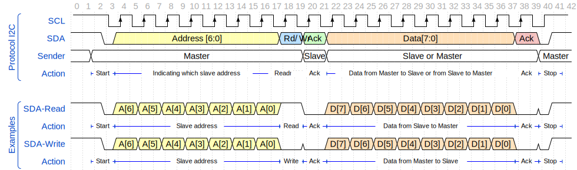

---
tags:
  - hardware
  - communication
  - protocol
  - i2c
---

# I2C Protocol
{.center width="20%"}

## Introduction
$I^2C$ (Inter-Inter Circuit) is a serial communication protocol that allows multiple devices to communicate with each other using only two wires. It was developed by Philips in the 1980s and is widely used in embedded systems.

There are variants Single Master and Multi-Master. In the Single Master configuration, only one device can be the master and initiate communication. In the Multi-Master configuration, multiple devices can be masters and initiate communication.

*SDA* (Serial Data) transmits the data and *SCL* (Serial Clock) is the common clock signal. In the example below, there are 2 master blocks that can initiate communication. They can send data from the buses `DataIn_1` and `DataIn_2` or receive data from *SDA* and forward it on the buses `DataOut_1` and `DataOut_2`. The circuit also includes 2 slave blocks. Slave 1 has the $I^2C$ address of `0x30` and provides the data of an acceleration sensor (`SensorDataIn`). Slave 2 receives data and controls a motor (`ActuatorDataOut`), which has the $I^2C$ address of `0x10`.

{.center width="100%"}

Like SPI, I2C is synchronous, so the output of bits is synchronized to the sampling of bits by a clock signal shared between the master and the slave. The clock signal is always controlled by the master. and unlimited number of Master and maximum of 1008 slaves.

| Mode | Speed |
|------|-------|
| Standard | 100 kbit/s |
| Fast | 400 kbit/s |
| Fast Plus | 1 Mbit/s |
| High Speed | 3.4 Mbit/s |
| Ultra Fast | 5 Mbit/s |

## Protocol

The address and data are transmitted on the signal *SDA* as big endian (MSb first). At the beginning, the master sends a start bit as well as the address and the bit $Rd/\overline{Wr}$ which indicates whether data is read or written (`Read = '1'`). The slave must confirm this with an `ACK` (`Ack = '0'`). Then the data is transmitted. These can come from a master or slave. The other side must confirm this with a new `ACK`. At the end, the stop bit indicates the end of the communication.

{.center width="100%"}

## Advantages
- Only uses two wires
- Supports multiple masters and multiple slaves
- ACK/NACK bit gives confirmation that each frame is transferred successfully
- Hardware is less complicated than with UARTs
- Well known and widely used protocol

## Disadvantages
- Slower data transfer rate than SPI
- The size of the data frame is limited to 8 bits
- More complicated hardware needed to implement than SPI

## References
- [I2C Bus Specification](img/nxp-i2c-userguide-UM10204.pdf)
- [I2C Bus Specification (Online)](https://www.nxp.com/docs/en/user-guide/UM10204.pdf)
- [I2C Wikipedia](https://en.wikipedia.org/wiki/I%C2%B2C)
