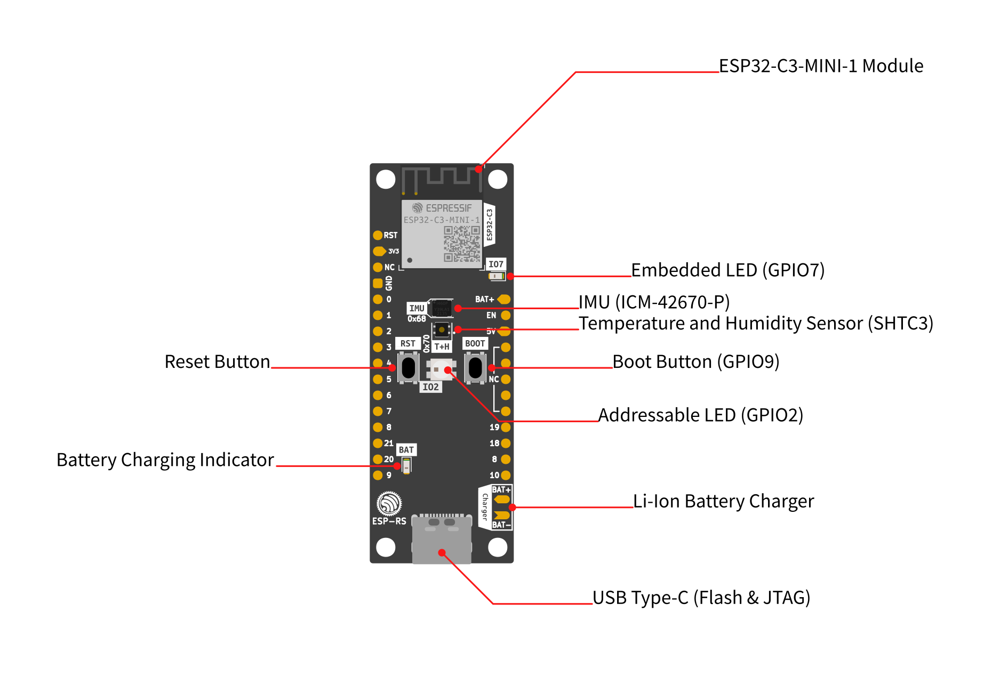

---
tags:
- hardware
- espressif
- esp32
- riscv
---
# ESP32-C3
{.center width="40%"}

This page is specifically about the ESP32-C3-DevKit-Rust Hardware.

This board is based on the ESP32-C3, and includes sensors, LEDs, buttons, a battery charger, and USB type-C connector.

{.center width="80%"}

## SoC Features
- IEEE 802.11 b/g/n-compliant
- Bluetooth 5, Bluetooth mesh
- 32-bit RISC-V single-core processor, up to 160MHz
- 384 KB ROM
- 400 KB SRAM (16 KB for cache)
- 8 KB SRAM in RTC
- 22 × programmable GPIOs
- 3 × SPI
- 2 × UART
- 1 × I2C
- 1 × I2S
- 2 × 54-bit general-purpose timers
- 3 × watchdog timers
- 1 × 52-bit system timer
- Remote Control Peripheral (RMT)
- LED PWM controller (LEDC)
- Full-speed USB Serial/JTAG controller
- General DMA controller (GDMA)
- 1 × TWAI®
- 2 × 12-bit SAR ADCs, up to 6 channels
- 1 × temperature sensor

## Documents

- [ESP32-C3 Datasheet]({{base_repo_file}}/docs/hw/esp32-c3/ESP32-C3 Datasheet.pdf)
- [ESP32-C3 - A Comprehensive guide to IoT]({{base_repo_file}}/docs/hw/esp32-c3/ESP32-C3 - A Comprehensive guide to IoT.pdf)

## Links

- [Espressif ESP32-C3](https://www.espressif.com/en/products/socs/esp32-c3) - Product page
- [Espressive ESP32-C3-DevvKit- Rust](https://github.com/esp-rs/esp-rust-board)

