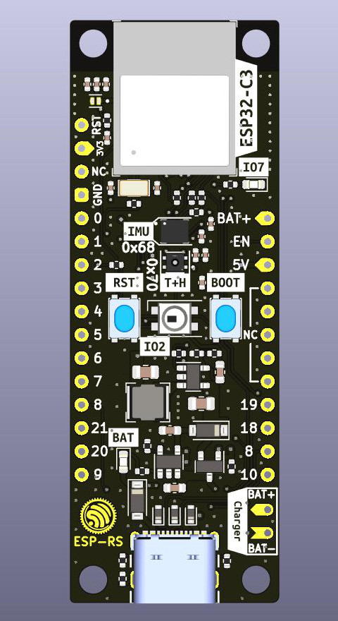

---
tags:
- hardware
- espressif
- esp32
- riscv
---
# ESP32-C3
{.center width="40%"}

This page is specifically about the ESP32-C3-DevKit-Rust Hardware.

This board is based on the ESP32-C3, and includes sensors, LEDs, buttons, a battery charger, and USB type-C connector.

{.center width="80%"}

## SoC Features
- IEEE 802.11 b/g/n-compliant
- Bluetooth 5, Bluetooth mesh
- 32-bit RISC-V single-core processor, up to 160MHz
- 384 KB ROM
- 400 KB SRAM (16 KB for cache)
- 8 KB SRAM in RTC
- 22 × programmable GPIOs
- 3 × SPI
- 2 × UART
- 1 × I2C
- 1 × I2S
- 2 × 54-bit general-purpose timers
- 3 × watchdog timers
- 1 × 52-bit system timer
- Remote Control Peripheral (RMT)
- LED PWM controller (LEDC)
- Full-speed USB Serial/JTAG controller
- General DMA controller (GDMA)
- 1 × TWAI
- 2 × 12-bit SAR ADCs, up to 6 channels
- 1 × temperature sensor

## Documents

- [ESP32-C3 - A Comprehensive guide to IoT](docs/ESP32-C3 - A Comprehensive guide to IoT.pdf)
- [ESP32-C3 Datasheet](docs/ESP32-C3 Datasheet.pdf)
- [ESP-RS Schematic](docs/esp-rs board schematic.pdf)
- [ESP-RS Assembly](docs/esp-rs board assembly.pdf)
- [TDK 6 Axis MEMS Sensor ICM 42670](docs/Datasheet - ICM 42670 6axis mems.pdf)
- [Sensirion Humidity and Temperature Sensor SHTC3](docs/Datasheet - Sensirion SHTC3 Humidity and Temp Sensor.pdf)

## Links

- [Espressif ESP32-C3](https://www.espressif.com/en/products/socs/esp32-c3) - Product page
- [Espressive ESP32-C3-DevKit-Rust](https://github.com/esp-rs/esp-rust-board)

## Board
## Peripherals
### Pin Layout

  | Left  Description | Left  SoC   | Pin   Number | Right  Description | Right  SoC |
  | -------------------: | -------------: | :-------------: | --------------------- | ------------- |
  | Reset                | `EN`/`CHIP_PU` | 1               | VBAT                  |               |
  | 3V3                  |                | 2               | EN [1]                |               |
  | N/C                  |                | 3               | VBUS [2]              |               |
  | GND                  |                | 4               | NC                    |               |
  | IO0/ADC1-0           | `GPIO0`        | 5               | NC                    |               |
  | IO1/ADC1-1           | `GPIO1`        | 6               | NC                    |               |
  | IO2/ADC1-2           | `GPIO2`        | 7               | NC                    |               |
  | IO3/ADC1-3           | `GPIO3`        | 8               | NC                    |               |
  | IO4/ADC2-0           | `GPIO4`        | 9               | IO18/USB_D-           | `GPIO18`      |
  | IO5/ADC2-1           | `GPIO5`        | 10              | IO19/USB_D+           | `GPIO19`      |
  | IO6/MTCK             | `GPIO6`        | 11              | IO8/SCL               | `GPIO8`       |
  | IO7/MTDO/LED         | `GPIO7`        | 12              | IO10/SDA              | `GPIO10`      |
  | IO9/LOG              | `GPIO8`        | 13              | -                     | -             |
  | IO21/U0RXD           | `GPIO21`       | 14              | -                     | -             |
  | IO20/U0TXD           | `GPIO20`       | 15              | -                     | -             |
  | IO9/BOOT             | `GPIO9`        | 16              | -                     | -             |

- [1] Connected to LDO enable pin*
- [2] Connected to USB 5V*

### I/Os
The following devices are connected through GPIO:

| I/O Devices | GPIO    |
| ----------- | ------- |
| WS2812 LED  | `GPIO2` |
| LED         | `GPIO7` |
| Button/Boot | `GPIO9` |

### I2C
This board includes the following peripherals over the I2C bus:

| Peripheral               | Part number | Reference                                                                  | Crate                                     | Address |
| ------------------------ | ----------- | -------------------------------------------------------------------------- | ----------------------------------------- | ------- |
| IMU                      | ICM-42670-P | [Datasheet](docs/Datasheet - ICM 42670 6axis mems.pdf)                     | [Link](https://crates.io/crates/icm42670) | `0x68`  |
| Temperature and Humidity | SHTC3       | [Datasheet](docs/Datasheet - Sensirion SHTC3 Humidity and Temp Sensor.pdf) | [Link](https://crates.io/crates/shtcx)    | `0x70`  |

#### I2C Bus Connection

| Signal | GPIO     |
| ------ | -------- |
| SDA    | `GPIO10` |
| SCL    | `GPIO8`  |

### Power

* USB type-C.
* Li-Ion battery charger - MCP73831T-2ACI/OT, it charges up to 4.2V.
  * Recommendation: MCP73831T-2ACI/OT does not provide battery protection for over-current or over-discharge. For the battery (Li-Ion or Li-Po), it's recommended the ones with embedded protection
  * Limitation: reading the battery voltage is not supported.

## Board Design

{width="300px"} {width="300px"}

## Bill of Material

[Interactive BOM](https://esp-rs.github.io/esp-rust-board/)

## Case

[Case 3D Printing Model](https://www.printables.com/model/288200-minimalistic-case-for-esp32-c3-devkit-rust-1)
