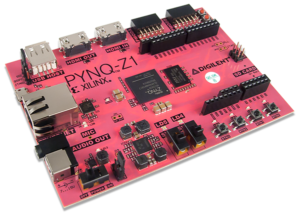

---
tags:
- hardware
- Xilinx
- PYNQ-Z1
---

# Xilinx PYNQ-Z1
{.center width="30%"}

## Additional Informations

- [PYNQ.io Webpage](http://www.pynq.io)
- [PYNQ ReadtheDocs](https://pynq.readthedocs.io)
- [PYNQ Github Source Code](https://github.com/xilinx/pynq)
- [FINN Deep Neural Network Webpage](https://xilinx.github.io/finn/)
- [My Pynq repo](https://github.com/tschinz/pynq_notebooks.git)

## Introduction
- `PS` = Processing System
- `PL` = Program Logic

### Important Linux Commands

``` bash
# Shutdown
shutdown now

# Restart
shutdown -r now
```

### Xilinx Zynq FPGA
The core of a PYNQ Board is a Xilinx ZYNQ-7000 SoC.

- [Zynq-7000 Soc Reference Manual]({{base_repo_file}}/docs/boards/pynq-z1/docs/ug585-Zynq-7000-TRM.pdf)

{.center}

### Start

Program the [SDCard image](http://www.pynq.io/board.html) with
[Rufus](https://rufus.ie/)

- **JP5** Power Selection Set to USB
- **JP4** Boot Selection - Set to SDCard

{.center}

### Access
By default access is grated with the following account

| Hostname | User     | Password |
|----------|----------|----------|
| `pynq`   | `xilinx` | `xilinx` |

#### Ethernet
There is Jupter and Jupyterlab installed it can be accessed by the browser

-   Jupyter Notebooks <http://192.168.2.99> or [http://pynq.local](http://pynq.local)
-   Jupyterlab Notebooks <http://192.168.2.99/lab> or [http://pynq.local/lab](http://pynq.local/lab)

#### USB
USB Serial Terminal can be accessed via putta via the microUSB interface. Terminal Settings are:

- Speed : `115200 baud`
- Datasize : `8 bits`
- Stopbit : `1 bit`
- Parity : `No parity`
- Flow : `No Flow Control`

#### Samba
Samba, a file sharing service, is running on the board. This allows you to access the Pynq home area as a network drive, to transfer files to and from the board.

``` raw
\\192.168.2.99\xilinx
# or
\\pynq.local\xilinx
```