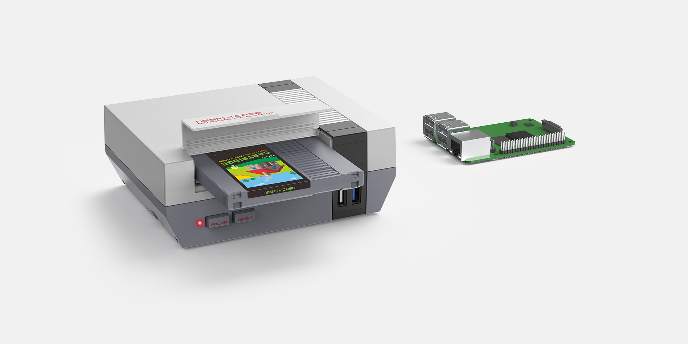

---
tags:
- hardware
- raspberry pi
- retropie
---
# Retroflag Cases
{.center width="30.0%"}

For more detailes about Retroflag cases see their [Webpage](http://www.retroflag.com/) . They are making awesome products.

## Safe Shutdown Feature
Almost every Retroflag case has a build-in safe shutdown feature. This needs to be activated and installed. Installation information can be found on the [github repo](https://github.com/RetroFlag/retroflag-picase)

## NESPi 4 Case
{.center width="90.0%"}

### Safe Shutdown

- Turn switch "SAFE SHUTDOWN" to ON.
- Enter Terminal and execute
    ``` bash
    wget -O - "https://raw.githubusercontent.com/RetroFlag/retroflag-picase/master/install.sh" | sudo bash
    ```