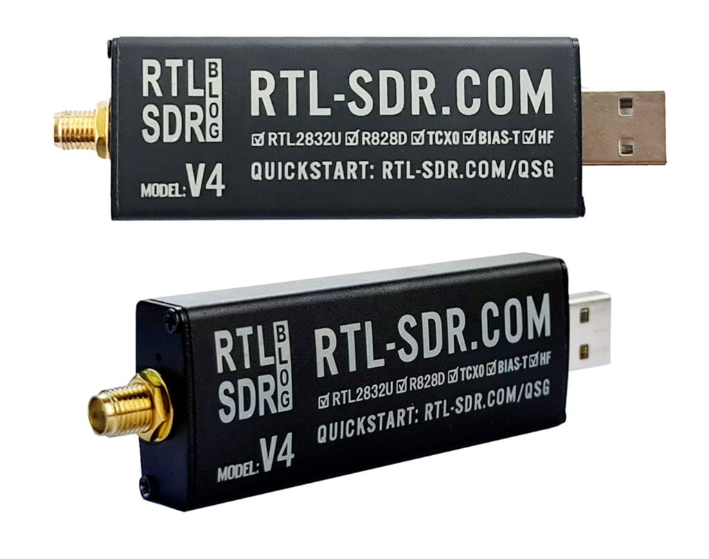
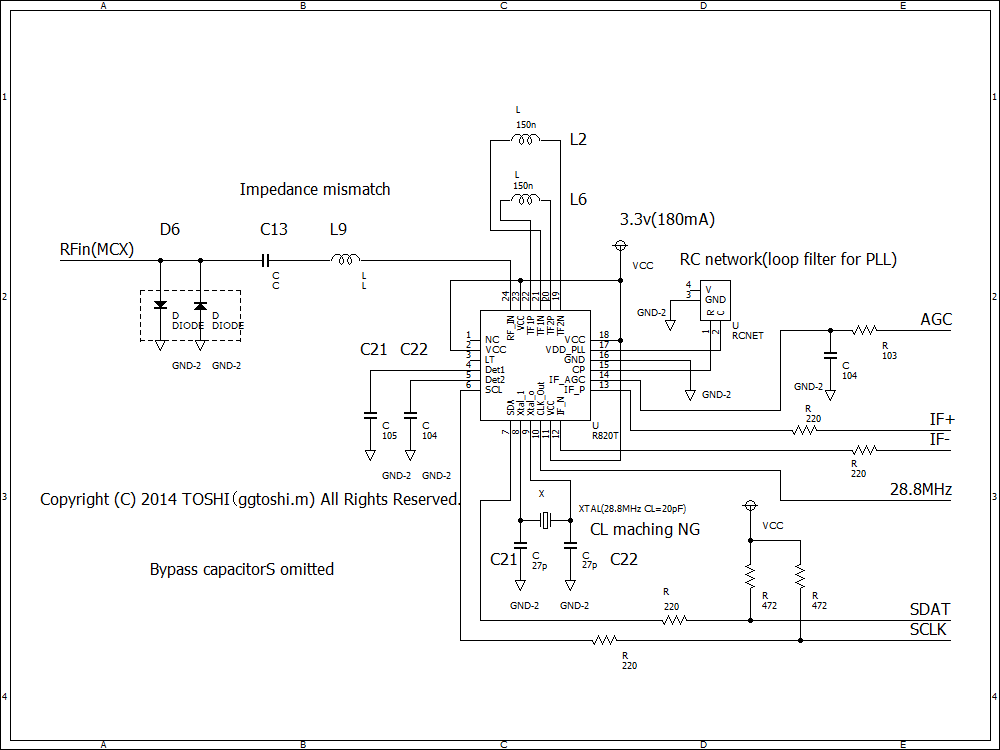

---
tags:
  - hardware
  - hw
  - rtl-sdr
---

# RTL-SDR

[RTL-SDR](https://www.rtl-sdr.com/about-rtl-sdr/) is a very cheap ~$30 USB dongle that can be used as a computer based radio scanner for receiving live radio signals in your area (no internet required). Depending on the particular model it could receive frequencies from 500 kHz up to 1.75 GHz. Most software for the RTL-SDR is also community developed, and provided free of charge. Note that RTL-SDRs cannot transmit.

The origins of RTL-SDR stem from mass produced DVB-T TV tuner dongles that were based on the RTL2832U chipset. It was found that the raw I/Q data on the RTL2832U chipset could be accessed directly, which allowed the DVB-T TV tuner to be converted into a wideband software defined radio via a custom software driver.

{.center width="50%"}

## RTL-SDR v4

The latest version of the dongle is the [RTL-SDR v4](https://www.rtl-sdr.com/V4/). It has a few improvements over the previous versions, including a metal case, a direct sampling mode, and a software switchable bias tee. The direct sampling mode allows the dongle to receive HF frequencies without the need for an upconverter. The bias tee allows you to power external devices such as a LNA (low noise amplifier) or active antenna through the coax cable.

{.center width="100%"}

### Specs

- Sample rate Max: $2.56MS/s - 3.2 MS/s$
- ADC Resolution: 8 bits but the ENOB (Effectove Number of Bits) is around 7 bits
- Input Impedance: $50 \Omega$
- Frequency Range: $24MHz - 1766 MHz$
    - With v4 HF Upconversion: $500 kHz - 28.8MHz$

### Datasheets

- [Realtek RTK2832U Chipset](https://www.kechuang.org/r/303602)
- [Rafael Micro R820T2 Tuner](docs/R820T_datasheet-Non_R-20111130_unlocked1.pdf)
- [Rafael Micro R820T2 Tuner Register Description](docs/R820T2_Register_Description.pdf)

### Diplole Antenna Kit

The basic RTl-SDR Kit comes with a Dipole Antenna Kit. It contains 2 Antenna types:

- $2x 23cm - 1 m$ telescopic antennas.
    - These long telescopic antennas cover VHF to UHF
    - $~70MHz - 285MHz$
- $2x 5cm - 13cm$ telescopic antennas.
    - These smaller antennas cover UHF to $1090 MHz$ ADS-B, and even still work decently up to L-band $1.5 GHz$ frequencies.
    - $~445MHz - 1030MHz$

{.center width="80%"}

#### Orientation

Depending on the signals they have to be oriented horizontally or vertically. A mismatch will result in a $-20dB$ loss.

_Most signals broadcast terrestrially (on Earth) are vertically polarized._

#### Calculator

Depending on the frequency you want to receive you can calculate the length of the antenna with the [Amateur Dipole Antenna Calculator](http://www.csgnetwork.com/antennaedcalc.html)

_In reality extending the antenna to almost any random length will work just fine for most strong signals. But if you're really trying to optimize those weak signals you'll want to fine tune the lengths._

Basically the longer the antenna, the lower it's resonant frequency. The shorter the antenna, the higher the resonant frequency. You want to be close to the resonant frequency. Remember that there is about 2cm of metal inside the antenna itself which needs to be added on. Below is a cheat sheet for various lengths and frequencies.

Length for one side of the Dipol only

| Antenna Size | Sections | Length        | Resonant Frequency |
| ------------ | -------- | ------------- | ------------------ |
| Large        | 5        | $100cm + 2cm$ | $~70 MHz$          |
| Large        | 4        | $80cm + 2cm$  | $~87 MHz$          |
| Large        | 3        | $60cm + 2cm$  | $~115 MHz$         |
| Large        | 2        | $42cm + 2cm$  | $~162 MHz$         |
| Large        | 1        | $23cm + 2cm$  | $~285 MHz$         |
| Small        | 4        | $14cm + 2cm$  | $~445 MHz$         |
| Small        | 3        | $11cm + 2cm$  | $~550 MHz$         |
| Small        | 2        | $8cm + 2cm$   | $~720 MHz$         |
| Small        | 1        | $5cm + 2cm$   | $~1030 MHz$        |

## Software

There are several software options available for RTL-SDR dongles. Some of the most popular ones include:

- [SDR++](https://www.sdrpp.org/) or on this page [SDR++](./../../tools/sdr++/index.md)
- [SDR#](https://airspy.com/download/)
- [HFSDR](https://hdsdr.de/)
- [CubisSDR](https://cubicsdr.com/)
- [GQRX](https://www.gqrx.dk/download)
- [Welle.io](https://www.welle.io/#download) for DAB/DAB+ Radio

## SDR Theory

See the dedicated [SDR page](./../../computerscience/sdr/index.md)
