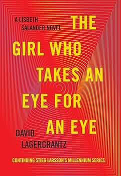
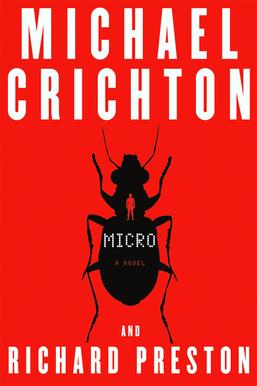
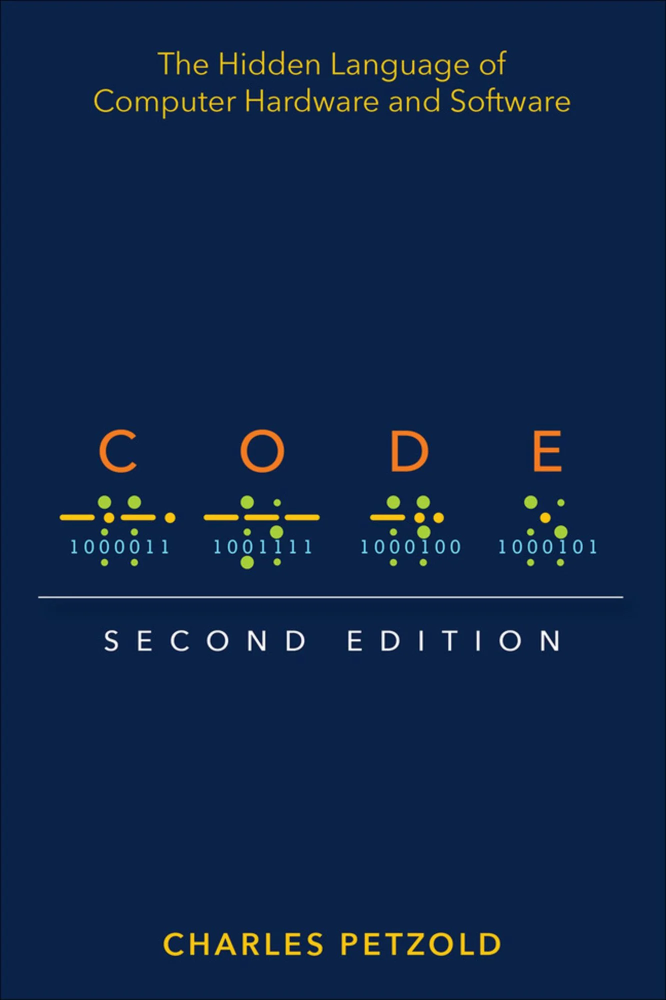
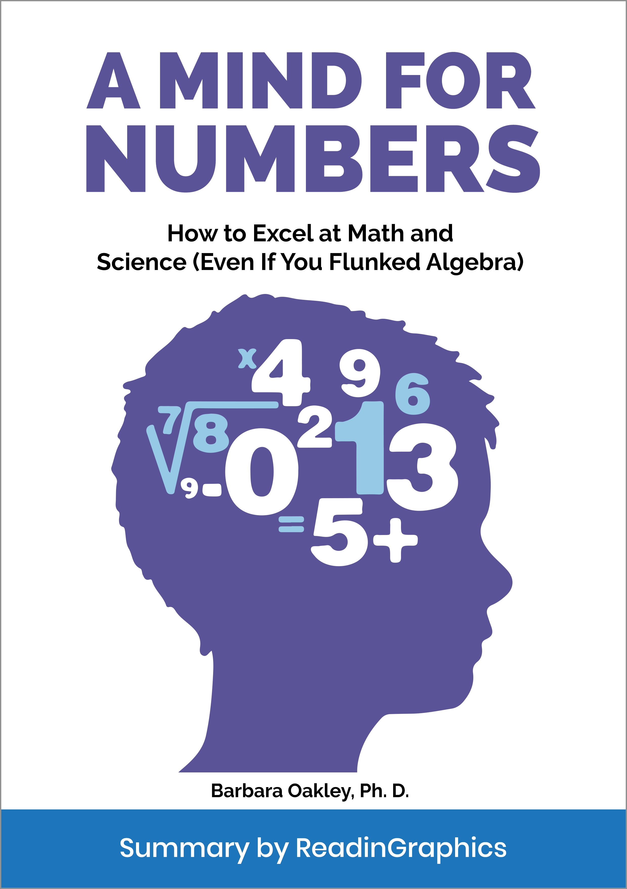

---
tags:
  - multimedia
  - text
  - books
---

# Book Review

{.center width="20%"}

A list of my favorite books

## Crime

| Cover                                                            | Book                                                                                                                                        | Serie                                                                  | Year | Author                                                               | Rating                         |
| ---------------------------------------------------------------- | ------------------------------------------------------------------------------------------------------------------------------------------- | ---------------------------------------------------------------------- | ---- | -------------------------------------------------------------------- | ------------------------------ |
| {width="100px"}      | [Verblendung (The Girl with the Dragon Tattoo)](https://www.google.ch/books/edition/Verblendung/LAJOZsWyJ3YC?hl=de&gbpv=0)                  | [Millenium](<https://en.wikipedia.org/wiki/Millennium_(novel_series)>) | 2005 | [Stieg Larsson](https://en.wikipedia.org/wiki/Stieg_Larsson)         | :star::star::star::star::star: |
| {width="100px"}        | [Verdammnis (The Girl who played with Fire)](https://www.google.ch/books/edition/Verdammnis/L8vhw_62tqwC?hl=de&gbpv=0)                      | [Millenium](<https://en.wikipedia.org/wiki/Millennium_(novel_series)>) | 2006 | [Stieg Larsson](https://en.wikipedia.org/wiki/Stieg_Larsson)         | :star::star::star::star:       |
| {width="100px"} | [Vergebung (The Girl Who Kicked the Hornets Nest)](https://www.google.ch/books/edition/Vergebung/Gi_L423XJP8C?hl=de&gbpv=0)                 | [Millenium](<https://en.wikipedia.org/wiki/Millennium_(novel_series)>) | 2007 | [Stieg Larsson](https://en.wikipedia.org/wiki/Stieg_Larsson)         | :star::star::star::star:       |
| {width="100px"}           | [The Girl in the Spider's Web](https://www.google.ch/books/edition/The_Girl_in_the_Spider_s_Web/9lOWBgAAQBAJ?hl=de&gbpv=0)                  | [Millenium](<https://en.wikipedia.org/wiki/Millennium_(novel_series)>) | 2015 | [David Lagercrantz](https://en.wikipedia.org/wiki/David_Lagercrantz) | :star::star::star:             |
| {width="100px"} | [The Girl Who Takes an Eye for an Eye](hhttps://www.google.ch/books/edition/The_Girl_Who_Takes_an_Eye_for_an_Eye/ENj1DQAAQBAJ?hl=de&gbpv=0) | [Millenium](<https://en.wikipedia.org/wiki/Millennium_(novel_series)>) | 2017 | [David Lagercrantz](https://en.wikipedia.org/wiki/David_Lagercrantz) | :star::star::star:             |
| {width="100px"}             | [The Girl Who Lived Twice](https://www.google.ch/books/edition/The_Girl_Who_Lived_Twice/zgF7DwAAQBAJ?hl=de&gbpv=0)                          | [Millenium](<https://en.wikipedia.org/wiki/Millennium_(novel_series)>) | 2019 | [David Lagercrantz](https://en.wikipedia.org/wiki/David_Lagercrantz) | :star::star::star:             |
| {width="100px"}                         | [Die Fährte](https://www.google.ch/books/edition/Die_F%C3%A4hrte/wS8cAwAAQBAJ?hl=de&gbpv=0)                                                 | Harry Hole                                                             | 2010 | [Jo Nesbø](https://en.wikipedia.org/wiki/Jo_Nesb%C3%B8)              | :star::star::star:             |
| {width="100px"}                          | [Headhunter](https://www.google.ch/books/edition/Headhunter/qOYaAwAAQBAJ?hl=de&gbpv=0)                                                      |                                                                        | 2008 | [Jo Nesbø](https://en.wikipedia.org/wiki/Jo_Nesb%C3%B8)              | :star::star::star:             |
| {width="100px"}                     | [Nicht tot genug](https://www.google.ch/books/edition/Nicht_tot_genug/s4BrAgAAQBAJ?hl=de&gbpv=0)                                            |  -                                                                     | 2012 | [Peter James](<https://en.wikipedia.org/wiki/Peter_James_(writer)>)  | :star::star:                   |
| {width="100px"}                           | [Stirb Ewig](https://www.google.ch/books/edition/_/mUjbMAAACAAJ?hl=de&sa=X&ved=2ahUKEwjvs8qEjaeHAxWpqf0HHXuJCTAQ7_IDegQIFBAC)               |  -                                                                     | 2007 | [Peter James](<https://en.wikipedia.org/wiki/Peter_James_(writer)>)  | :star::star:                   |
| {width="100px"}                       | [Der Vogelmann](https://www.google.ch/books/edition/Der_Vogelmann/KW14zgEACAAJ?hl=de)                                                       |  -                                                                     | 2002 | [Mo Hayder](https://en.wikipedia.org/wiki/Mo_Hayder)                 | :star::star:                   |
| {width="100px"}                                | [Gier](https://www.google.ch/books/edition/Gier/8McUAwAAQBAJ?hl=de&gbpv=0)                                                                  |  -                                                                     | 2012 |  [Arne Dahl](https://en.wikipedia.org/wiki/Arne_Dahl)                | :star::star:                   |
| {width="100px"}                           | [Erlösung](https://www.google.ch/books/edition/Erl%C3%B6sung/hXI5mwEACAAJ?hl=de)                                                            |                                                                        | 2011 | [Adler Olsen](https://en.wikipedia.org/wiki/Jussi_Adler-Olsen)       | :star::star:                   |

## Science-Fiction

| Cover                                                           | Book                                                                                                                                               | Serie                                                                                                  | Year  | Author                                                             | Rating                         |
| --------------------------------------------------------------- | -------------------------------------------------------------------------------------------------------------------------------------------------- | ------------------------------------------------------------------------------------------------------ | ----- | ------------------------------------------------------------------ | ------------------------------ |
| {width="100px"} | [Reise zum Mittelpunkt der Erde](https://www.google.ch/books/edition/Reise_zum_Mittelpunkt_der_Erde/jJ7IEAAAQBAJ?hl=de&gbpv=0)                     |                                                                                                        | 1864  | [Jules Vernes](https://en.wikipedia.org/wiki/Jules_Verne)          | :star::star::star::star:       |
| {width="100px"}               | [Von der Erde zum Mond](https://www.google.ch/books/edition/Von_der_Erde_zum_Mond/nFJpEAAAQBAJ?hl=de&gbpv=0)                                       |                                                                                                        | 1865  | [Jules Vernes](https://en.wikipedia.org/wiki/Jules_Verne)          | :star::star::star:             |
| {width="100px"}        | [20.000 Meilen unter dem Meer](https://www.google.ch/books/edition/20_000_Meilen_unter_dem_Meer/fS3AswEACAAJ?hl=de)                                |                                                                                                        | 1869  | [Jules Vernes](https://en.wikipedia.org/wiki/Jules_Verne)          | :star::star::star::star:       |
| {width="100px"}      | [Reise um die Erde in 80 Tagen](https://www.google.ch/books/edition/Reise_um_die_Erde_in_80_Tagen/5b4sEAAAQBAJ?hl=de&gbpv=0)                       |                                                                                                        | 1873  | [Jules Vernes](https://en.wikipedia.org/wiki/Jules_Verne)          | :star::star::star::star:       |
| {width="100px"}           | [Die geheimnisvolle Insel 1-3](https://www.google.ch/books/edition/Die_geheimnisvolle_Insel/DsPiEAAAQBAJ?hl=de&gbpv=0)                             |                                                                                                        | 1875  | [Jules Vernes](https://en.wikipedia.org/wiki/Jules_Verne)          | :star::star::star:             |
| {width="100px"}                   | [The Invisible Man](https://www.google.ch/books/edition/The_Invisible_Man/vdAOAAAAIAAJ?hl=de&gbpv=0)                                               |                                                                                                        | 1897  | [H.G. Wells](https://en.wikipedia.org/wiki/H._G._Wells)            | :star::star::star::star:       |
| {width="100px"}                   | [The Time Machine](https://www.google.ch/books/edition/The_Time_Machine/51aMCgAAQBAJ?hl=de&gbpv=0)                                                 |                                                                                                        | 1895  | [H.G. Wells](https://en.wikipedia.org/wiki/H._G._Wells)            | :star::star::star::star:       |
| {width="100px"}                                | [1984](https://www.google.ch/books/edition/1984/ImAGEAAAQBAJ?hl=de&gbpv=0)                                                                         |                                                                                                        | 1949  | [George Orwell](https://en.wikipedia.org/wiki/George_Orwell)       | :star::star::star::star::star: |
| {width="100px"}                               | [Dune 50th Anniversary Edition](https://isbnsearch.org/isbn/9780340960196)                                                                         | [Dune](<https://en.wikipedia.org/wiki/Dune_(franchise)>)                                               | 1965  | [Frank Herbert](https://en.wikipedia.org/wiki/Frank_Herbert)       | :star::star::star::star:       |
| {width="100px"} | [Do Androids Dream of Electric Sheep](https://www.google.ch/books/edition/Do_Androids_Dream_of_Electric_Sheep/mEQqGwAACAAJ?hl=de)                  |                                                                                                        | 1968  | [Philip K Dick](https://en.wikipedia.org/wiki/Philip_K._Dick)      | :star::star:                   |
| {width="100px"}                             |  [The Dig](https://www.google.ch/books/edition/The_Dig/pI05H-o0pZ8C)                                                                               |                                                                                                        | 1997  | Alan Dean Foster                                                   | :star::star::star:             |
| {width="100px"}                       | [The Departure](https://www.google.ch/books/edition/The_Departure/QQeGQCVVsOEC?hl=de&gbpv=1&dq=Departure+Neal&printsec=frontcover)                 | Owner trilogy                                                                                          | 2011  | [Neal Asher](https://en.wikipedia.org/wiki/Neal_Asher)             | :star::star::star::star:       |
| {width="100px"}                      | [Jurassic Park](https://www.google.ch/books/edition/Jurassic_Park/V5s14nks9I8C?hl=de&gbpv=0)                                                       |                                                                                                        | 1990  | [Michael Crichton](https://en.wikipedia.org/wiki/Michael_Crichton) | :star::star::star:             |
| {width="100px"}                     | [The Lost Word](https://www.google.ch/books/edition/The_Lost_World/mDlHyTmvLG4C?hl=de&gbpv=0)                                                      |                                                                                                        | 1995  | [Michael Crichton](https://en.wikipedia.org/wiki/Michael_Crichton) | :star::star:                   |
| {width="100px"}                           | [Timeline](https://www.google.ch/books/edition/Timeline/CaQgAQAAIAAJ?hl=de&gbpv=0&bsq=timeline%20michael)                                          |                                                                                                        | 1999  | [Michael Crichton](https://en.wikipedia.org/wiki/Michael_Crichton) | :star::star::star::star:       |
| {width="100px"}                        | [Enthüllung](https://www.google.ch/books/edition/Enth%C3%BCllung/qu3RAwAAQBAJ?hl=de&gbpv=0)                                                        |                                                                                                        | 2000  | [Michael Crichton](https://en.wikipedia.org/wiki/Michael_Crichton) | :star::star:                   |
| {width="100px"}                                | [Prey](https://www.google.ch/books/edition/_/_o9D4dXUHLEC?hl=de&sa=X&ved=2ahUKEwin77TykqeHAxVCif0HHc87A3EQ7_IDegQIEhAE)                            |                                                                                                        | 2003  | [Michael Crichton](https://en.wikipedia.org/wiki/Michael_Crichton) | :star::star::star::star:       |
| {width="100px"}                       | [State of fear](https://www.google.ch/books/edition/State_of_Fear/m5Uo4aEvsU4C?hl=de&gbpv=0&bsq=state%20of%20fear)                                 |                                                                                                        | 2004  | [Michael Crichton](https://en.wikipedia.org/wiki/Michael_Crichton) | :star::star::star:             |
| {width="100px"}                                | [Next](https://www.google.ch/books/edition/Next/cZR5vQL0nhwC?hl=de&gbpv=0)                                                                         |                                                                                                        | 2006  | [Michael Crichton](https://en.wikipedia.org/wiki/Michael_Crichton) | :star::star::star::star:       |
| {width="100px"}                   | [Gold - Pirate Latitudes](https://www.google.ch/books/edition/_/oYpWPgAACAAJ?hl=de&sa=X&ved=2ahUKEwiN27--lqeHAxVthv0HHe1AAzoQ7_IDegQIDhAC)         |                                                                                                        | 2009  | [Michael Crichton](https://en.wikipedia.org/wiki/Michael_Crichton) | :star::star::star:             |
| {width="100px"}                               | [Micro](https://www.google.ch/books/edition/Micro/vDVfRJG9sXwC?hl=de&gbpv=0)                                                                       |                                                                                                        | 2011  | [Michael Crichton](https://en.wikipedia.org/wiki/Michael_Crichton) | :star::star::star::star:       |
| {width="100px"}     |  [Per Anhalter durch die Galaxis](https://www.google.ch/books/edition/_/lmt4SwAACAAJ?hl=de&sa=X&ved=2ahUKEwjLr_eul6eHAxXk_rsIHaQ_BysQ7_IDegQIChAD) | [Hitchhiker's Guide to the Galaxy](https://en.wikipedia.org/wiki/The_Hitchhiker's_Guide_to_the_Galaxy) | 1979  | [Douglas Adams](https://en.wikipedia.org/wiki/Douglas_Adams)       | :star::star::star::star::star: |
| {width="100px"}  | [Machs gut und Danke für den Fisch](https://www.google.ch/books/edition/Macht_s_gut_und_danke_f%C3%BCr_den_Fisch/-oKYQAAACAAJ)                     | [Hitchhiker's Guide to the Galaxy](https://en.wikipedia.org/wiki/The_Hitchhiker's_Guide_to_the_Galaxy) | 1984  | [Douglas Adams](https://en.wikipedia.org/wiki/Douglas_Adams)       | :star::star::star::star:       |
| {width="100px"}  | [Restaurant am Ende des Universums](https://www.google.ch/books/edition/Das_Restaurant_am_Ende_des_Universums/RXaEAAAACAAJ)                        | [Hitchhiker's Guide to the Galaxy](https://en.wikipedia.org/wiki/The_Hitchhiker's_Guide_to_the_Galaxy) | 1980  | [Douglas Adams](https://en.wikipedia.org/wiki/Douglas_Adams)       | :star::star::star::star:       |

## Biography

| Cover                                                        | Book                                                                                                                                                 | Year | Author                                                           | Rating                   |
| ------------------------------------------------------------ | ---------------------------------------------------------------------------------------------------------------------------------------------------- | ---- | ---------------------------------------------------------------- | ------------------------ |
| {width="100px"}               | [Leonardo Da Vinci](https://www.google.ch/books/edition/Leonardo_da_Vinci/ylhttps://www.google.ch/books/edition/Elon_Musk/lmWzBgAAQBAJ?hl=de&gbpv=0) | 2015 | [Ashlee Vance](https://en.wikipedia.org/wiki/Ashlee_Vance)       | :star::star::star::star: |
| {width="100px"} | [Surely you're joking Mr Feynman](https://www.google.ch/books/edition/Surely_You_re_Joking_Mr_Feynman_Adventur/7papZR4oVssC?hl=de&gbpv=0)            | 1985 | [Richard Feynman](https://en.wikipedia.org/wiki/Richard_Feynman) | :star::star::star:       |
| {width="100px"}                      | [Steve Jobs](https://www.google.ch/books/edition/Steve_Jobs/ZgrDRPlNNfQC?hl=de&gbpv=0)                                                               | 2011 | [Walter Isaacson](https://en.wikipedia.org/wiki/Walter_Isaacson) | :star::star::star::star: |
| {width="100px"}                     | [Hit Refesh](https://www.google.ch/books/edition/Hit_Refresh/y8JwDwAAQBAJ?hl=de&gbpv=0)                                                              | 2018 | [Satya Nadella](https://en.wikipedia.org/wiki/Satya_Nadella)     | :star::star:             |
| {width="100px"}                | [Edward Snowden - Permanent Record](https://www.google.ch/books/edition/Permanent_Record/0XCcDwAAQBAJ?hl=de&gbpv=0)                                  | 2019 | [Edward Snowden](https://en.wikipedia.org/wiki/Edward_Snowden)   | :star::star::star::star: |

## Science

| Cover                                                                  | Book                                                                                                                                           | Year | Author                                                           | Rating                   |
| ---------------------------------------------------------------------- | ---------------------------------------------------------------------------------------------------------------------------------------------- | ---- | ---------------------------------------------------------------- | ------------------------ |
| {width="100px"}                  | [Code The Hidden Language of Computer Hardware and Software](https://www.google.ch/books/edition/Code/iNfPEAAAQBAJ?hl=de&gbpv=0)               | 2022 | Charles Petzold                                                  | :star::star:             |
| {width="100px"} | [What is ChatGPT Doing and Why does it work?](https://www.google.ch/books/edition/What_Is_ChatGPT_Doing_and_Why_Does_It_Wo/8WL0zwEACAAJ?hl=de) | 2022 | [Stephen Wolfram](https://en.wikipedia.org/wiki/Stephen_Wolfram) | :star::star:             |
| {width="100px"}                              | [The Rust Programming Language](https://doc.rust-lang.org/stable/book/)                                                                        | 2021 | Steve Klabnik                                                    | :star::star::star::star: |
| {width="100px"}                        | [Rust for Rustaceans](https://rust-for-rustaceans.com/)                                                                                        | 2021 | Jon Gjengset                                                     | :star::star::star::star: |
| {width="100px"}                             | [Rust in Action](https://www.manning.com/books/rust-in-action)                                                                                 | 2021 | Tim McNamara                                                     | :star::star::star:       |
| {width="100px"}                           | [Programming Rust](https://www.oreilly.com/library/view/programming-rust-2nd/9781492052586/)                                                   | 2021 | Jim Blandy, Jason Orendorff & Leaonora F.S. Tindall              | :star::star:             |

## Psychology

| Cover                                                                  | Book                                                                                                                                             | Year | Author           | Rating             |
| ---------------------------------------------------------------------- | ------------------------------------------------------------------------------------------------------------------------------------------------ | ---- | ---------------- | ------------------ |
| {width="100px"}                         | [Supercommunicators](https://www.google.ch/books/edition/Supercommunicators/D9e_EAAAQBAJ?hl=de&gbpv=1&dq=supercommunicators&printsec=frontcover) | 2024 | Charles Duhigg   | :star::star::star: |
| {width="100px"}                              | [Atomic Habits](https://books.google.ch/books/about/Atomic_Habits.html?id=lFhbDwAAQBAJ)                                                          | 2018 | James Clear      | :star::star::star: |
| {width="100px"}                       | [Talking to Strangers](https://www.google.ch/books/edition/Talking_to_Strangers/DwaHDwAAQBAJ)                                                    | 2019 | Malcolm Gladwell | :star::star:       |
| {width="100px"}        | [How to Win Friends and Influence People](https://www.google.ch/books/edition/How_To_Win_Friends_and_Influence_People/yxfJDVXClucC)              | 1937 | Dale Carnegie    | :star::star::star: |
| {width="100px"}                         | [A Mind for Numbers](https://www.google.ch/books/edition/A_Mind_For_Numbers/Sb1iAgAAQBAJ)                                                        | 2014 | Barbara Oakley   | :star: |
| {width="100px"}                           | [Learn Like a Pro](https://www.google.ch/books/edition/Learn_Like_a_Pro/-9f3DwAAQBAJ)                                                            | 2020 | Barbara Oakley   | :star::star: |
| {width="100px"}          | [The Subtle Art of not Giving a Fuck](https://www.google.de/books/edition/Die_subtile_Kunst_des_Daraufschei%C3%9Fens/A0-HDQAAQBAJ)               | 2016 | Mark Manson      | :star::star: |
