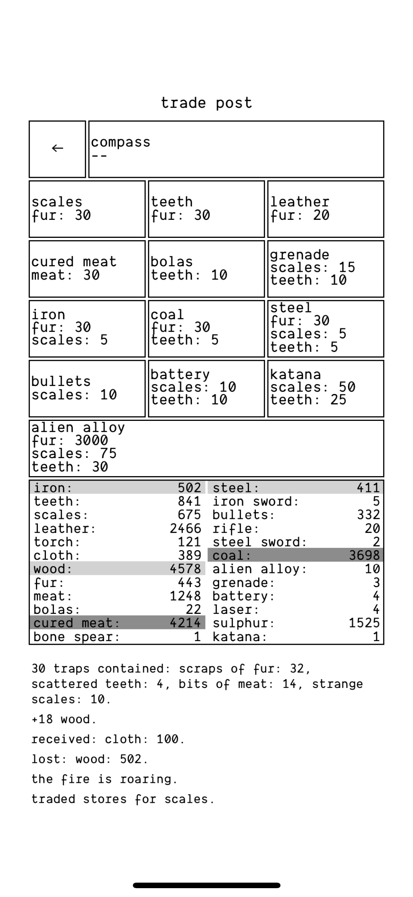
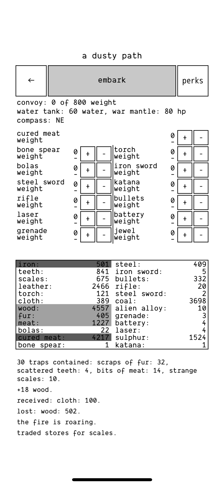
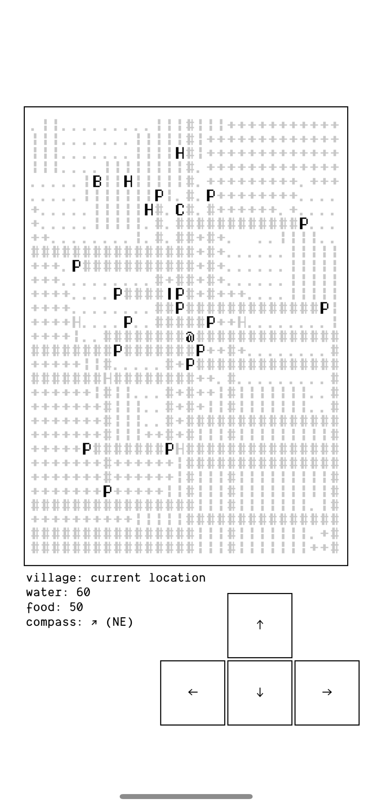

---
tags:
- multimedia
- games
- a dark room
---
# A Dark Room
An amazing open source game of a different kind.

You can play in on your mobile [iOS](https://apps.apple.com/us/app/a-dark-room/id736683061) or [Android](https://play.google.com/store/apps/details?id=com.yourcompany.adarkroom&pli=1) or in the [browser](https://adarkroom.doublespeakgames.com/).

Here some screenshots of the unlocked items in the game

{width="49%"}
{width="49%"}
{width="49%"}
{width="49%"}
{width="49%"}
{width="49%"}
{width="49%"}

## Map Elements

The map shows many symbols here is a list of what they mean

```
P - An Outpost
M - A Murky Swamp
V - A Damp Cave
O - A Deserted Town
Y - A Ruined City
H - An Old House
F - A Forgotten Battlefield
B - A Huge Borehole
W - A Crashed Ship
S - The Sulphur Mine
C - The Coal Mine
I - The Iron Mine
U - A Destroyed Village
X - A Ravaged Battleship

; Forest
, Field
. Barrens
# Road
```

## Random Encounters
- **Noises**. Strange sounds in the store room? Better look. You'll usually find Wood stolen… though in exchange, the creatures who committed the deed leave something better behind.
- **A Beast Attack**. Snarling creatures burst from the forest and kill a few of your villagers. There's now way to avoid this. Mourn your dead and wait for replacements.
- **A Ruined Trap**. A beast destroys a random number of Traps. You can follow and kill it, if you wish, but the damage is already done.
- **Strangers**
- **The Mysterious Wanderer**. These vagabonds trot up to your village and ask that you fill their cart with Wood or Furs, in increments of 100 or 500. They promise they'll return. Accede to their demands and you'll typically never see them again. Every now and then, though, they'll come back with more resources than you gave them. Not a bad idea at first, but later on it's a forgivable gamble.
- **The Nomad**. Nomads will sell you Scales, Teeth, Bait and a Compass at reduced prices from what you'll see at the Trading Company. You can save a lot on resources if you wait for one to show up.
- **The Beggar**. He will ask you for Furs to keep him warm. Accommodate him and he'll leave behind a small amount of a random item, usually Teeth or Scales.
- **The Thief**. Your villagers discover a man who's been pilfering supplies. You can either execute him or spare him. Execute him and the thieving of your storeroom will end. Sparing him is nevertheless the superior choice, as it grants you the Stealthy perk.
- **The Scout**. This worldly woman is willing to exchange maps (uncovered portions of A Dusty Road) for Fur and Scales. She will also teach you the art of Scouting for Fur, Scales, and Teeth. The maps aren't that amazing, but Scouting is well worth the price.
- **The Master**. An old man wants shelter in the form of Fur, Cured Meat, and a Torch. Supply him with these three things and he'll bestow one of three Perks upon you, all of which make life on A Dusty Path much easier. Evasion gives you the [FILL THE BLANK] Perk; [BLANK] gives you the [FILL THE BLANK] Perk; Force gives you the Barbarian Perk.

## Items
- **Cart**. The first item you'll get. Carts allow you to carry more Wood back to town when you Gather. Useful at first, though eventually you won't have to Gather Wood anymore.
- **Trap**. Traps are deployed automatically. Check them when you can and you will get small amounts of Fur, Teeth, Meat, Cloth and Scales. You'll get more resources if you buy more Traps, to a maximum of ten.
- **Compass**. Allows you to access A Dusty Path. The Compass can be bought from a Nomad at a reduced price.
- **Torch**. Torches allow you to explore darkened places on A Dusty Path, namely abandoned buildings and caves. Without Torches you can't enter these areas.
- **Waterskin**. Allows you to take more water when you explore A Dusty Path, to a maximum of 20.
- **Rucksack**. Alloxs you to carry more items when you explore A Dusty Path, to a maximum weight of 20.
- **Cask**. Allows you to take more water when you explore A Dusty Path, to a maximum of 30.
- **Wagon**. Allows you to carry more items when you explore A Dusty Path, to a maximum weight of 40.
- **Water Tank**. Allows you to take more water when you explore A Dusty Path, to a maximum of 60.
- **Convoy**. Allows you to carry more items when you explore A Dusty Path, to a maximum weight of 70.
- **Bullet**. Used as ammunition in Rifles.
- **Energy Pack**. Used as ammunition in Energy Rifles.

## Weapons
- **Bone Spear**. The base weapon, and the cheapest to create. Bone Spears do two damage when they hit.
- **Iron Sword**. The next in line. Iron Swords do four damage when they hit.
- **Steel Sword**. Getting stronger! Steel Swords do six damage when they hit. They're the weapon you're most likely to find while wandering around cities and caves.
- **Bayonet**. Quite a piece of work. Bayonets do eight damage when they hit.x
- **Rifle**. Your first projectile weapon. Rifles do five damage when they hit. Each attack requires one Bullet.
- **Laser Rifle**. Your next projectile weapon. Laser Rifles do eight damage when they hit. Each attack requires one Energy Pack.
- **Bolas**. Temporarily stuns an enemy. Bolas are extremely useful against stronger enemies that attack constantly. Single use only.
- **Grenades**. Deals 15 damage to an enemy. Single use only.

## Armour
- `L` Armour. Leather. Raises your HP on A Dusty Path to 15.
- `I` Armour. Iron. Raises your HP on A Dusty Path to 25
- `S` Armour. Steel. Raises your HP on A Dusty Path to 45.

## Enemies

This list may be somewhat inaccurate. It's difficult to catch every detail when you can't pause.

- **Snarling Beast** - 5 HP, 1 damage. Drops Fur, Meat, Teeth.
- **Gaunt Man** - 6 HP, 2 damage. Drops Cloth.
- **Man / Squatter** - 10 HP, 3 damage. Drops Cured Meat and Cloth.
- **Chief** - 20 HP, 5 damage. Cured Meat, Cloth, Iron.
- **Cave Lizard** - 6 HP, 3 damage. Drops Scales and Teeth.
- **Giant Lizard / Beastly Matriarch** - 10 HP, 4 damage. Drops Scales and Teeth.
- **Man-Eater / Beast** - 25 HP, 3 damage. Drops Fur, Meat, Teeth.
- **Thug** - 30 HP, 4 damage. Drops Cloth and Cured Meat.
- **Squatters** - 30 HP, 3 damage. Drops Teeth. Very fast attackers.
- **Scavenger** - 30 HP, 5 damage. Drops Cured Meat, Leather.
- **Feral Terror** - 45 HP, 9 damage. Drops Fur, Meat, Teeth.
- **Youth** - 45 HP, 2 damage. Drops Teeth and Cloth.
- **Sniper** - 30 HP, 15 damage. Drops Cloth, Bullets, Rifle.
- **Soldier** - 45 HP, 8 damage. Drops Cured Meat, Bullets, Rifle. Some soldiers have 50 HP rather than 45.
- **Commando** - 45 HP, 3 damage. Drops Cured Meat.
- **Veteran** - 65 HP, 10 damage. Drops Cured Meat, Bayonet.

## A Dusty Path Map Legend
- **A** - Your village. Return here when your travelling is done, and try not to stray too far from it.
- **P** - An outpost. These appear whenever you clear an area. Each time you embark on a new journey, these spots will yield up a small stock of Cured Meat. They'll also fully restore your water.
- **H** - An abandoned house. You'll usually find Squatters and a few uncommon items inside. You may also discover a well that will restore your water.
- **V** - A cave. You'll need several Torches to explore caves. Monsters dwell within, though if you make it to the rear of the cave you'll usually discover a cache of items.
- **I** - An iron mine. Guess what you're most likely to find inside. Successfully clearing out an iron mine allows you to allocate workers as Iron Miners.
- **C** - A coal mine. Again, guess what's inside. Successfully clearing out a coal mine allows you to allocate workers as Coal Miners.
- **O** - A deserted town. Towns can be normally explored, though on occasion you'll need Torches to proceed. Good places to gather equipment.
- **B** - A huge borehole. The primary place to find Alien Alloy.
- **F** - A forgotten battlefield. You'll typically find a bunch of high-tech equipment in these areas. Very useful.
- **S** - A sulphur mine. Like the other mines, it can be cleared out to gain access to Sulphur Miners.
- **Y** - A ruined city. Similar to a town, though with more dangerous inhabitants and better prizes to claim.
- **M** - A murky swamp. If you bring a Charm to the man inside, he'll share a bit of the lore of the world, and his former place in it. Talking to him will get you the Gastronome Perk.
- **W** - A crashed ship. Finding this sparks the end of the game. Upgrade it with Alien Alloy and you can use it to flee into the great unknown.

## Perks

This list is incomplete. I couldn't for the life of me, in three hours of waiting, get another Master to visit my village. I'll finish it off when I have better luck.

- **Stealthy** - Reduces the chances you'll run into enemies on the main map while moving around. Gained by sparing The Thief.
- **Barbarian** - Increases the damage dealt with each hit. The amount of extra damage depends on the weapon. Learned from The Master.
- **Gastronome** - Doubles the amount of health regained upon eating Cured Meat.
