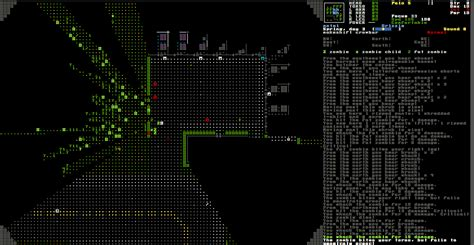
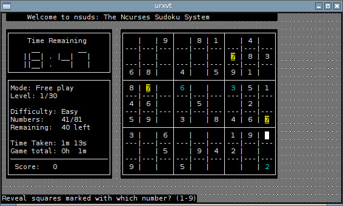

---
tags:
- multimedia
- games
- terminal
---
# Terminal Games
{.center width="20%"}

Hereafter a list of cool terminal games

# `greed`

[Greed @github](https://github.com/garrettleising/GREED)

The object of Greed is to erase as much of the screen as possible by moving around in a grid of numbers. To move your cursor, simply use your arrow keys or the the 'wedcxzaq' keys. Your location is signified by
the ! symbol.

``` bash
brew install greed
greed
```

{.center width="80%"}

# `cataclysm`

[Cataclysm - The Dark Days Ahead](https://cataclysmdda.org)

Cataclysm: Dark Days Ahead is a turn-based survival game set in a post-apocalyptic world. Struggle to survive in a harsh, persistent, procedurally generated world. Scavenge the remnants of a dead civilization for food, equipment, or, if you are lucky, a vehicle with a full tank of gas to get you the hell out of Dodge. Fight to defeat or escape from a wide variety of powerful monstrosities, from zombies to giant insects to killer robots and things far stranger and deadlier, and against the others like yourself, that want what you have...

``` bash
brew install cataclysm
cataclysm
```

{.center width="80%"}

# `nethack`

[Nethack](http://www.nethack.org)

NetHack is a wonderfully silly, yet quite addictive, Dungeons & Dragons-style adventure game. You play a character from one of many classes (such as wizard, ranger, or tourist), fighting your way down to retrieve the Amulet of Yendor (try saying THAT one backwards!) for your god. On the way, you might encounter a quantum mechanic or two, or perhaps King Arthur, or - if you're REALLY lucky - the Ravenous Bugblatter Beast of Traal.

``` bash
brew install nethack
nethack
```

{.center width="80%"}

# `rogue`

[Rogue](https://en.wikipedia.org/wiki/Rogue_(video_game))

Rogue (also known as Rogue: Exploring the Dungeons of Doom) is a dungeon crawling video game by Michael Toy and Glenn Wichman with later contributions by Ken Arnold. Rogue was originally developed around 1980 for Unix-based minicomputer systems as a freely distributed executable. Commercial ports of the game for a range of personal computers were made by Toy, Wichman, and Jon Lane under the company A.I. Design and financially supported by the Epyx software publishers. Additional ports to modern systems have been made since by other parties using the game's now-open source code.

``` bash
brew install rogue
rogue
```

{.center width="80%"}

# Sudoku `nsuds`

[nsud](https://sourceforge.net/projects/nsuds/)

An in-development text-graphical sudoku game, with pencil marking support and very few dependencies.

``` bash
brew install nsuds
nsuds
```

{.center width="80%"}

# Sudoku `nudoku`

[Ndoku](http://jubalh.github.io/nudoku/)

ncurses based sudoku game

``` bash
brew install nudoku
nudoku
```

{.center width="80%"}

# Snake `nsnake`

[nSnake](https://github.com/alexdantas/nSnake)

nsnake is a clone of the classic snake game that we all used to play on our cellphones. You play this game on the terminal, with textual interface.

``` bash
brew install nsnake
nsnake
```

{.center width="80%"}

# `typespeed`

A terminal based typing test.

``` bash
brew install typespeed
typespeed
```

{.center width="80%"}

# `tt`

A terminal based typing test.

``` bash
sudo curl -L https://github.com/lemnos/tt/releases/download/v0.4.2/tt-osx -o /usr/local/bin/tt && sudo chmod +x /usr/local/bin/tt
sudo curl -o /usr/local/share/man/man1/tt.1.gz -L https://github.com/lemnos/tt/releases/download/v0.4.2/tt.1.gz
tt
```

{.center width="80%"}

# Pacman `myman`

[MaMan](https://myman.sourceforge.io)

MyMan is a text-mode videogame inspired by Namco's Pac-Man. It has been ported to a variety of operating systems using the following for user interaction: ncurses, PDcurses, XCurses, sysV-curses, old BSD curses, old VMS curses, S/Lang slcurses, Win32 console, VMS console, raw stdio and termios, GGI, Allegro, aalib, libcaca, TWin, and Carbon. It produces plain-text and HTML screenshots which may give a reasonable approximation of how it will look in a text terminal.

``` bash
brew install myman
myman
```

{.center width="80%"}

# Space Invaders `ninvaders`

[ninvaderws](https://github.com/CleanCut/invaders)

Invaders is an open source terminal arcade game with audio, based off of the "Space Invaders" classic arcade game.

``` bash
brew install myman
myman
```

{.center width="80%"}

# `tetris`

[Tetris](https://github.com/samtay/tetris)

A terminal interface for Tetris

``` bash
brew install samtay/tui/tetris
tetris
```

{.center width="80%"}
