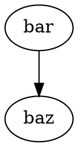
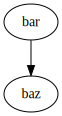
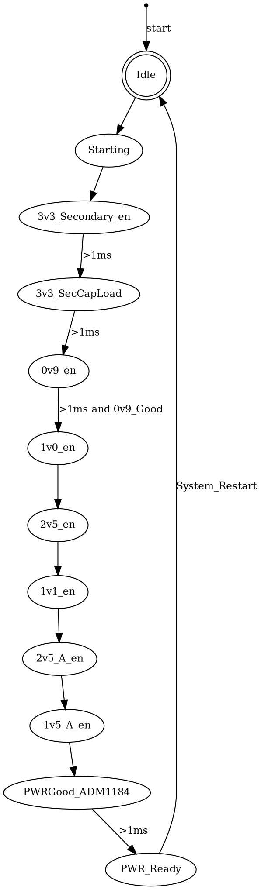
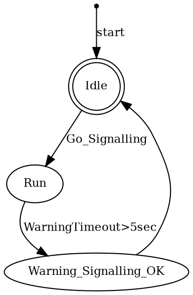
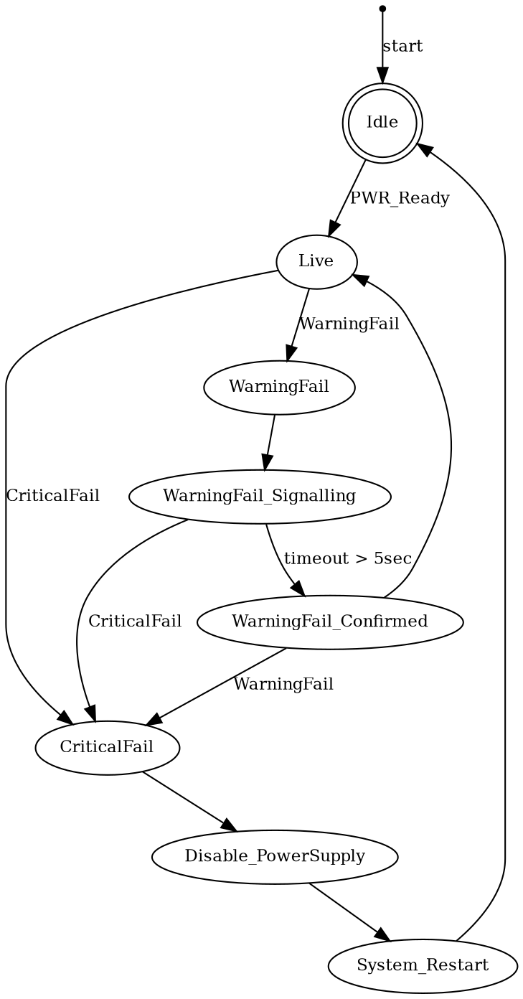
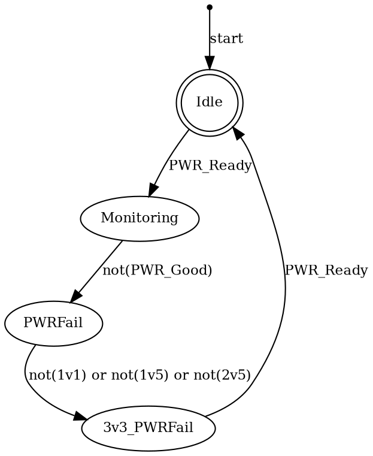

---
tags:
- multimedia
- picture
- graphviz
---
# Graphviz
{.center width="20%"}

## State Machines

```graphviz
digraph foo {
  "bar" -> "baz";
}
```

{.center}

```graphviz
digraph finite_state_machine {
  rankdir=TB;
  size="100";
  graph [fontsize=11];
  edge  [fontsize=11];
  start [fontsize=11, shape="point"]
  node  [fontsize=11, shape = doublecircle]; Idle;
  node  [fontsize=11, shape = ellipse]; Starting "3v3_Secondary_en" "3v3_SecCapLoad" "0v9_en" "1v0_en" "2v5_en" "1v1_en" "2v5_A_en" "1v5_A_en" "PWRGood_ADM1184" "PWR_Ready";
  start                  -> Idle [ label = "start"];
  Idle                   -> Starting;
  Starting               -> "3v3_Secondary_en";
  "3v3_Secondary_en"     -> "3v3_SecCapLoad" [label = ">1ms"];
  "3v3_SecCapLoad"       -> "0v9_en" [label = ">1ms"];
  "0v9_en"               -> "1v0_en" [label = ">1ms and 0v9_Good"];
  "1v0_en"               -> "2v5_en";
  "2v5_en"               -> "1v1_en";
  "1v1_en"               -> "2v5_A_en";
  "2v5_A_en"             -> "1v5_A_en";
  "1v5_A_en"             -> "PWRGood_ADM1184";
  "PWRGood_ADM1184"      -> "PWR_Ready" [label = ">1ms"];
  "PWR_Ready"            -> "Idle" [label = "System_Restart"];
}
```

{.center}

```graphviz
digraph finite_state_machine {
  rankdir=TB;
  size="100";
  graph [fontsize=11];
  edge  [fontsize=11];
  start [fontsize=11, shape="point"]
  node  [fontsize=11, shape = doublecircle]; Idle;
  node  [fontsize=11, shape = ellipse]; Run Warning_Signalling_OK;
  start                  -> Idle [ label = "start"];
  Idle                   -> Run [ label = "Go_Signalling" ];
  Run                    -> Warning_Signalling_OK [ label = "WarningTimeout>5sec" ];
  Warning_Signalling_OK  -> Idle;
}
```

{.center}

```graphviz
digraph finite_state_machine {
  rankdir=TB;
  size="100";
  graph [fontsize=11];
  edge  [fontsize=11];
  start [fontsize=11, shape="point"]
  node  [fontsize=11, shape = doublecircle]; Idle;
  node  [fontsize=11, shape = ellipse]; Live CriticalFail WarningFail WarningFail_Signalling WarningFail_Confirmed Disable_PowerSupply System_Restart;
  start                  -> Idle [ label = "start"];
  Idle                   -> Live [ label = "PWR_Ready"];
  Live                   -> CriticalFail [ label = "CriticalFail"];
  Live                   -> WarningFail [ label = "WarningFail"];
  WarningFail            -> WarningFail_Signalling;
  WarningFail_Signalling -> WarningFail_Confirmed [ label = "timeout > 5sec"];
  WarningFail_Signalling -> CriticalFail [ label = "CriticalFail"];
  WarningFail_Confirmed  -> CriticalFail [ label = "WarningFail"];
  WarningFail_Confirmed  -> Live;
  CriticalFail           -> Disable_PowerSupply;
  Disable_PowerSupply    -> System_Restart;
  System_Restart         -> Idle;
}
```

{.center}

```graphviz
digraph finite_state_machine {
  rankdir=TB;
  size="100";
  graph [fontsize=11];
  edge  [fontsize=11];
  start [fontsize=11, shape="point"]
  node  [fontsize=11, shape = doublecircle]; Idle;
  node  [fontsize=11, shape = ellipse]; Monitoring PWRFail "3v3_PWRFail";
  start                  -> Idle [ label = "start"];
  Idle                   -> Monitoring [ label = "PWR_Ready" ];
  Monitoring             -> PWRFail [ label = "not(PWR_Good)" ];
  PWRFail                -> "3v3_PWRFail" [ label = "not(1v1) or not(1v5) or not(2v5)" ];
  "3v3_PWRFail"          -> Idle [ label = "PWR_Ready" ];
}
```
{.center}
