---
tags:
- multimedia
- picture
- mermaid
---
# Mermaid
{.center width="20%"}

-   [Mermaid Webpage](https://mermaid-js.github.io/mermaid/#/)
-   [Mermaid Live Editor](https://mermaid.live)

## Graph

```
graph  TD;

  A --> B;
  A --> C;
  B --> D;
  C --> D;
```


```
graph TD
    A[Christmas] -->|Get money| B(Go shopping)
    B --> C{Let me think}
    C -->|One| D[Laptop]
    C -->|Two| E[iPhone]
    C -->|Three| F[fa:fa-car Car]
```

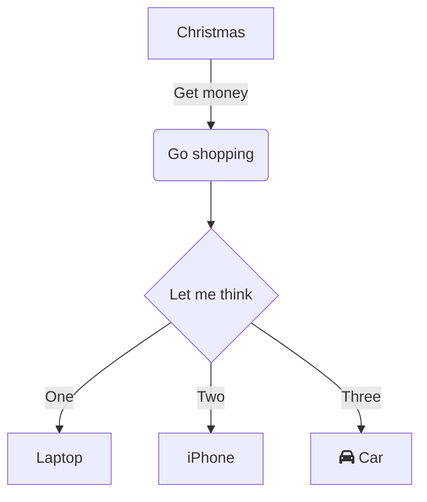

## State Diagram

```
stateDiagram-v2
    [*] --> Still
    Still --> [*]
    Still --> Moving
    Moving --> Still
    Moving --> Crash
    Crash --> [*]
```

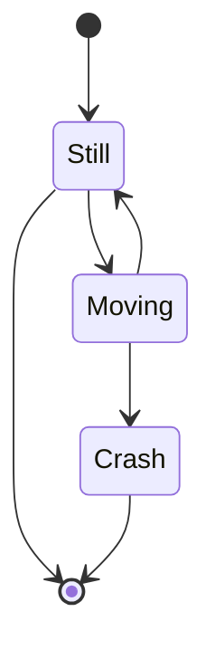

## Flowchart

```
flowchart LR;
    A-->B;
    B-->C;
    C-->D;
    click A callback "Tooltip for a callback"
    click B "http://www.github.com" "This is a tooltip for a link"
    click A call callback() "Tooltip for a callback"
    click B href "http://www.github.com" "This is a tooltip for a link"
```

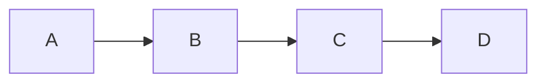

## Gantt

```
gantt
  dateFormat YYYY-MM-DD
  title Gantt diagram
  excludes weekdays 2014-01-10

  section A section
  Completed task :done,   des1, 2014-01-06,2014-01-08
  Active task    :active, des2, 2014-01-09,3d
  Future task    :        des3, after des2, 5d
  Future task2   :        des4, after des3, 10d
```

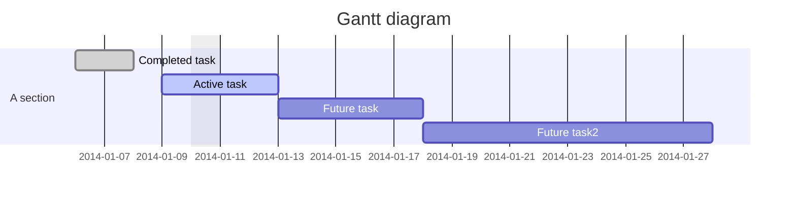

```
gantt
    dateFormat  YYYY-MM-DD
    title       Adding GANTT diagram functionality to mermaid
    excludes    weekends
    %% (`excludes` accepts specific dates in YYYY-MM-DD format, days of the week ("sunday") or "weekends", but not the word "weekdays".)

    section A section
    Completed task            :done,    des1, 2014-01-06,2014-01-08
    Active task               :active,  des2, 2014-01-09, 3d
    Future task               :         des3, after des2, 5d
    Future task2              :         des4, after des3, 5d

    section Critical tasks
    Completed task in the critical line :crit, done, 2014-01-06,24h
    Implement parser and jison          :crit, done, after des1, 2d
    Create tests for parser             :crit, active, 3d
    Future task in critical line        :crit, 5d
    Create tests for renderer           :2d
    Add to mermaid                      :1d
    Functionality added                 :milestone, 2014-01-25, 0d

    section Documentation
    Describe gantt syntax               :active, a1, after des1, 3d
    Add gantt diagram to demo page      :after a1  , 20h
    Add another diagram to demo page    :doc1, after a1  , 48h

    section Last section
    Describe gantt syntax               :after doc1, 3d
    Add gantt diagram to demo page      :20h
    Add another diagram to demo page    :48h
```

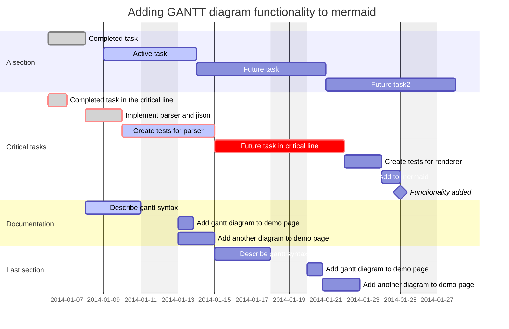

## Journey

```
journey
    title My working day
    section Go to work
      Make tea: 5: Me
      Go upstairs: 3: Me
      Do work: 1: Me, Cat
    section Go home
      Go downstairs: 5: Me
      Sit down: 5: Me
```

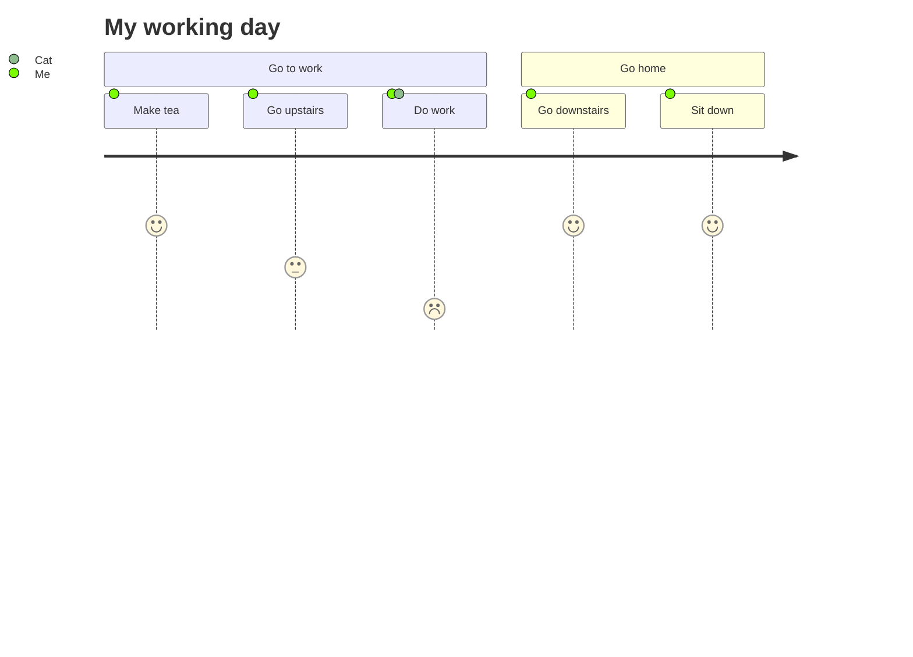

## Sequence Diagram

```
sequenceDiagram
    Alice->>+John: Hello John, how are you?
    Alice->>+John: John, can you hear me?
    John-->>-Alice: Hi Alice, I can hear you!
    John-->>-Alice: I feel great!
```

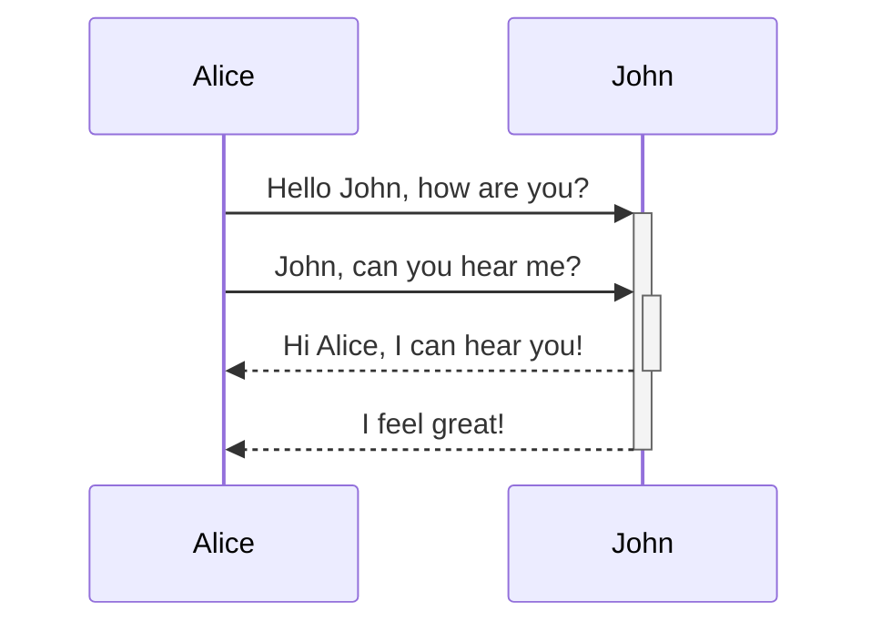

```
sequenceDiagram

  participant V as VISITOR
  participant C as CLIENT
  participant I as IDENTITY SERVICE
  participant D as DATABASE
  participant M as MAILER

  V->>C: sign up request
  C->>V: registration page
  V->>C: desired credentials
  alt Invalid Credentials
    C->>V: validation error
  else Valid Credentials
    C->>I: create user
  end
  alt Already Registered
    I->>C: validation error
    C->>V: login page
  else Registration Fails
    I->>D: insert user record
    I->>D: insert session record
    D->>I: database error
    I->>C: registration error
    C->>V: server error
  else Registration Succeeds
    I->>D: insert user record
    I->>D: insert session record
    I-->>M: send verification email
    I->>C: session token
    C->>V: welcome page
  end
```

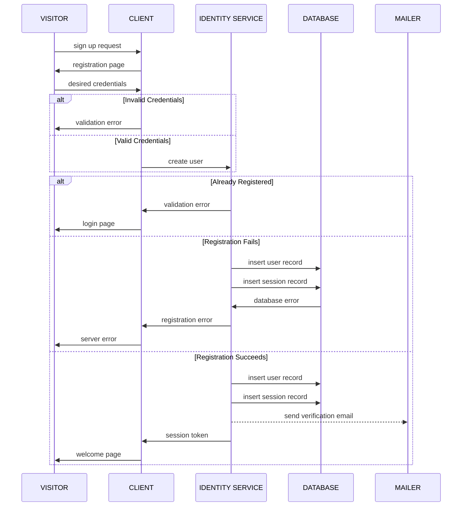

## Class Diagram

```
classDiagram
    Animal <|-- Duck
    Animal <|-- Fish
    Animal <|-- Zebra
    Animal : +int age
    Animal : +String gender
    Animal: +isMammal()
    Animal: +mate()
    class Duck{
      +String beakColor
      +swim()
      +quack()
    }
    class Fish{
      -int sizeInFeet
      -canEat()
    }
    class Zebra{
      +bool is_wild
      +run()
    }
```

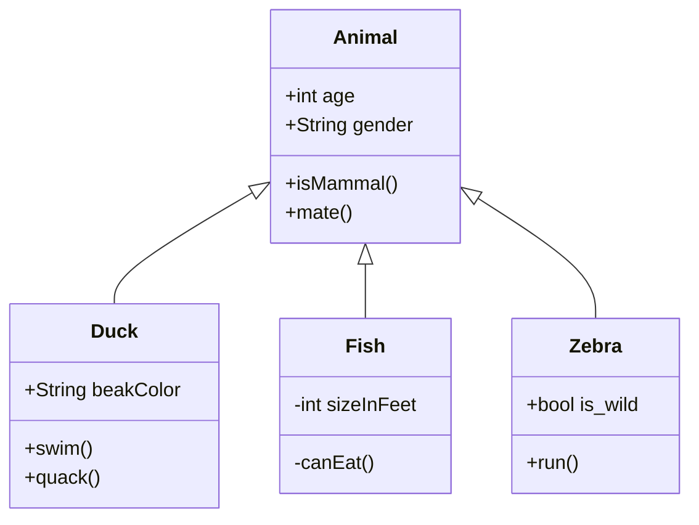

## Pie Chart

```
pie title Pets adopted by volunteers
    "Dogs" : 386
    "Cats" : 85
    "Rats" : 15
```

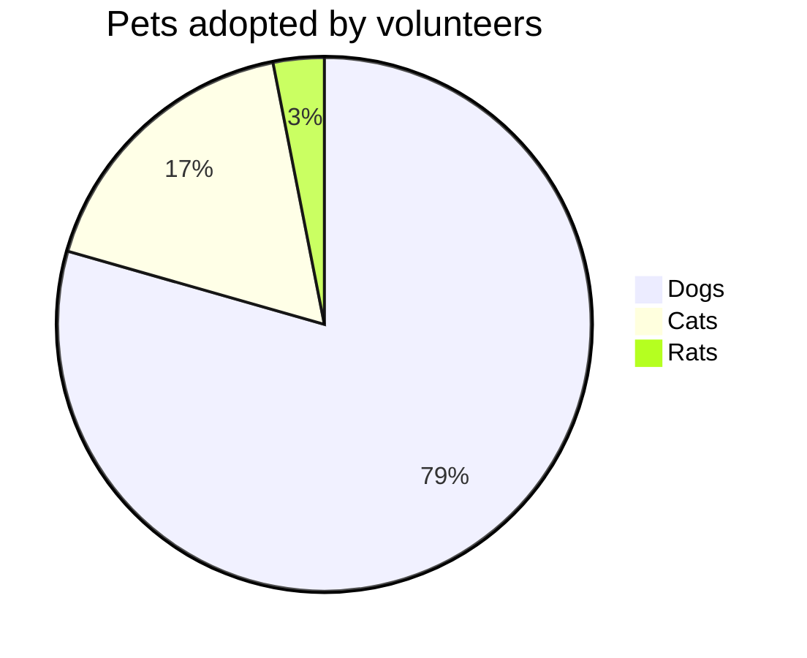

# ER Diagram

```
erDiagram
          CUSTOMER }|..|{ DELIVERY-ADDRESS : has
          CUSTOMER ||--o{ ORDER : places
          CUSTOMER ||--o{ INVOICE : "liable for"
          DELIVERY-ADDRESS ||--o{ ORDER : receives
          INVOICE ||--|{ ORDER : covers
          ORDER ||--|{ ORDER-ITEM : includes
          PRODUCT-CATEGORY ||--|{ PRODUCT : contains
          PRODUCT ||--o{ ORDER-ITEM : "ordered in"
```

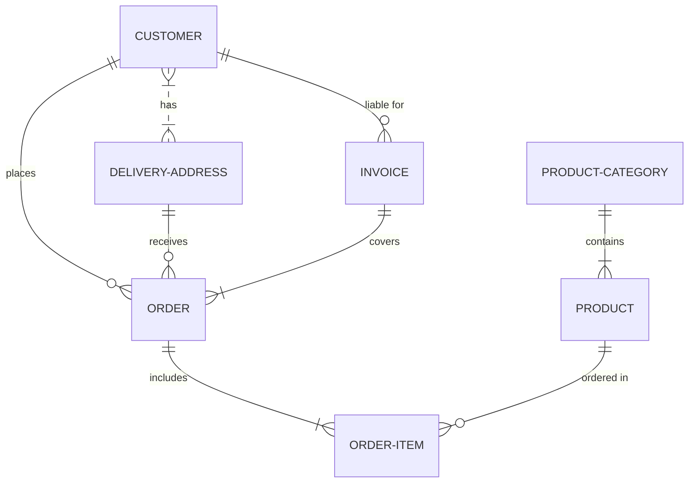

