---
tags:
- multimedia
- picture
- plantuml
---
# PlantUml
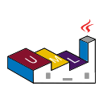{.center}{.center width="20%"}

- [PlantUML Reference Guide]({{base_repo_file}}/docs/multimedia/pictures/docs/PlantUML_Language_Reference_Guide_en.pdf)
- [PlantUML Webpage](https://plantuml.com/)
- [PlantUML Ashley Doc](https://plantuml-documentation.readthedocs.io/en/latest/)
- [PlantText Live Editor](https://planttext.com/)

## Skinparam

With the `skinparam` you can change the feel and design of the whole Diagram

### Shadows

``` plantuml
skinparam shadowing false
```

### Colors

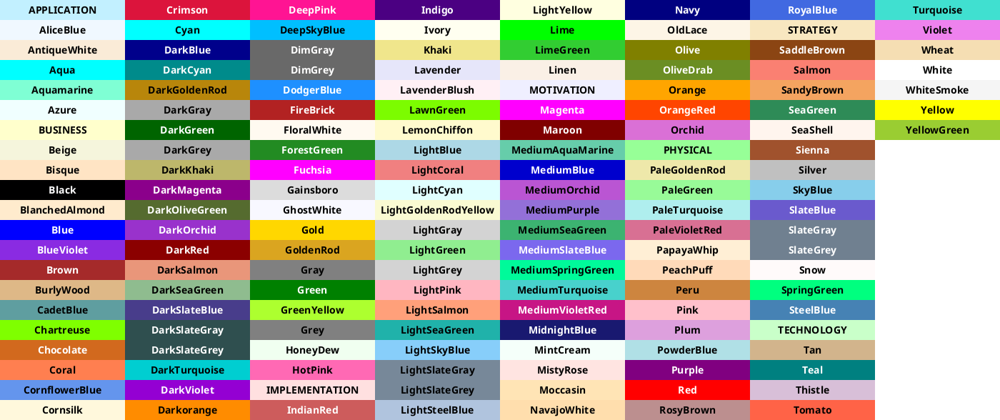

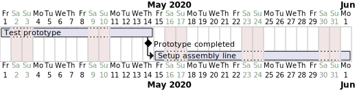{.center}

#### Black and White

``` plantuml
skinparam monochrome true
```

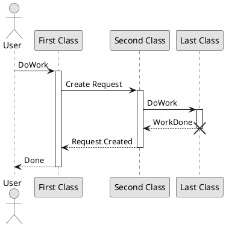

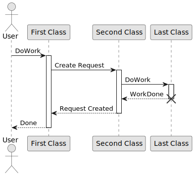{.center}

#### White and Black

``` plantuml
skinparam monochrome reverse
```

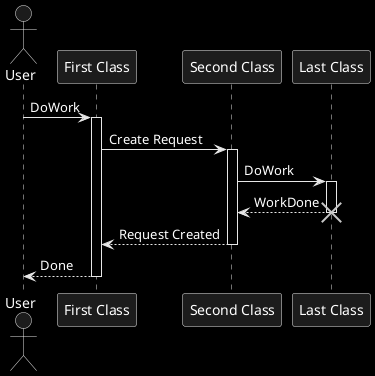

{.center}

## Sequence Diagram

``` plantuml
participant Alice
participant "The **Famous** Bob" as Bob

Alice -> Bob : hello --there--
... Some ~~long delay~~ ...
Bob -> Alice : ok
note left
  This is **bold**
  This is //italics//
  This is ""monospaced""
  This is --stroked--
  This is __underlined__
  This is ~~waved~~
end note

Alice -> Bob : A //well formatted// message
note right of Alice
This is <back:cadetblue><size:18>displayed</size></back>
__left of__ Alice.
end note
note left of Bob
<u:red>This</u> is <color #118888>displayed</color>
**<color purple>left of</color> <s:red>Alice</strike> Bob**.
end note
note over Alice, Bob
<w:#FF33FF>This is hosted</w> by 
end note
```

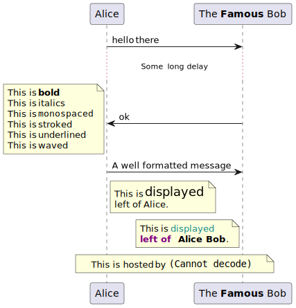{.center}

## Use Case Diagram

```plantuml
:Main Admin: as Admin
(Use the application) as (Use)

User -> (Start)
User --> (Use)

Admin ---> (Use)

note right of Admin : This is an example.

note right of (Use)
  A note can also
  be on several lines
end note

note "This note is connected\nto several objects." as N2
(Start) .. N2
N2 .. (Use)
```

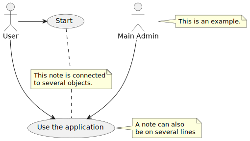{.center}

## Class Diagram

```plantuml
Object <|-- ArrayList

Object : equals()
ArrayList : Object[] elementData
ArrayList : size()
```

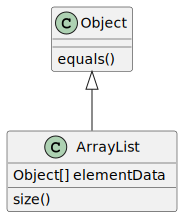{.center}


```plantuml
class Foo1 {
  You can use
  several lines
  ..
  as you want
  and group
  ==
  things together.
  __
  You can have as many groups
  as you want
  --
  End of class
}

class User {
  .. Simple Getter ..
  + getName()
  + getAddress()
  .. Some setter ..
  + setName()
  __ private data __
  int age
  -- encrypted --
  String password
}
```

{.center}

## Activity Diagram

```plantuml
(*) --> "Initialization"

if "Some Test" then
  -->[true] "Some Activity"
  --> "Another activity"
  -right-> (*)
else
  ->[false] "Something else"
  -->[Ending process] (*)
endif
```

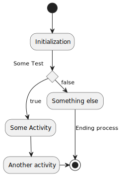{.center}

```plantuml
title Servlet Container

(*) --> "ClickServlet.handleRequest()"
--> "new Page"

if "Page.onSecurityCheck" then
  ->[true] "Page.onInit()"

  if "isForward?" then
  ->[no] "Process controls"

  if "continue processing?" then
  -->[yes] ===RENDERING===
  else
  -->[no] ===REDIRECT_CHECK===
  endif

  else
  -->[yes] ===RENDERING===
  endif

  if "is Post?" then
  -->[yes] "Page.onPost()"
  --> "Page.onRender()" as render
  --> ===REDIRECT_CHECK===
  else
  -->[no] "Page.onGet()"
  --> render
  endif

else
  -->[false] ===REDIRECT_CHECK===
endif

if "Do redirect?" then
->[yes] "redirect request"
--> ==BEFORE_DESTROY===
else
if "Do Forward?" then
  -left->[yes] "Forward request"
  --> ==BEFORE_DESTROY===
else
  -right->[no] "Render page template"
  --> ==BEFORE_DESTROY===
endif
endif

--> "Page.onDestroy()"
-->(*)
```

{.center}

## MindMaps

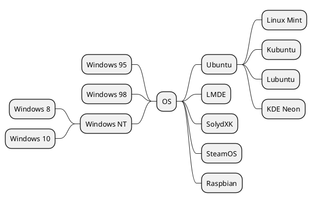
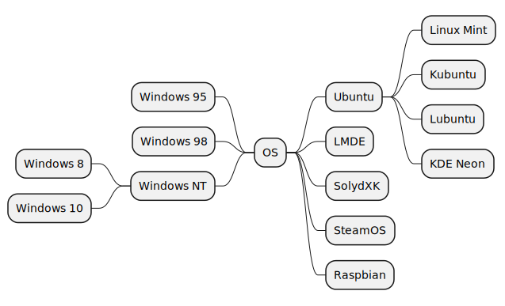{.center}

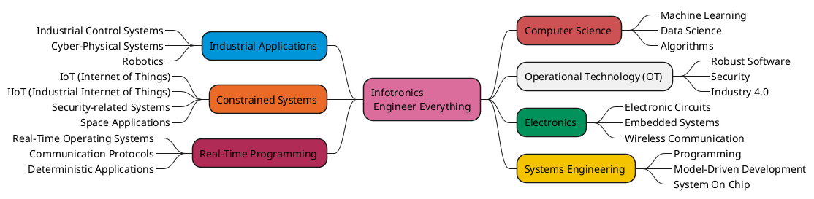

{.center}

## WBS Work Breakdown Structure

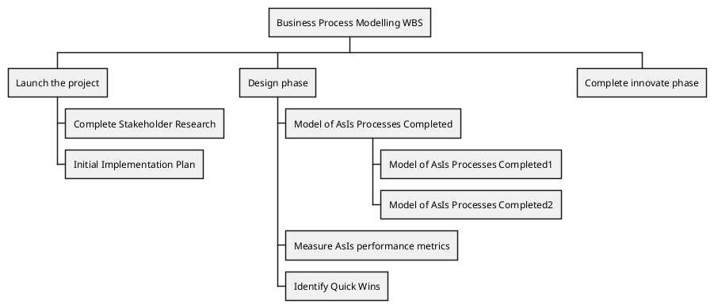

{.center}

## GANTT Chart

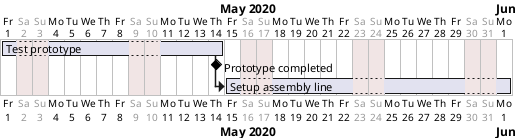

{.center}

```plantuml
@startgantt
project starts 2021/06/01
saturday are closed
sunday are closed
printscale weekly

[WP1 Literature Research] starts at 2021/06/01
[WP1 Literature Research] lasts 3 weeks

[WP2 External Survey] starts at [WP1 Literature Research]'s start
[WP2 External Survey] ends at [WP1 Literature Research]'s end

[WP3 Synthesising State of the Art] starts at [WP2 External Survey]'s end
[WP3 Synthesising State of the Art] lasts 2 weeks

[Theoretical research completed] happens at [WP3 Synthesising State of the Art]'s end

[WP4 Selection practial application] starts at [WP3 Synthesising State of the Art]'s end
[WP4 Selection practial application] lasts 2 week

[WP5 Data Collection] starts at [WP4 Selection practial application]'s end
[WP5 Data Collection] lasts 3 weeks

[WP6 ML Model Selection] starts at [WP4 Selection practial application]'s end
[WP6 ML Model Selection] lasts 2 weeks

[WP7 ML Model Implementation] starts at [WP6 ML Model Selection]'s end
[WP7 ML Model Implementation] lasts 5 weeks

[Implementation completed] happens at [WP7 ML Model Implementation]'s end

[WP8 Fieldtest] starts at [WP7 ML Model Implementation]'s end
[WP8 Fieldtest] ends at 2021/09/30

[Write Thesis Report] starts at 2021/06/01
[Write Thesis Report] ends at 2021/09/30

' Color definitions
[WP1 Literature Research] is colored in LightSteelBlue/DimGrey
[WP2 External Survey] is colored in LightSteelBlue/DimGrey
[WP3 Synthesising State of the Art] is colored in LightSteelBlue/DimGrey
[WP4 Selection practial application] is colored in LightGreen/DimGrey
[WP5 Data Collection] is colored in LightGreen/DimGrey
[WP6 ML Model Selection] is colored in LightGreen/DimGrey
[WP7 ML Model Implementation] is colored in LightGreen/DimGrey
[WP8 Fieldtest] is colored in SandyBrown/Sienna

[Write Thesis Report] is colored in LightSteelBlue/DimGrey

@endgantt
```

{.center}


## Timing Diagram

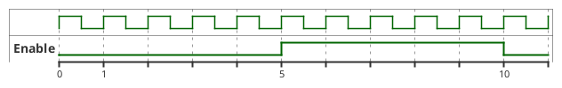

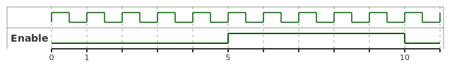{.center}
