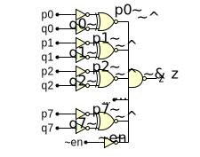

---
tags:
- multimedia
- picture
- wavedrom
---
# Wavedrom
{.center width="20%"}

- [Wavedrom Paper]({{base_repo_file}}/docs/multimedia/pictures/docs/SNUG2016_WaveDrom.pdf)

## Timing Diagrams
```wavedrom
{
  signal: [
    { name: "Alfa", wave: "01.zx=ud.23.456789" }
  ]
}
```

{.center}

```wavedrom
{ // Wavedrom Config
  config: {
    hscale: 1,      // horizontal scale
    skin:'default', // narrow
  },
  // Title
  head:{
    text:'Timing Xaar1003 Explanation',
    tick:0, // Numeration top
  },
  // Signal
  signal: [
    { name: "DA-[0..3]", wave: 'z23.4z........23.4z........', data: ["1", "2..255", "256","1", "2..255", "256"]},
    { name: "DCLKA", wave: 'ln...l........n...l........', data: ["1", "2..255"], node: '.....a........b'},
    { name: "PCLK", wave: '0......10.10.10....50.50.50', data:["CycleA","CycleB","CycleC"], node: '.......c..d' },
    { name: "SCLK", wave: 'N..........................' },
  ],
  // Arrows
  edge: [
    'a<->b t_fire',
    'c<->d t_Cycle',
  ],
  // Footer
  foot: {
    text:['tspan', 'zas created for Xaar 28.04.2017',
    ],
    tock:0, // Numeration bottom
  },
}
```

{.center}


```wavedrom
{ // Wavedrom Config
  config: {
    hscale: 1,      // horizontal scale
    skin:'default', // narrow
  },
  // Title
  head:{
    text:'PrintBuffer timing',
    tick:0, // Numeration top
  },
  // Signals
  signal: [
    ['input',
      {name: 'register',      wave: '010....|.10...' , node: '.a.......b..'},
      {name: 'pContainer',    wave: 'x3.x...|.4.x..' , data: ['pC1', 'pC2'], phase: 0.5},
      {name: 'trig',          wave: 'pPp....|.Pp...'},
      {name: 'position',      wave: '=======|......' , data: ['p0','p1','p2','p3','p4','p5','p..']},
      {name: 'Count',         wave: '==.....|.=....' , data: ['0', '1', '2']},
      {name: 'first',         wave: '=......|......' , data: ['1']},
      {name: 'next',          wave: '==.....|.=....' , data: ['1', '2', '3']}
    ],
    ['output',
      {name: 'shifted trig.', wave: '0....1..0..|..' , node: '.....e..f..'},
      {name: 'pContainer',    wave: 'x....3..x..|..' , data: ['pC1', 'pC2']},
      {name: 'Count',         wave: '=.......=..|..' , data: ['1', '0']},
      {name: 'first',         wave: '=.......=..|..' , data: ['1', '2']},
      {name: 'next',          wave: '=..........|..' , data: ['2', '3']}
    ]
  ],
  // Arrows
  edge: [
    'a<->b t_cycle',
    'a~>e t_shift',
    'e<->f t_trigger',
  ],
  // Footer
  foot: {
    text:['tspan', 'zas 09.05.2017',],
    tock:0, // Numeration bottom
  },
}
```

{.center}


Assign
======
```wavedrom
{ assign:[
  ["b3", "g3"],
  ['a', ["=", "a"]],
  [['tspan', {'text-decoration':'overline'},'a'], ["~", "a"]],
  ["and", ["&", "a", "b"]],
  ["nand", ["~&", "a", "b"]],
  ["or", ["|", "a", "b"]],
  ["nor", ["~|", "a", "b"]],
  ["xor", ["^", "a", "b"]],
  ["nxor", ["~^", "a", "b"]],
]}
```

{.center}

```wavedrom
{ assign:[
  ["out",
    ["|",
      ["&", ["~", "a"], "b"],
      ["&", ["~", "b"], "a"]
    ]
  ]
]}
```

{.center}


```wavedrom
{ assign:[
  ["z",
    ["~&",
      ["~^", ["~", "p0"], ["~", "q0"]],
      ["~^", ["~", "p1"], ["~", "q1"]],
      ["~^", ["~", "p2"], ["~", "q2"]],
      "...",
      ["~^", ["~", "p7"], ["~", "q7"]],
      ["~","~en"]
    ]
  ]
]}
```

{.center}

## Registers

```wavedrom
{ reg: [
    {bits: 2, name: 'Machine Nbr', attr: ['Sequentialnumber', '01 - first ...', '02 - second ...'], type:1},
    {bits: 5, name: 'Sequence Nbr', attr: 'Continuous Number', type: 2},
    {bits: 2, name: 'Type', attr: '02 = Type 2', type: 3},
  ],
  config: {hspace: 500, vspace: 120, bits:9, lanes:1}
}
```

{.center}


```wavedrom
{ reg:[
  {bits: 1, name: 'no type'},
  {bits: 1, name: 'type 1', type: 1},
  {bits: 1, name: 'type 2', type: 2},
  {bits: 1, name: 'type 3', type: 3},
  {bits: 1, name: 'type 4', type: 4},
  {bits: 1, name: 'type 5', type: 5},
  {bits: 1, name: 'type 6', type: 6},
  {bits: 1, name: 'type 7', type: 7},
],
config: {hspace:750, bits:8, lanes:1}
}
```

{.center}

```wavedrom
{
  reg:[
    {bits: 8, name: 'lanes', type: 1},
    {bits: 8, name: 'two', type: 2},
  ],
  config: {hspace:750, bits:16, lanes:2}
}
```

{.center}


```wavedrom
{
  reg:[
    {bits: 8, name: 'lanes', type: 1},
    {bits: 8, name: 'register', type: 2},
    {bits: 8, name: 'compact', type: 3},
    {bits: 8, name: 'register', type: 4},
  ],
  config: {hspace:750, bits:32, lanes:4, compact: true}
}
```

{.center}
