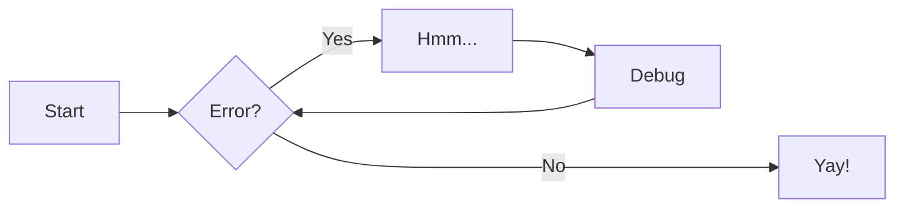
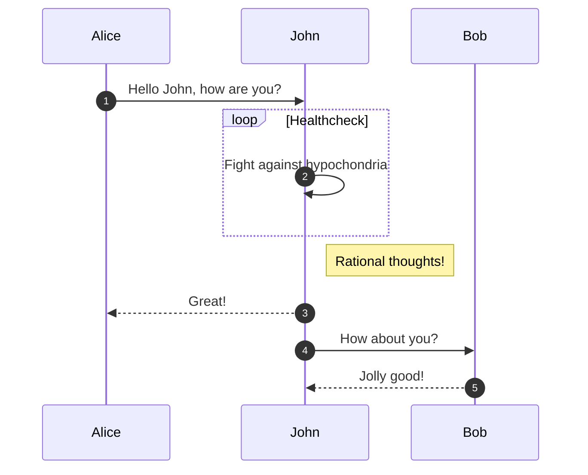
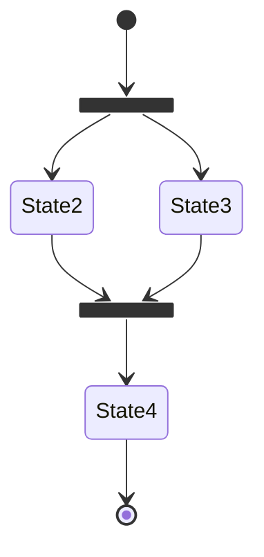
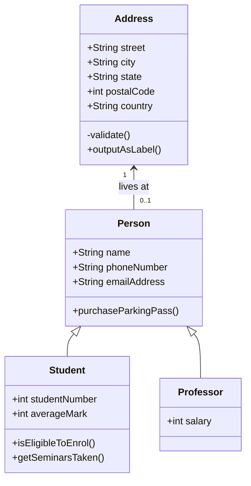
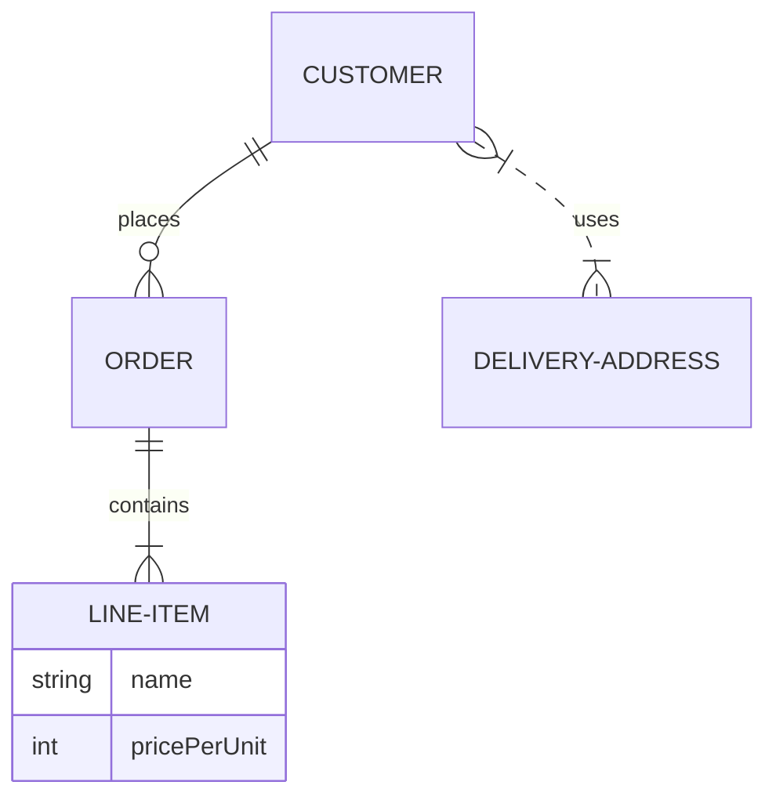
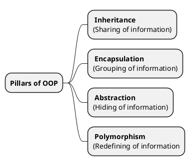
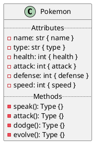
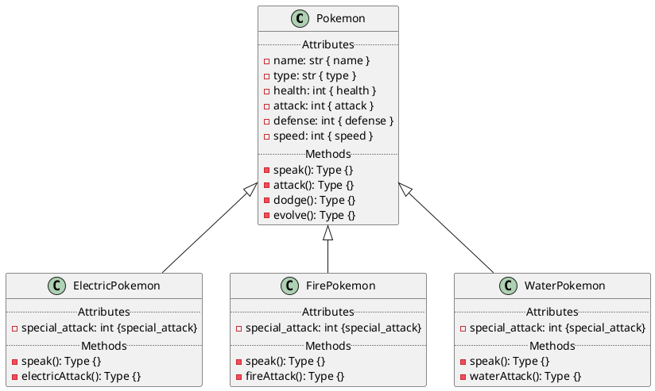
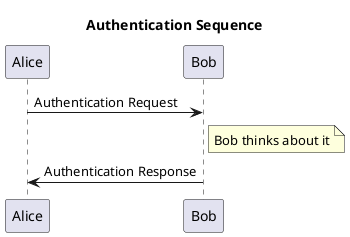

---
  tags:
    - multimedia
    - writing
    - md
    - mkdocs
---

# Cheatsheet
{.center width="20%"}
In this page you will get a quick overview about the most used syntax.

## Metadata
File metadata is writen in `YAML`at the beginning of every document.

Default (optional) metadata
```md
---
title: My Document
summary: A brief description of my document.
authors:
    - tschinz
date: 2018-07-10
some_url: https://example.com
tags:
    - tag 1
    - tag 2
---
```

Hide navigation sidebar and / or table of contents
```md
---
hide:
- navigation
- toc
---
```

Disable macros
```md
```yml
---
render_macros: false
---
```


## Titles
```md
# H1 Title
## H2 Title
### H3 Title
#### H4 Title
##### H5 Title
###### H6 Title

Horizontal Rule

---

```
## H2 Title
### H3 Title
#### H4 Title
##### H5 Title
###### H6 Titles

Horizontal Rule

---

## Markup

```md
_italic_ *italic*

__bold__ **bold**

^^underline^^

~~strike through~~

==highlight==

`inline code`

==*you* **can** ^^combine^^ `them`==

> blockquote

newline is <br>

---

[//]: # (This may be the most platform independent comment)

<!-- Comment -->
<!--
Multi
Line
Comment
-->

```

_italic_ *italic*

__bold__ **bold**

^^underline^^

~~strike through~~

==highlight==

`inline code`

==*you* **can** ^^combine^^ `them`==

> blockquote

newline is <br>

[//]: # (This may be the most platform independent comment)

<!-- Comment -->
<!--
Multi
Line
Comment
-->

## Links
### External Links
``` md
Simple link [rust](https://www.rust-lang.org/)
Link with custom title [rust](https://www.rust-lang.org/ "Rust Lang Webpage")
Mail link with emoji [:bug:](mailto:nonofyourbusiness.com)
Link of pdf [Rust Book](https://www.scs.stanford.edu/~zyedidia/docs/rust/rust_book.pdf)
```
Simple link [rust](https://www.rust-lang.org/) <br>
Link with custom title [rust](https://www.rust-lang.org/ "Rust Lang Webpage") <br>
Mail link with emoji [:bug:](mailto:nonofyourbusiness.com) <br>
Link of pdf [Rust Book](https://www.scs.stanford.edu/~zyedidia/docs/rust/rust_book.pdf) <br>

### External Shortlinks
int the `mkdocs.yml` file there are multiple `extra`'s defined:
```yml
base_url: https://tschinz.github.io/znotes
base_repo: https://github.com/tschinz/znotes-mkdocs
base_repo_file: https://github.com/tschinz/znotes-mkdocs/blob/main
base_repo_folder: https://github.com/tschinz/znotes-mkdocs/tree/main
config_repo: https://github.com/tschinz/config
config_repo_file: https://github.com/tschinz/config/blob/master
config_repo_folder: https://github.com/tschinz/config/tree/master
```

This helps to link quickly to the [znotes-repo]({{base_repo}}) or my [config-repo]({{config_repo}}).

```md
- link to [znotes-repo]({{base_repo}})
- link to [config-repo]({{config_repo}})

- link to folder [_extra]({{base_repo_file}}/docs/_extra) from znotes repo
- link to folder [shell]({{config_repo_file}}/scripts/shell) from config repo

- link to file [extra.css]({{base_repo_file}}/docs/_extra/css/extra.css) from znotes repo
- link to file [backup.bash]({{config_repo_file}}/scripts/shell/backup.bash) from config repo
```

- link to [znotes-repo]({{base_repo}})
- link to [config-repo]({{config_repo}})

- link to folder [_extra]({{base_repo_file}}/docs/_extra) from znotes repo
- link to folder [shell]({{config_repo_file}}/scripts/shell) from config repo

- link to file [extra.css]({{base_repo_file}}/docs/_extra/css/extra.css) from znotes repo
- link to file [backup.bash]({{config_repo_file}}/scripts/shell/backup.bash) from config repo

### Internal Links
All internal links are relative.

```md
[mkdocs index](index.md)
[mkdocs index](./index.md)
[writing index](../index.md)
[writing index](./../index.md)
[cheatsheets title](./cheatsheet.md#links)
```
[mkdocs index](index.md) <br>
[mkdocs index](./index.md) <br>
[writing index](../index.md) <br>
[writing index](./../index.md) <br>
[cheatsheets title](./cheatsheet.md#links) <br>

You can also link a pdf file directly
```md
[Guide to Typst](../../typst/docs/guide-to-typst.pdf)
```


### Link Settings
```md
[open in new tab](index.md){.new-tab}
[open in new tab](index.md){:target="_blank"}
Link to pdf download [Rust Book](https://www.scs.stanford.edu/~zyedidia/docs/rust/rust_book.pdf){:download}
Link to pdf download with custom name [Rust Book](https://www.scs.stanford.edu/~zyedidia/docs/rust/rust_book.pdf){:download="Rust-Book.pdf"}
```
[open in new tab](index.md){.new-tab} <br>
[open in new tab](index.md){:target="_blank"} <br>
Link to pdf download [Rust Book](https://www.scs.stanford.edu/~zyedidia/docs/rust/rust_book.pdf){:download} <br>
Link to pdf download with custom name [Rust Book](https://www.scs.stanford.edu/~zyedidia/docs/rust/rust_book.pdf){:download="Rust-Book.pdf"} <br>

## Images
Supported file types are `.svg` `.png` `.jpg` `.webp`

```md
{width="50px"}
{width="50px"}
{width="50px"}
{width="50px"}
```
{width="50px"}
{width="50px"}
{width="50px"}
{width="50px"}

### Align + Caption
```md
{align=left width="100px"}
{align=right width="100px"}
{.center width="100px"}
```
{align=left width="100px"}
{align=right width="100px"}
{.center width="100px"}

### Side-by-Side Images
```md
{align=left width="45%"}
{align=right width="45%"}
<br><br><br><br><br><br><br><br><br><br><br><br><br>
```

{align=left width="45%"}
{align=right width="45%"}
<br><br><br><br><br><br><br><br><br><br><br><br><br>

### Official Caption
<figure markdown>
  { width="300px" }
  <figcaption>Image caption</figcaption>
</figure>

### Inline Images
```md
This is {width="15px"} an inline image.
```
This is {width="15px"} an inline image.

### Emoji
Using [twemoji](https://twemoji.twitter.com/) and the shortcodes can be looked up at [emojipedia](https://emojipedia.org/twitter/).

```md
:handshake:
:crab:
:earth_africa:
:rocket:
:bulb:
:star:
```

:handshake:
:crab:
:earth_africa:
:rocket:
:bulb:
:star:

## Fontawesome
All image from [Fontawesome](https://fontawesome.com/) are possible
```md
:fontawesome-regular-face-laugh-wink:
:fontawesome-brands-rust:
:fontawesome-solid-arrow-right:
:fontawesome-solid-arrow-left:
:fontawesome-solid-arrow-up:
:fontawesome-solid-arrow-down:
:fontawesome-solid-arrow-rotate-right:
:fontawesome-solid-arrow-rotate-left:
```
:fontawesome-regular-face-laugh-wink:
:fontawesome-brands-rust:
:fontawesome-solid-arrow-right:
:fontawesome-solid-arrow-left:
:fontawesome-solid-arrow-up:
:fontawesome-solid-arrow-down:
:fontawesome-solid-arrow-rotate-right:
:fontawesome-solid-arrow-rotate-left:

## Lists

### Unordered
```md
- minus item
* asterix item
    - subitem 1
    - subitem 2
+ plus item
```

- minus item
* asterix item
    - subitem 1
    - subitem 2
+ plus item

### Ordered
```md
1. item 1
2. item 2
    1. item 2.1
    2. item 2.2
    3. item 2.3
        1. item 2.3.1
        2. item 2.3.2
        3. item 2.3.3
4. item 3
```

1. item 1
2. item 2
    1. item 2.1
    2. item 2.2
    3. item 2.3
        1. item 2.3.1
        2. item 2.3.2
        3. item 2.3.3
4. item 3

### Tasks
```md
- [x] Task 1
    - [ ] Task 1.1
    - [ ] Task 1.2
    - [X] Task 1.3
- [ ] Task 2
- [ ] Task 3
```

- [x] Task 1
    - [ ] Task 1.1
    - [ ] Task 1.2
    - [X] Task 1.3
- [ ] Task 2
- [ ] Task 3

## Buttons
```md
[Send :fontawesome-solid-paper-plane:](cheatsheet.md#buttons){ .md-button }

[Send :fontawesome-solid-paper-plane:](#){ .md-button .md-button--primary }

```
[Send :fontawesome-solid-paper-plane:](cheatsheet.md#buttons){ .md-button }

[Send :fontawesome-solid-paper-plane:](#){ .md-button .md-button--primary }

## Math
Block math

```md
$$
\operatorname{ker} f=\{g\in G:f(g)=e_{H}\}{\mbox{.}}
$$
```

$$
\operatorname{ker} f=\{g\in G:f(g)=e_{H}\}{\mbox{.}}
$$

```md
Inline math is with $\operatorname{ker} f=\{g\in G:f(g)=e_{H}\}{\mbox{.}}$
```

Inline math is with $\operatorname{ker} f=\{g\in G:f(g)=e_{H}\}{\mbox{.}}$

## Tables

| Method      | Description                          |
| ----------- | ------------------------------------ |
| `GET`       | :material-check:     Fetch resource  |
| `PUT`       | :material-check-all: Update resource |
| `DELETE`    | :material-close:     Delete resource |

| Method      | Description                          |
| :---------- | :----------------------------------- |
| `GET`       | :material-check:     Fetch resource  |
| `PUT`       | :material-check-all: Update resource |
| `DELETE`    | :material-close:     Delete resource |

| Method      | Description                          |
| :---------: | :----------------------------------: |
| `GET`       | :material-check:     Fetch resource  |
| `PUT`       | :material-check-all: Update resource |
| `DELETE`    | :material-close:     Delete resource |

| Method      | Description                          |
| ----------: | -----------------------------------: |
| `GET`       | :material-check:     Fetch resource  |
| `PUT`       | :material-check-all: Update resource |
| `DELETE`    | :material-close:     Delete resource |

|  Tables      |   Are    |      Cool    |
| ------------ |:--------:| ------------:|
| left-aligned | centered | left-aligned |
| **bold**     | :crab:   |              |

## Code

```md
```rust
fn main() {
    let message = "Hello, Rust!";
    println!("{}", message);
}
`` `
```

```rust
fn main() {
    let message = "Hello, Rust!";
    println!("{}", message);
}
```

```md
```rust title="hello-world.rs"
fn main() {
    let message = "Hello, Rust!";
    println!("{}", message);
}
`` `
```

```rust title="hello-world.rs"
fn main() {
    let message = "Hello, Rust!";
    println!("{}", message);
}
```

```md
```rust linenums="1"
fn main() {
    let message = "Hello, Rust!";
    println!("{}", message);
}
`` `
```

```rust linenums="1"
fn main() {
    let message = "Hello, Rust!";
    println!("{}", message);
}
```

If a code block contains jinja style macros such as `{ {...} }` or `#` there can be a **Macro Rendering Error**. On way to solve it is the disable macros for the whole page by adding the following statement in the front matter:

```yml
---
render_macros: false
---
```

## Boxes (Admonitions)
### Settings

```md
!!! note
    Notebox
```

!!! note
    Notebox

```md
!!! note "This is a custom title"
    Custom title notebox
```

!!! note "This is a custom title"
    Custom title notebox

```md
!!! note ""
    No title notebox
```

!!! note ""
    No title notebox

```md
??? note
    By default collabeed, collapsible notebox
```

??? note
    By default collabeed, collapsible notebox

```md
???+ note
    By default open, collapsible notebox
```

???+ note
    By default open, collapsible notebox

### Type of Boxes

```md
!!! note
    Notebox
```

!!! note
    Notebox

```md
!!! info
    Infobox
```

!!! info
    Infobox

```md
!!! abstract
    Abstractbox
```

!!! abstract
    Abstractbox

```md
!!! tip
    Tipbox
```

!!! tip
    Tipbox

```md
!!! success
    Successbox
```

!!! success
    Successbox

```md
!!! question
    Questionbox
```

!!! question
    Questionbox

```md
!!! warning
    Warningbox
```

!!! warning
    Warningbox

```md
!!! failure
    Failurebox
```

!!! failure
    Failurebox

```md
!!! danger
    Dangerbox
```

!!! danger
    Dangerbox

```md
!!! bug
    Bugbox
```

!!! bug
    Bugbox

```md
!!! example
    Examplebox
```

!!! example
    Examplebox

```md
!!! quote
    Qutobox
```

!!! quote
    Qutobox

## Grids
```md
<div class="grid cards" markdown>
- :fontawesome-brands-html5: __HTML__ for content and structure
- :fontawesome-brands-js: __JavaScript__ for interactivity
- :fontawesome-brands-css3: __CSS__ for text running out of boxes
- :fontawesome-brands-internet-explorer: __Internet Explorer__ ... huh?
</div>
```

<div class="grid cards" markdown>
- :fontawesome-brands-html5: __HTML__ for content and structure
- :fontawesome-brands-js: __JavaScript__ for interactivity
- :fontawesome-brands-css3: __CSS__ for text running out of boxes
- :fontawesome-brands-internet-explorer: __Internet Explorer__ ... huh?
</div>

```md
<div class="grid cards" markdown>
-   :material-clock-fast:{ .lg .middle } __Set up in 5 minutes__

    ---

    Install [`mkdocs-material`](#) with [`pip`](#) and get up
    and running in minutes
    [:octicons-arrow-right-24: Getting started](#)

-   :fontawesome-brands-markdown:{ .lg .middle } __It's just Markdown__

    ---

    Focus on your content and generate a responsive and searchable static site
    [:octicons-arrow-right-24: Reference](#)

-   :material-format-font:{ .lg .middle } __Made to measure__

    ---

    Change the colors, fonts, language, icons, logo and more with a few lines
    [:octicons-arrow-right-24: Customization](#)

-   :material-scale-balance:{ .lg .middle } __Open Source, MIT__

    ---

    Material for MkDocs is licensed under MIT and available on [GitHub]
    [:octicons-arrow-right-24: License](#)
</div>
```

<div class="grid cards" markdown>
-   :material-clock-fast:{ .lg .middle } __Set up in 5 minutes__

    ---

    Install [`mkdocs-material`](#) with [`pip`](#) and get up
    and running in minutes
    [:octicons-arrow-right-24: Getting started](#)

-   :fontawesome-brands-markdown:{ .lg .middle } __It's just Markdown__

    ---

    Focus on your content and generate a responsive and searchable static site
    [:octicons-arrow-right-24: Reference](#)

-   :material-format-font:{ .lg .middle } __Made to measure__

    ---

    Change the colors, fonts, language, icons, logo and more with a few lines
    [:octicons-arrow-right-24: Customization](#)

-   :material-scale-balance:{ .lg .middle } __Open Source, MIT__

    ---

    Material for MkDocs is licensed under MIT and available on [GitHub]
    [:octicons-arrow-right-24: License](#)
</div>

## Diagrams
### Mermaid
#### Flowchart
```md



#### Sequence Diagram
```md



#### State Diagrams
```md



#### Class Diagrams
```md



#### Entity-Realationship Diagram
```md



### Wavedrom
For more information see:

- [Wavedrom JSON Wiki](https://github.com/wavedrom/wavedrom/wiki/WaveJSON)
- [Wavedrom Tutorial](https://wavedrom.com/tutorial.html)

#### Timing Diagrams

``` wavedrom
{ signal: [{ name: 'Alfa', wave: '01.zx=ud.23.45' }] }
```

```wavedrom
{ "signal": [
  { "name": "pclk", "wave": 'p.......' },
  { "name": "Pclk", "wave": 'P.......' },
  { "name": "nclk", "wave": 'n.......' },
  { "name": "Nclk", "wave": 'N.......' },
  {},
  { "name": 'clk0', "wave": 'phnlPHNL' },
  { "name": 'clk1', "wave": 'xhlhLHl.' },
  { "name": 'clk2', "wave": 'hpHplnLn' },
  { "name": 'clk3', "wave": 'nhNhplPl' },
  { "name": 'clk4', "wave": 'xlh.L.Hx' },
]}
```

#### Register

you can describe register mapping with the same syntax:

```wavedrom
{"reg":[
  {"bits": 8, "name": "things"},
  {"bits": 2, "name": "stuff" },
  {"bits": 6},
 ],
 "config": { "bits":16,"lanes":1 }
 }
```

### PlantUML

This documentation makes use of the [plantuml-markdown plugin](https://github.com/mikitex70/plantuml-markdown) and the [PlantUML Webpage](https://plantuml.com/).

For a small Cheatsheet for PlantUML see <https://ogom.github.io/draw_uml/plantuml/>

```md



```md



```md



```md



