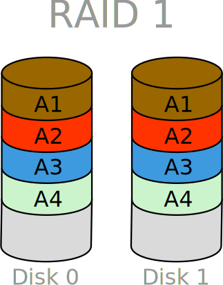

---
tags:
- os
- operating system
- linux
- tools
- raid
---
# Raid

Raid ( **R**edundant **A**rray of **I**ndependent **D**isks) is a system to connect multiple harddisks together to increase the size, the performance or the security of those drives.

Raid can be done via a specific hardware implementation, which is expensive; or a software implementation, which adds overhead and decreases your CPU performance.

On this page only the software implementation using the [mdadm](http://en.wikipedia.org/wiki/Mdadm) ( **M**ulti **D**rive **Adm**inistration) is covered.

# Types

## Raid types

| Type   | Description                                | Image           |
|--------|--------------------------------------------|-----------------|
| RAID 0 | Block level striping. MD can handle devices of different lengths, the extra space on the larger device is then not striped |  |
| RAID 1 | Mirror                                     |  |
| RAID 4 | Like RAID 0, but with an extra device for parity | |
| RAID 5 | Like RAID 4, but with the parity distributed across all devices |  |
| RAID 6 | Like RAID 5, but with two parity segments per stripe | |
| RAID 10| Take a number of RAID 1 mirrorsets and stripe across them RAID 0 style | |

### Non-Raid types

- **LINEAR** -- Concatenate a number of devices into a single large MD device.
- **MULTIPATH** -- Provide multiple paths with failover to a single device.
- **FAULTY** -- A single device which emulates a number of disk fault scenarios for testing and development.
- **CONTAINER** -- A group of devices managed as one, in which RAID systems can be built.

## mdadm Commands

### Check Raid Status

``` bash
cat /proc/mdstat
sudo mdadm --query --detail /dev/md* # * = md number e.g. md0
```

### Create Raid Array

Create a RAID 1 (mirror) array from two partitions. If the partitions differ in size, the array is the size of the smallest partition.

``` bash
mdadm --create /dev/md0 --level=mirror --raid-devices=2 /dev/sda1 /dev/sdb1
```

Create a RAID 5 volume from three partitions. If the partitions used in your RAID array are not the same size, mdadm will use the size of the smallest from each partition. If you receive an error, such as: `mdadm: RUN_ARRAY failed: Invalid argument`, make sure your kernel supports (either via a module or by being directly compiled in) the raid mode you are trying to use. Most modern kernels do, but you never
know ...

``` bash
mdadm --create /dev/md1 --level=5 --raid-devices=3 /dev/sda2 /dev/sdb2 /dev/sdc2
```

### Change Raid Array

#### Grow

This adds the new device to the array then grows the array to use its space.

``` bash
mdadm --add /dev/md1 /dev/sdd1
mdadm --grow /dev/md1 --raid-devices=4
```

#### Delete Raid Array

``` bash
mdadm --stop /dev/md0        # to halt the array
mdadm --remove /dev/md0      # to remove the array
mdadm --zero-superblock /dev/sd[abc]1  # delete the superblock from all drives in the array
vim /etc/mdadm/mdadm.conf    # delete any rows related to deleted array
```

## Links

- [MDADM Wikipedia article](http://en.wikipedia.org/wiki/Mdadm)
- [Official mdadm webpage](http://neil.brown.name/blog/mdadm)
