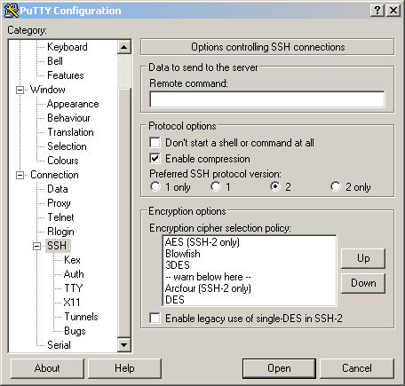

---
tags:
- os
- operating system
- linux
- tools
- vnc
---
# VNC Remote Control

VNC is a protocol to let you connect and view the screen of your remote controlled PC. But this isn't very secure and should not be enabled over the internet but only locally. VNC is often used to hack Linux PC. Therefore you should use VNC over SSH where the data is encrypted and very secure.

## x11vnc
 Perfect fast and configurable solution for almost all Linux distributions. x11vnc does not create an extra display (or X desktop) for remote control. Instead, it uses the existing X11 display shown on the monitor of a Unix-like computer in real time.

### Install

``` bash
sudo apt-get install x11vnc
```

### Config

Generate password file

``` bash
x11vnc -storepasswd
Enter VNC password:
Verify VNC password:
```

The password in now store by default in the file `~/.vnc/passwd`

### Start

``` bash
x11vnc -usepw -forever -display :0 -safer -bg -o /home/user/Documents/log/vnc/x11vnc.log -localhost
```

- `-forever` : listen forever to input connections
- `-display :<nbr>` : Define display to use
- `-usepw` : uses password file stored in `~/.vnc/passwd`
- `-safer` : don't allows remote comands `-noremote` and `-novncconnect`
- `-localhost` : allows only local connections works only local or over SSH
- `-o logfile` : defines location of the logfile
- `-bg` : Launches in Background

### Autostart

In Lubuntu with LXDE add the following line to the file: `/etc/xdg/lxsession/Lubuntu/autostart`

``` bash title="/etc/xdg/lxsession/Lubuntu/autostart"
@x11vnc -usepw -forever -display :0 -safer -bg -o /home/user/Documents/log/vnc/x11vnc.log -localhost
```

In Lubuntu with lightdm add the following line to the file: `/etc/xdg/lxsession/Lubuntu/autostart`

``` bash title="/etc/xdg/lxsession/Lubuntu/autostart"
@x11vnc -usepw -forever -safer -bg -o /home/user/Documents/log/vnc/x11vnc.log -localhost -auth /var/run/lightdm/root/:0 -display :0
```

In Gnome add the following line to the file: `/etc/gdm/Init/Default`

``` bash title="/etc/gdm/Init/Default"
x11vnc -usepw -forever -display :0 -safer -bg -o /home/zas/Documents/log/vnc/x11vnc.log -localhost
```

## VNC over SSH

### Linux

#### Open SSH Tunnel

``` bash
ssh -N -T -L 5900:localhost:5900 <hostname>
```

This forwards our local port `5900` to the host computers port `5900`, just replace `5900` with the port you normally use for VNC connections, i.e if you use display 20 then it would read `ssh -N -T -L 5920:<hostname>:5920`. The middle part is the hostname hostmachine, replace with the correct number for your network. The `-L` is the local port forward option while the `-N` option prevents a shell from opening so we cannot execute commands and the `-T` option disables pseudo-tty allocation.

#### Launch VNC Viewer in Linux

``` bash
vncviewer localhost:5900
```

### Windows

To connect to VNC over SSH in Linux you need a VNC Viewer like [UltraVNC](http://www.uvnc.com/) and [Putty](http://www.putty.org/)

#### Putty Config

see: [Putty-VNC](../../../os/linux/tools/vnc.md#putty)

##### Start VNC

- Start Putty with the above configuration
- Enter password
- Open a VNC Viewer
- Connect to `127.0.0.1`

#### Troubleshooting

If you have problems connecting to the remote machine, and if the connection gets rejected then you should quit your local VNC Server. Because you are connecting via localhost he might respond to your request.

### Macintosh

#### Install Tools

Tightvnc is a great vncviewer and is installable through [Homebrew](../../../os/mac/homebrew.md), as well as Putty:

``` bash
sudo port install tightvnc
sudo port install putty
```

### Set up SSH Tunnel

**Terminal**

``` bash
ssh -p <portnumber> -L 5900:127.0.0.1:5900 <hostname>
```

**Putty**

see: [Putty-VNC](../../../os/linux/tools/vnc.md#putty)

#### Launch VNC Viewer in Mac

``` bash
vncviewer localhost:5900
```

or use the program "Chicken Of VNC"

## Putty

- Create a new putty session
- goto Session -> Add hostname and port
- goto SSH -> Enable compression
- goto SSH -> Tunnels -> Add tunnel
  - Source Port: `5900`
  - Destination : `127.0.0.1:5900`
  - Click Add

{align=left width="30%"}
{align=right width="30%"}
{.center width="30%"}
