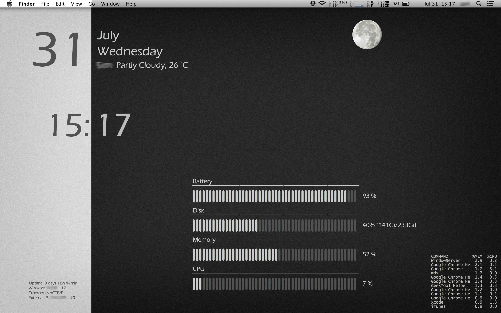

---
tags:
- os
- operating system
- macos
- geektool
---
# Geektool

Geektool is a wonderful program to display information on your desktop. Here you can see my "Control Center".



## Date & Time

All command geeklets

``` bash
date +%d               # Day number
date +%B               # Month
date +%A               # Weekday
```

``` bash
date "+%H"             # Hour
date "+%M"             # Minutes
```

## Location & Weather

### Actual Weather

All command geeklets Get the weather of a certain location from Yahoo weather.

``` bash
WEATHER=`curl --silent "http://weather.yahooapis.com/forecastrss?p=SZXX0035&u=c" | grep -E '(Current Conditions:|C<BR)' | tail -n1 | sed -e 's/<BR \/>//' -e 's/ C$/°C/'`
echo "Sion " $WEATHER
```

### Moonphase

Get the image for the actual Moonphase from lexiyoga. Directly the image will be fetch, therefore a image geeklet is needed.

``` bash
http://www.lexiyoga.com/images/moon/moon16.png
```

## System information

### Uptime

``` bash
uptime | awk '{sub(/[0-9]|user\,|users\,|load/, "", $6); sub(/mins,|min,/, "min", $6); sub(/user\,|users\,/, "", $5); sub(",", "min", $5); sub(":", "h ", $5); sub(/[0-9]/, "", $4); sub(/day,/, " day ", $4); sub(/days,/, " days ", $4); sub(/mins,|min,/, "min", $4); sub("hrs,", "h", $4); sub(":", "h ", $3); sub(",", "min", $3); print "Uptime: " $3$4$5$6}'
```

### Networking

``` bash
# Internal Wireless IP
myen0=`ifconfig en0 | grep "inet " | grep -v 127.0.0.1 | awk '{print $2}'`
if [ "$myen0" != "" ]
then
echo "Wireless: $myen0"
else
echo "Wireless INACTIVE"
fi

# Internal Ethernet IP
myen1=`ifconfig en1 | grep "inet " | grep -v 127.0.0.1 | awk '{print $2}'`
if [ "$myen1" != "" ]
then
echo "Ethernet: $myen1"
else
echo "Ethernet INACTIVE"
fi

# External IP
wip=`curl --silent http://checkip.dyndns.org | awk '{print $6}' | cut -f 1 -d "<"`
echo "External IP: $wip"
```

### Battery status

``` bash
BATTERY=`ioreg -l | awk '$3~/Capacity/{c[$3]=$5}END{OFMT="%.f %%";max=c[""MaxCapacity""];print(max>0?100*c[""CurrentCapacity""]/max:"?")}'`
echo $BATTERY '\n\n\n'
```

### HDD usage

``` bash
DISK=`df -hl | grep 'disk0s2' | awk '{print $5 "  ("$4"/"$2")"}'`
echo $DISK '\n\n\n'
```

### Ram usage

``` bash
MEM=`top -l 1 | grep PhysMem: | awk '{print int($2/($2+$6)*100)}'`
echo $MEM'%\n\n\n'
```

### CPU load

``` bash
SYSTEM=`top -l3 | grep "CPU usage" | tail -1 | awk '{print int(($3+$5))}' | sed 's/\%//'`
echo $SYSTEM '%\n\n\n'
```

### Process manager

``` bash
ps -amcwwwxo "command %mem %cpu" | grep -v grep | head -13
```
