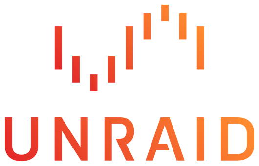

---
tags:
- os
- operating system
- unraid
---
# Unraid
{.center width="20%"}

Unraid OS allows sophisticated media aficionados, gamers, and other intensive data-users to have ultimate control over their data, media, applications, and desktops, using just about any combination of hardware.

- [Unraid Documentation](https://wiki.unraid.net/Documentation)

## Tips and Tricks
### Custom VM Icons

Custom VM icon images can be stored at

``` bash
/usr/local/emhttp/plugins/dynamix.vm.manager/templates/images
```

### Notifications for userscripts

As configured will sent emails, telegram messages or webGUI notifications.

``` bash
/usr/local/emhttp/webGui/scripts/notify -i [normal|warning|alert] -s "<notification>" -d "<description>"
```

## Log file

To check the logfile size try find problem with the followign two commands:width

``` bash
df -h /var/log
du -sm /var/log/*
```