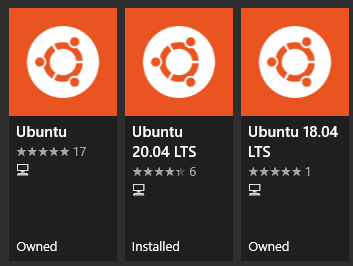

---
tags:
- os
- operating system
- windows
- wsl
---
# WSL

WSL means Windows Subsystem for Linux. There are two version available, this page is dedicated to `wsl2`.

Once wsl is installed new Linux distributions can be installed on the Windows Store.

{.center width="30%"}

In addition docker for windows also runs on `wsl2` see more informations [Docker](../../tools/docker/index.md) Page.

## Additional Information

- [https://docs.microsoft.com/en-us/windows/wsl/](https://docs.microsoft.com/en-us/windows/wsl/)

## Commands

``` bash
# shows images available on wsl including version
wsl -l -v

# change wsl image to version 2
wsl --set-version <distro-name> 2

# set all new images to wsl version 2
wsl --set-default-version 2

# start linux shell
wsl

# start specific distributions
wsl --distribution Ubuntu-20.04
```

## Cmder
wsl can be easily integrated into cmder.

Settings Startup Tasks

Task for open wsl shell

``` bat
wsl -cur_console:pm:/mnt
```

Task for open specific distribution

``` bat
wsl --distribution Ubuntu-20.04 -cur_console:pm:/mnt
```
