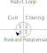

---
tags:
  - psychology
  - habits
  - atomic habits
---

# Habits

{.center width="20%"}

## Atomic Habits

{.center width="20%"}

My take and some ideas from the book [Atomic Habits](https://books.google.ch/books/about/Atomic_Habits.html?id=lFhbDwAAQBAJ&redir_esc=y) by James Clear.

### The Habit Loop

{.center width="50%"}

Ho habits form and opreates works in four stages:

1. **Cue**: The trigger that initiates the habit. It is a signal from the environment or internal condition that starts the brain’s process to execute a habit. It could be a specific time, place, emotional state, or other cues that prompt behavior.
2. **Craving**: The motivational force behind the habit. It represents the desire for a specific outcome. For example, craving comfort might drive a habit like snacking or watching TV. Without craving, the habit loop breaks down.
3. **Response**: The actual habit or behavior that is performed. It can be a thought or action triggered by the cue, depending on one’s motivation and ability to perform the action.
4. **Reward**: The satisfaction or benefit gained from completing the habit. Rewards reinforce the habit, signaling to the brain that the behavior is worth repeating in the future.

Out of the habit loop forms the four laws of behavior change see also [Atomic Habits CheatSheet](https://atomichabits.com/cheat-sheet/)):

To create a good habit, you need to:

1. **Make It Obvious** (Cue):
    * Fill out the Habits Scorecard. Write down your current habits to become aware of them.
    * Use implementation intentions: “I will [BEHAVIOR] at [TIME] in [LOCATION].”
    * Use habit stacking: “After [CURRENT HABIT], I will [NEW HABIT].”
    * Design your environment. Make the cues of good habits obvious and visible.
2. **Make It Attractive** (Craving):
    * Use temptation bundling. Pair an action you want to do with an action you need to do.
    * Join a culture where your desired behavior is the normal behavior.
    * Create a motivation ritual. Do something you enjoy immediately before a difficult habit.
3. **Make It Easy** (Response):
    * Reduce friction. Decrease the number of steps between you and your good habits.
    * Prime the environment. Prepare your environment to make future actions easier.
    * Master the decisive moment. Optimize the small choices that deliver outsized impact.
    * Use the Two-Minute Rule. Downscale your habits until they can be done in two minutes or less.
    * Automate your habits. Invest in technology and onetime purchases that lock in future behavior.
4. **Make It Satisfying** (Reward):
    * Use reinforcement. Give yourself an immediate reward when you complete your habit.
    * Make “doing nothing” enjoyable. When avoiding a bad habit, design a way to see the benefits.
    * Use a habit tracker. Keep track of your habit streak and “don’t break the chain.”
    * Never miss twice. When you forget to do a habit, make sure you get back on track immediately.

To break a bad habit, you need to inverse the laws:

1. **Make It Invisible** (Cue):
    * Reduce exposure. Remove the cues of your bad habits from your environment.
2. **Make It Unattractive** (Craving):
    * Reframe your mindset. Highlight the benefits of
  avoiding your bad habits.
3. **Make It Difficult** (Response):
    * Increase friction. Increase the number of steps between you and your bad habits.
    * Use a commitment device. Restrict your future choices to the ones that benefit you.
4. **Make It Unsatisfying** (Reward):
    * Get an accountability partner. Ask someone to watch your behavior.
    * Create a habit contract. Make the costs of your bad habits public and painful.

### Habit Tracker Template

{.center width="100%"}
