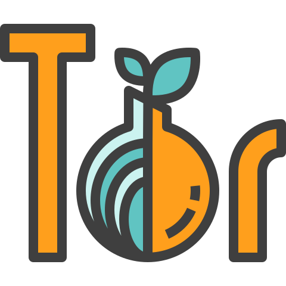

---
tags:
- security
- tor
---

{.center width="30%"}

**What is Tor?**

Tor (The Onion Router) is free software and an open network that helps you defend against a form of network surveillance that threatens personal freedom and privacy, confidential business activities and relationships, and state security known as traffic analysis.

- [Official Tor Webpage](https://www.torproject.org/)
- [Check if you're using Tor](https://check.torproject.org/)

## Download

Download the latest **Tor Browser Bundle** from the Tor Webpage

- [Tor Bundle Download](https://www.torproject.org/download/)
