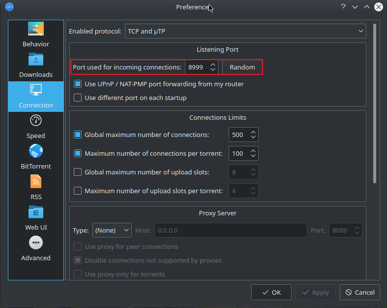
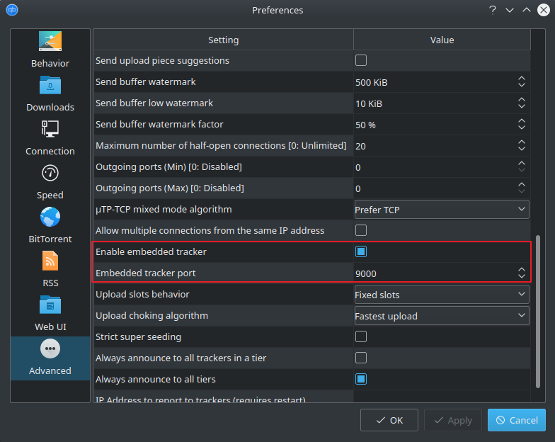
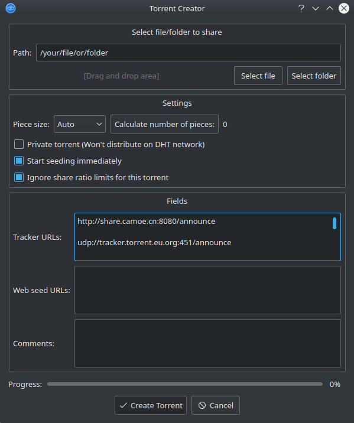

---
tags:
- tools
- bittorrent
---
#  Creating a Torrent

## Enable Local Tracker

The local tracker lets find your Client by others but you have to enable it and forward the tracker port. In addition your also need to forward the listening port.

By default in qBitTorrent these values are:

- Listening Port: `8999`
- Tracker Port: `9000`

{align=left width="45%"}
{align=left width="45%"}
Listening Port Settings and qBitTorrent Embedded Tracker Settings

!!! warning
    These two ports needs to be forwarded by your router, adjust the settings accordingly Verify these settings with the [openport checker](https://www.yougetsignal.com/tools/open-ports/)

## Creating a Public Torrent

Public Torrents can be find by anyone and be downloaded by anyone. Depending on your tracker selection they cn be find on popular torrent sites such as [ThePirateBay](https://thepirate-bay.org).

!!! warning
    Be careful what you offer to be downloaded.

Create a new Torrent file with the following settings.

{.center width="70.0%"}

Add public trackers to your tracker list. To find the latest active public trackers goto [tinytorrent.net](https://tinytorrent.net/best-torrent-tracker-list-updated/). You can also add your personal tracker if you like.

## Creating a Private Torrent

Hereafter a semi-private torrent is created. Which means only people having the torrent file can download the file. But it is not per-se private. You have to create the same Torrent file except add only your own tracker to the tracker list.

To find your external ip address goto: <https://www.ip-adress.com/>

```
http://your.external.url:9000/announce

http://external-ip-address:9000/announce

http://localhost:9000/announce
```

{.center width="70.0%"}