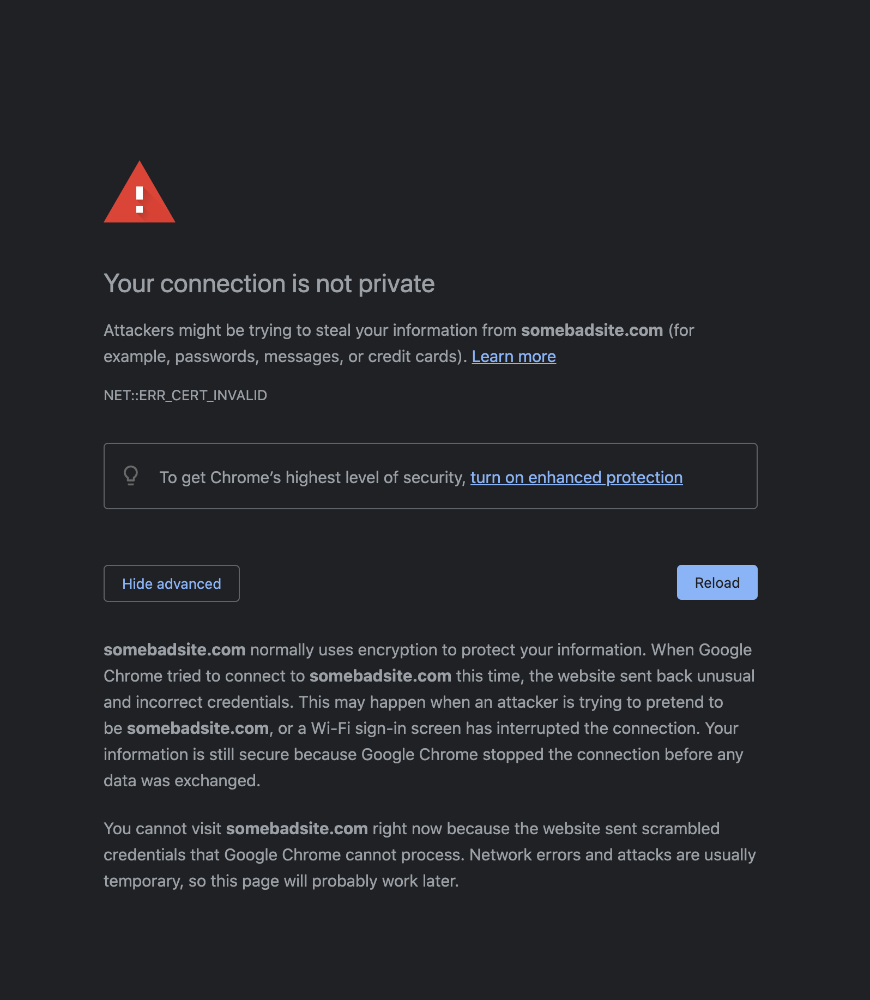

---
tags:
- tools
- chromium
---
#  Chromium Browsers

{.center width="20%"}

## Access unsafe page

If a page has not a valid certificate and cannot be accessed, there is a method to bypass the chrome security warnings.

{.center width="80.0%"}

As you can see, these are just warnings. Some browsers will let you go through after clicking on the Accept and Continue button. In some situations Chrome doesn't even present you with a Continue button.

For those circumstances though, there is a bypass available. You can just type in `thisisunsafe` anywhere on the window and the browser will let you visit the page.

```
thisisunsafe
```
