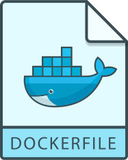

---
tags:
- tools
- docker
---
# Dockerfile

{.center width="20.0%"}

Docker can build images automatically by reading the instructions from a Dockerfile.

For more information see: [Dockerfile reference](https://docs.docker.com/engine/reference/builder/)

## Instructions

A typical Dockerfile contains the following instructions.

| Instruction  | Description |
|--------------|-------------|
| `FROM`       | It will set the base image of the container. |
| `LABEL`      | It is a key-value pair used to specify metadata information of the image. |
| `MAINTAINER` | It will give the detail of the author who created this Docker image. |
| `RUN`        | It is used to execute the command on the base image and it will create a new layer. |
| `COPY`       | It is used to copy local files to the container. |
| `ADD`        | It works same as copy but having some more feature like we can extract local tar and add remote URL. |
| `ENV`        | It is used to set environment variables in the key-value pair. These variables are set during the image build and are available after container created. |
| `EXPOSE`     | It will expose the port to access the container. Container will listen on this network port. We can access the output using this port. |
| `VOLUME`     | It will creates a mount point with the specified name. |
| `USER`       | It will sets the user name and user group to use when running the image. |
| `WORKDIR`    | It will set the working directory. It will create the directory if not present. |
| `CMD`        | It is used to set a command to execute first when the container starts. |
| `ENTRYPOINT` | It is used to set the main command for the image. It works as same as `CMD` instruction. The only difference between `CMD` and `ENTRYPOINT` is instructions are not overwritten in `ENTRYPOINT`. |

``` dockerfile
FROM ubuntu:18.04

LABEL ENV="DEVELOPEMENT"

MAINTAINER maintainer@email.com

RUN apt-get update
RUN apt-get install tomcat

COPY /target/plantuml.jar plantuml.jar

ADD file.tar.xz / .
ADD http://url.com/git.git /usr/local/folder/

ENV DB_NAME=”MySQL”
ENV DB_VERSION=”8.0”

EXPOSE 8080

VOLUME /app/folder

USER user
USER admin

WORKDIR /var/lib/

CMD [“java”, “-jar”, “app.jar”]

ENTRYPOINT [“java”, “-jar”, “app.jar”]
```

## Example
### Small

Example of a small dockerfile for a javascript webapplication.

``` dockerfile
FROM ubuntu:latest
MAINTAINER Prename Name "user@email.com"s
RUN apt-get install -y software-properties-common python
RUN add-apt-repository ppa:chris-lea/node.js
RUN echo "deb http://us.archive.ubuntu.com/ubuntu/ precise universe" >> /etc/apt/sources.list
RUN apt-get update
RUN apt-get install -y nodejs
RUN mkdir /var/www
ADD app.js /var/www/app.js
CMD ["/usr/bin/node", "/var/www/app.js"]
```

### Python with pip

Example of a dockerized python application. All modules are installed with `pip`. In addition crontab and a docker entryfile is used.

``` dockerfile
FROM python:3.8-slim-buster AS runtime-image
MAINTAINER tschinz

# Update and install git
RUN apt-get update && apt-get install -y --no-install-recommends git cron libcurl4-openssl-dev libssl-dev build-essential

# Create and install crontab
COPY docker/crontab /etc/cron.d/crontab
RUN chmod 0644 /etc/cron.d/crontab
RUN /usr/bin/crontab /etc/cron.d/crontab

ARG dest=/usr/src/app

# Create the application directories
RUN mkdir $dest
WORKDIR $dest
RUN mkdir ./src
RUN mkdir /data

# Copy the rest of the codebase into the image
COPY src/ ./src
COPY index.py .
COPY docker/requirements.txt /tmp/

# Install python environment
RUN pip install -r /tmp/requirements.txt

## set environment variables

# Keeps Python from generating .pyc files in the container
ENV PYTHONDONTWRITEBYTECODE=1

# Turns off buffering for easier container logging
ENV PYTHONUNBUFFERED=1

# Run command once at startup
#CMD ["python", "/usr/src/app/index.py", "-av", "-o", "/data"]
# Dummy command to keep container in foreground and running
#CMD ["tail", "-f", "/dev/null"]

# Setup entrypoint.sh
COPY docker/docker-entrypoint.sh /
RUN chmod +x /docker-entrypoint.sh
ENTRYPOINT ["/docker-entrypoint.sh"]
```

### Python with wheels

Example of a dockerized python application. This dockerfiles describes a two stage build. In the first state a wheel executable of the python application is created. In the second the wheels are used to create the docker image. In addition crontab and a docker entryfile is used.

``` dockerfile
########## 1st Stage ##########
FROM python:3.8-slim-buster AS build-image

# Update and install git
RUN apt-get update && apt-get install -y --no-install-recommends libcurl4-openssl-dev libssl-dev build-essential

# instead of installing, create wheels
RUN pip3 install --upgrade pip
COPY setup.py ./tmp
COPY src/ ./tmp/src
RUN pip3 wheel --wheel-dir=/tmp/wheels ./tmp

########## 2nd Stage ##########
FROM python:3.8-slim-buster AS runtime-image
MAINTAINER tschinz

RUN apt-get update && apt-get install -y --no-install-recommends cron libcurl4-openssl-dev libssl-dev

# Create and install crontab
COPY docker/crontab /etc/cron.d/crontab
RUN chmod 0644 /etc/cron.d/crontab
RUN /usr/bin/crontab /etc/cron.d/crontab

ARG dest=/usr/src/app

## copy wheels from build image and install packages from wheels
COPY --from=build-image /tmp/wheels /tmp/wheels

## Get all wheels and install them. We had to use '--no-deps' for our 'src' package because
## this latter needs git to install all its dependencies.
RUN WHEELS=$(cd /tmp/wheels; ls -1 *.whl | grep -v src | awk -F - '{ gsub("_", "-", $1); print $1 }' | uniq) && \
    pip3 install --no-index --find-links=/tmp/wheels $WHEELS && \
    pip3 install --no-index --find-links=/tmp/wheels src --no-deps

RUN rm -rf /tmp/wheels

# Create the application directories
RUN mkdir /data
RUN mkdir $dest
WORKDIR $dest

# Copy the rest of the codebase into the image
COPY index.py .

## set environment variables

# Keeps Python from generating .pyc files in the container
ENV PYTHONDONTWRITEBYTECODE=1

# Turns off buffering for easier container logging
ENV PYTHONUNBUFFERED=1

# Run command once at startup
#CMD ["python", "/usr/src/app/index.py", "-av", "-o", "/data"]
# Dummy command to keep container in foreground and running
#CMD ["tail", "-f", "/dev/null"]

# Setup entrypoint.sh
COPY docker/docker-entrypoint.sh /
RUN chmod +x /docker-entrypoint.sh
ENTRYPOINT ["/docker-entrypoint.sh"]
```

!!! warning
    docker entryfile needs to have linux line endings `LF`.

!!! warning
    crontab file needs to have an empty line at the end.
