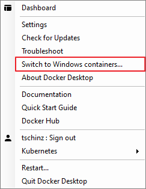
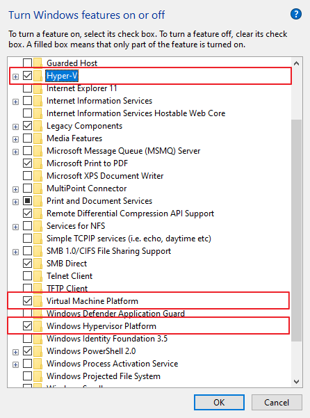
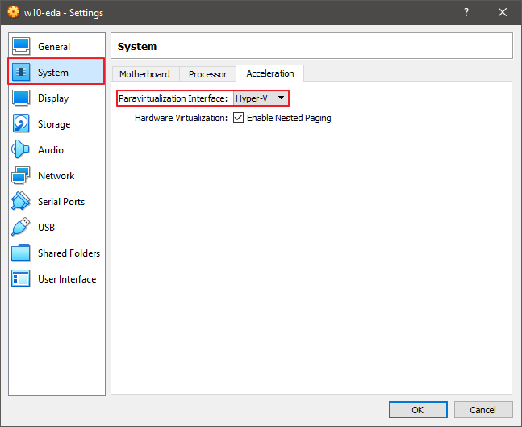

---
tags:
- tools
- docker
---
#  Docker

{.center width="70.0%"}

## Contents

- [Basics](basics.md)
- [Docker CMD](docker_cmd.md)
- [Dockerfile](dockerfile.md)
- [Common Fixes](common_fixes.md)

## Introduction

Docker is a set of platform as a service (PaaS) products that use OS-level virtualization to deliver software in packages called containers. Containers are isolated from one another and bundle their own software, libraries and configuration files; they can communicate with each other through well-defined channels. All containers are run by a single operating system kernel and therefore use fewer resources than virtual machines.

## Additional Information

- [Docker Docs](https://docs.docker.com/)
- [Docker](https://www.docker.com/) - Official Docker page
- [Dockerhub](https://hub.docker.com/) - For community docker container images

## Windows vs Linux Containers

You cannot run Linux and Windows container at the same time. You have to choose and switch between them.

{align=left width="45%"}

{align=right width="45%"}

## Switch between Hyper-V and VirtualBox

In order to "quickly" switch between them use the commands below. But a restart if necessary in any case.

``` title="Hyper-V Disable"
bcdedit /set hypervisorlaunchtype off
```

``` title="Hyper-V Enable"
bcdedit /set hypervisorlaunchtype auto
```

## Docker for Windows and VirtualBox

Docker for Windows requires two Windows features activated:

- `Hyper-V`
- `Virtual Machine Platform`
- `Windows Hypervisor Platform`

{.center width="40.0%"}

Once activate normal Virtualbox images don't work anymore because the default Type 2 Hypervisor cannot run im parallel with Type 1 Hypervisor Hyper-V. Luckily since Virtualbox v6.0 you can select Hyper-V as default Hypervisor for any image.

!!! warning
    When run Virtualbox image run under Hyper-V there is a significant performance penalty. (practically unusable)

{.center width="60.0%"}

Once a image is launched a new icon in the iconbar appears (tortoise with a V)

{.center width="40.0%"}
