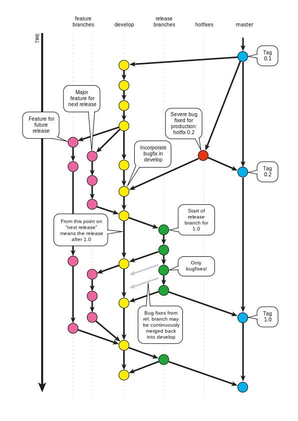

---
tags:
- tools
- cli
- git
- gitflow
---
# Git Flow
## Branches

- `master` - protected branch - Production releases
- `develop` - protected branch - main developement merge of all `feature` branches
- `feature/*` - for each feature a separate feature branch is created fork from `develop`
- `release` - preparing `development` branch for release on `master` branch, mainly for bugfixes
- `hotfix` - quick and dirty hotfix directly into `develop` and `master` branch

{.center}
