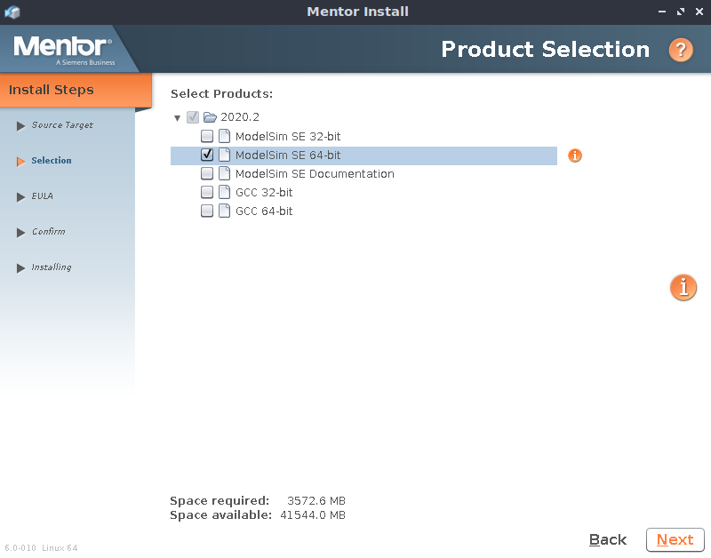
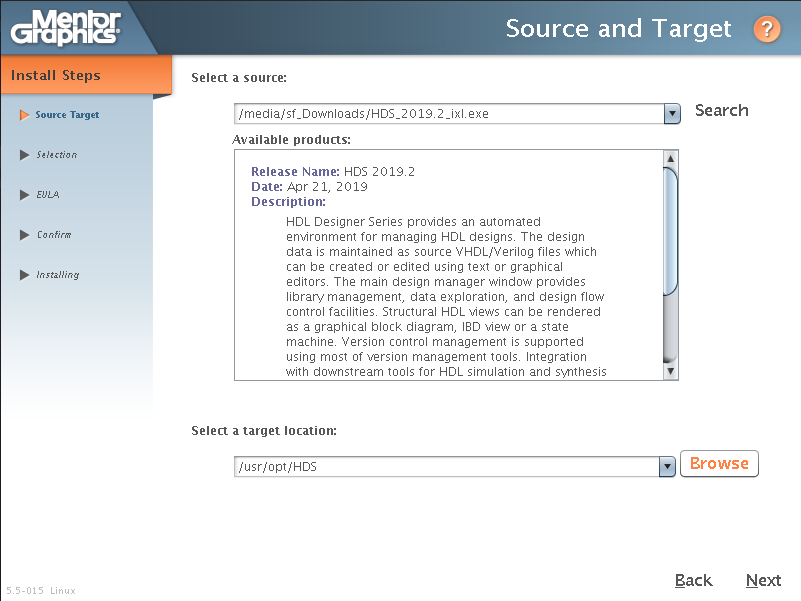

---
tags:
- tools
- mentor
---
#  Install Linux

Both tools are mostly installed at the same time. Download the latest Software on the [SupportNet](https://support.sw.siemens.com)

!!! note
    Tested on Lubuntu 20.04 LTS

## Modelsim

Download Modelsim: [https://support.sw.siemens.com/de-DE/product/852852093/downloads](https://support.sw.siemens.com/de-DE/product/852852093/downloads)

**Install**

Copy `modelsim*.aol` to `~/Downloads/`

``` bash
cd ~/Downloads
chmod +x modelsim*.aol
sudo ./modelsim*.aol
```

Options:

``` bash title="Target location"
/usr/opt/Modelsim
```

{.center width="70.0%"}

Select 64bit Modelsim

{.center width="70.0%"}

**Cleanup**

Cleanup the Mentor installer

``` bash
sudo su
rm -R /root/mgc
exit
```

**Test**

``` bash
export PATH=$PATH:/usr/opt/Modelsim/modeltech/bin
export LM_LICENSE_FILE=$LM_LICENSE_FILE:27001@mentorlm.hevs.ch

vsim &
```

# HDL Designer

Download HDL Designer: [https://support.sw.siemens.com/de-DE/product/862138546/downloads](https://support.sw.siemens.com/de-DE/product/862138546/downloads)

**Prerequisies**

``` bash title="install required libraries"
sudo apt install lib32z1
sudo dpkg --add-architecture i386
sudo apt update
sudo apt install libx11-6:i386
sudo apt install libxext6:i386
sudo apt install libxrender1:i386
sudo apt install libxtst6:i386
sudo apt install libxi6:i386
```

``` bash title="install fonts"
sudo apt install xfonts-75dpi
sudo apt install xfonts-100dpi

xset +fp /usr/share/fonts/X11/75dpi
xset +fp /usr/share/fonts/X11/100dpi
xset fp rehash
```

**Install**

Copy `HDS_*.exe` to `~/Downloads/`

``` bash
cd ~/Downloads
chmod +x HDS_*.exe
sudo ./HDS_*.exe
```

Options:

``` title="Target location"
/usr/opt/HDS
```

{.center width="70.0%"}

**Cleanup**

Cleanup the Mentor installer

``` bash
sudo su
rm -R /root/mgc
exit
```

**Libraries**

``` bash
git clone https://github.com/tschinz/config.git
sudo cp config/scripts/vhdl/libraries/ieee/numeric_std.vhd /usr/opt/HDS/hdl_libs/ieee/hdl
sudo cp config/scripts/vhdl/libraries/ieee/std_logic_1164.vhd /usr/opt/HDS/hdl_libs/ieee/hdl

sudo rm -R config
```

**Test**

``` bash
export PATH=$PATH:/usr/opt/HDS/bin
export LM_LICENSE_FILE=$LM_LICENSE_FILE:27001@mentorlm.hevs.ch

hdl_designer &
```

# License & PATH

For the HEVS license add the following lines to `/etc/profile`

``` bash
#-------------------------------------------------------------------------------
# EDA tools
#
export PATH=$PATH:/usr/opt/HDS/bin:/usr/opt/Modelsim/modeltech/bin:/usr/opt/Xilinx/ISE_DS/ISE/bin/lin64/
export LM_LICENSE_FILE=$LM_LICENSE_FILE:27001@mentorlm.hevs.ch:2100@xilinxlm.hevs.ch:1717@dl-srv69.admin.hes-so.ch
```
