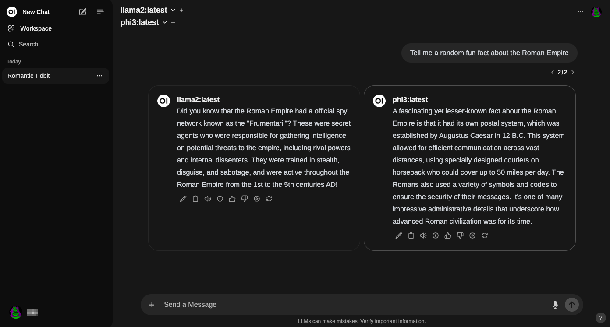

---
tags:
- tools
- llm
- ollama
- openweb ui
---

# OpenWeb UI
Open WebUI is an extensible, self-hosted UI that runs entirely inside of Docker. It can be used either with Ollama or other OpenAI compatible LLMs, like LiteLLM or my own OpenAI API for Cloudflare Workers.

Assuming you already have Docker and Ollama running on your computer, installation is super simple.

```bash
docker run -d -p 3000:8080 --add-host=host.docker.internal:host-gateway -v open-webui:/app/backend/data --name open-webui --restart always ghcr.io/open-webui/open-webui:main
```

To update the installation you can do it with Watchtower:
```bash
docker run --rm --volume /var/run/docker.sock:/var/run/docker.sock containrrr/watchtower --run-once open-webui
```

After the docker has been downloaded and runns go to [http://localhost:3000](http://localhost:3000), make an account, and start chatting away!

{.center width="100%"}

The interface is very similar to the ChgatGPT interface but has a few more features like the ability to train your own models, and a more user-friendly interface. You can

- Create a new model
- Chat with multiple models at the same time
- Load modelfiles which are similar to GPT's
- and more ...

## Image generation
For image generation you can use [AUTOMATIC1111/stable-diffusion-webui](https://github.com/AUTOMATIC1111/stable-diffusion-webui). for the installation process on Apple Silicon see: https://github.com/AUTOMATIC1111/stable-diffusion-webui/wiki/Installation-on-Apple-Silicon.

The url for using it into openWeBUI will be by default: http://127.0.0.1:7860

in short:

+ Install requirements
  ```bash
  brew install cmake protobuf rust python@3.10 git wget
  ```
+ Clone repo
  ```bash
  git clone https://github.com/AUTOMATIC1111/stable-diffusion-webui
  ```
+ Download and copy models/checkpoints from [here](https://github.com/AUTOMATIC1111/stable-diffusion-webui/wiki/Installation-on-Apple-Silicon#downloading-stable-diffusion-models)
+ launch the server
  ```bash
  cd stable-diffusion-webui
  ./webui.sh --api
  ```


